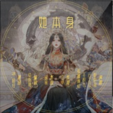

她本身盗墓笔记女性群像
============================

|  |  |
| :--: | :-- |
| [ 她本身盗墓笔记女性群像](https://emumo.xiami.com/album/5021360622) | **艺人**: [徒有琴](../index.md) **语种**: 国语 **唱片公司**: 独立发行 **发行时间**: 2020年08月27日 **专辑类别**: EP, 单曲 **专辑风格**: 中国风 China-Wave **播放数**: 5312 **收藏数**: 4 **评论数**: 1  |

## 简介

## 曲目

## 评论

|  |  |  |
| :-- | :-- | :-- |
|  [虾米用户](https://emumo.xiami.com/u/47414896) musical thea... 2020-08-30 12:06 赞(0) 踩(0) | 
好听
 |
