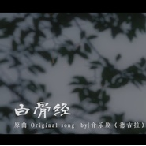
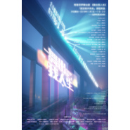
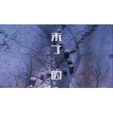
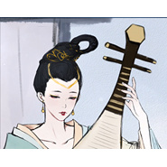
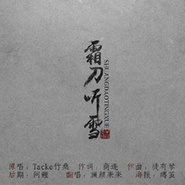
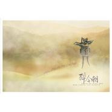

徒有琴
============================

|  |  |
| :--: | :-- |
| [ 徒有琴](https://i.xiami.com/tuyouqin) | **地区**: China 中国大陆 **风格**: 古风 GuFeng Music **播放数**: 22542835 **粉丝数**: 5397 **评论数**: 112  |

## 档案

徒有琴，青年作曲，原创音乐人。 
新浪微博@徒有琴 
微信：tuyouqin1991 
原创作品歌单：  https://emumo.xiami.com/collect/363753182 
属于徒有琴的抒情： https://emumo.xiami.com/collect/1028433088 
徒有琴的霹雳记忆： https://emumo.xiami.com/collect/1028403783 
有琴更多更全的作品欢迎来我的微博或B站试听！

## 专辑

| 名称 | 语种 | 唱片公司 | 发行时间 | 专辑类别 | 专辑风格 |
| :--: | :-- | :-- | :-- | :-- | :-- |
| [ 我志问鼎](./albums/5021377066.md) | 国语 | 独立发行 | 2020年08月29日 | EP, 单曲 | 中国风 China-Wave, 摇滚 Rock & Roll |
| [ 她本身盗墓笔记女性群像](./albums/5021360622.md) | 国语 | 独立发行 | 2020年08月27日 | EP, 单曲 | 中国风 China-Wave |
| [ 法外之罪改编自京剧《秦香莲》（铡美案）](./albums/5020706526.md) | 国语 | 独立发行 | 2020年05月24日 | EP, 单曲 | 国语流行 Mandarin Pop |
| [ 音乐剧中文翻唱II](./albums/2105426605.md) | 国语 | 独立发行 | 2019年11月09日 | 精选集 |  |
| [ 舞出人生原创校园音乐剧《舞出我人生》主题曲](./albums/2105368450.md) | 国语 |  | 2019年10月23日 | EP, 单曲 | 流行 Pop, 音乐剧 Musical theatre |
| [ 饮冰盗墓笔记同人歌曲](./albums/2105370212.md) | 国语 |  | 2019年10月23日 | EP, 单曲 | 摇滚 Rock & Roll, 流行说唱 Pop Rap |
| [ 双生电影《双生》同名主题曲](./albums/2105368470.md) | 国语 |  | 2019年05月11日 | EP, 单曲 | 流行 Pop |
| [ 孤剑萧](./albums/2104180393.md) | 国语 |  | 2018年11月06日 | EP, 单曲 | 流行 Pop |
| [ 《黑与白的证明》（上）专辑完整试听](./albums/2103751344.md) | 国语 | 独立发行 | 2018年06月15日 | EP, 单曲 | 流行 Pop, 音乐剧 Musical theatre |
| [ 他（原创音乐剧《黑与白的证明》）原创音乐剧《黑与白的证明》](./albums/2103720948.md) | 国语 | 独立发行 | 2018年05月27日 | EP, 单曲 | 流行 Pop, 音乐剧 Musical theatre |
| [ 我们之间原创音乐剧《黑与白的证明》](./albums/2103702548.md) | 国语 | 独立发行 | 2018年05月05日 | EP, 单曲 | 国语流行 Mandarin Pop, 电子 Electronic |
| [ 未了因原创音乐剧《黑与白的证明》](./albums/2103544397.md) | 国语 | 独立发行 | 2018年02月22日 | EP, 单曲 | 国语流行 Mandarin Pop, 流行 Pop |
| [ 阴阳决](./albums/2103528023.md) | 国语 | 独立发行 | 2018年02月14日 | EP, 单曲 | 人声合唱团 Vocal Group, 古风 GuFeng Music |
| [ 沧海遗珠](./albums/2103500299.md) | 国语 | 独立发行 | 2018年01月25日 | 精选集 | 古风 GuFeng Music |
| [ 音乐剧中文翻唱系列](./albums/2103465913.md) | 国语 | 独立发行 | 2018年01月01日 | 精选集 | 国语流行 Mandarin Pop, 音乐剧 Musical theatre |
| [ 高考背书系列高考古文与流行音乐的碰撞](./albums/2102748146.md) | 国语 | 独立发行 | 2017年05月13日 | 精选集 | 流行 Pop |
| [ KONG人声乐团2016年作品最美的阿卡贝拉](./albums/2102680496.md) | 国语 | 独立发行 | 2017年01月14日 | 合集, 杂锦 | 人声合唱团 Vocal Group, 日本动漫游戏 Japanese ACG |
| [ 梦浮灯AVG《梦浮灯》OP开头曲](./albums/2100371805.md) | 国语 | 独立发行 | 2016年07月24日 | EP, 单曲 | 流行 Pop |
| [ 卿君侧徒有琴操刀，柯暮卿个人古风专辑](./albums/2100286716.md) | 国语 | 独立发行 | 2016年03月04日 | 录音室专辑 | 中国风 China-Wave |
| [ 忆敦煌](./albums/2100258364.md) | 国语 | 独立发行 | 2016年01月12日 | EP, 单曲 | 国语流行 Mandarin Pop |
| [ 霜刀听雪](./albums/1437194986.md) | 国语 | 独立发行 | 2015年07月18日 | EP, 单曲 | 国语流行 Mandarin Pop |
| [ 宴清都——原创古风神话群像AVG游戏《蓬莱白鹿记》主题曲](./albums/424512124.md) | 国语 | 独立发行 | 2015年02月21日 | EP, 单曲 | 中国风 China-Wave |
| [ 有情霹雳II霹雳相关原创、改编作品](./albums/521032189.md) | 国语 | 独立发行 | 2015年01月01日 | 精选集 | 古风 GuFeng Music |
| [ 雅乐寻踪雅乐寻踪，悠悠国风](./albums/905348525.md) | 国语 | 独立发行 | 2014年07月01日 | 精选集 | 中国风 China-Wave |
| [ 秦时明月记《秦时明月》群英](./albums/172142592.md) | 国语 | 徒有琴 | 2013年06月17日 | 精选集 | 国语流行 Mandarin Pop, 中国风 China-Wave |
| [ 有情霹雳I霹雳布袋戏主题角色同人歌](./albums/1999450845.md) | 国语 | 徒有琴 | 2013年02月04日 | 精选集 | 国语流行 Mandarin Pop, 古风 GuFeng Music |
| [ 独坐幽篁徒有琴纯音乐合辑](./albums/527493.md) | 国语 | 独立发行 | 2012年07月11日 | 精选集 |  |
| [ 斩风阙徒有琴早期经典作品合辑](./albums/529064.md) | 国语 | 徒有琴 | 2012年02月02日 | 精选集 | 国语流行 Mandarin Pop, 古风 GuFeng Music |

## 评论

|  |  |  |
| :-- | :-- | :-- |
|  [虾米用户](https://emumo.xiami.com/u/197438808) 我见青山多妩媚，料青山，... 2020-12-15 17:06 赞(0) 踩(0) | 
喜欢，加油！
 |
|  [虾米用户](https://emumo.xiami.com/u/325374787)  2020-01-05 16:50 赞(0) 踩(0) | 
位乐者不在于国界之分！享受满足生活快乐……
 |
|  [虾米用户](https://emumo.xiami.com/u/6592487)   2019-12-03 11:11 赞(2) 踩(0) | 
戏腔好听
 |
|  [虾米用户](https://emumo.xiami.com/u/246689266)  2019-11-24 22:51 赞(1) 踩(0) | 
酷;-)
 |
|  [虾米用户](https://emumo.xiami.com/u/408998650)   2019-11-14 07:38 赞(0) 踩(0) | 
赞
 |
|  [虾米用户](https://emumo.xiami.com/u/404026779)  2019-10-31 09:01 赞(0) 踩(0) | 
，
 |
|  [虾米用户](https://emumo.xiami.com/u/428235557)  2019-09-05 22:10 赞(1) 踩(0) | 
，
 |
|  [虾米用户](https://emumo.xiami.com/u/42343147)  2019-08-02 10:09 赞(2) 踩(0) | 
这个徒有琴，是之前唱了一首话剧各种不同方言版的杀了人的女的的那个徒有琴吗
 |
|  [虾米用户](https://emumo.xiami.com/u/245530162)  2019-07-25 09:42 赞(2) 踩(0) | 
好优秀 
 |
|  [虾米用户](https://emumo.xiami.com/u/5769933)  2019-07-21 11:44 赞(3) 踩(0) | 
期待出个《圆圆曲》，这个才是千古绝唱！
 |
|  [虾米用户](https://emumo.xiami.com/u/407630412)   2019-07-04 15:35 赞(1) 踩(0) | 
Ddhj g
 |
|  [虾米用户](https://emumo.xiami.com/u/418937074) 哈 2019-06-08 22:03 赞(1) 踩(0) | 
我会永远支持你的，爱你，波波～
 |
| ⇒ |  [虾米用户](https://emumo.xiami.com/u/407630412)   2019-07-04 15:36 赞(0) 踩(0) | 
Frfd did not get
 |
|  [虾米用户](https://emumo.xiami.com/u/3566997)  2019-05-18 23:14 赞(1) 踩(0) | 
女的？！
 |
|  [虾米用户](https://emumo.xiami.com/u/355031500) 让身体与音乐碰撞 2019-04-26 14:17 赞(0) 踩(0) | 
嗨
 |
|  [虾米用户](https://emumo.xiami.com/u/12221090) 逍遥于天地而心意自得 2019-04-25 17:37 赞(0) 踩(0) | 
赞
 |
|  [虾米用户](https://emumo.xiami.com/u/223845151) _(:* ｣∠)_ 2019-03-19 22:31 赞(3) 踩(0) | 
感谢您让我背书有了希望
 |
|  [虾米用户](https://emumo.xiami.com/u/411046683) 快快乐乐 2019-03-06 18:58 赞(1) 踩(0) | 
最后，你唱的非常好听。
 |
|  [虾米用户](https://emumo.xiami.com/u/419498459) 「可乐要加冰      ... 2019-02-21 02:36 赞(4) 踩(0) | 
高中生会很感激你的！
 |
| ⇒ |  [虾米用户](https://emumo.xiami.com/u/424070710)  2019-05-03 15:28 赞(0) 踩(0) | 
对，因为这个很难背
 |
| ⇒ |  [虾米用户](https://emumo.xiami.com/u/424070710)  2019-05-03 15:28 赞(0) 踩(0) | 
因为这个很难背
 |
|  [虾米用户](https://emumo.xiami.com/u/332960053)  2019-02-16 00:30 赞(1) 踩(0) | 
我好喜欢琵琶行啊
 |
|  [虾米用户](https://emumo.xiami.com/u/414651075)  2019-02-05 20:11 赞(32) 踩(0) | 
为什么琵琶行会再某音上火
 |
|  [虾米用户](https://emumo.xiami.com/u/375961586) 我。。。。。。。。。。。... 2019-01-30 08:42 赞(1) 踩(0) | 
好听
 |
|  [虾米用户](https://emumo.xiami.com/u/412619303) 这世界最廉价的就是男人一... 2019-01-29 16:39 赞(2) 踩(0) | 
好听
 |
|  [虾米用户](https://emumo.xiami.com/u/413963080)  2019-01-28 21:40 赞(1) 踩(0) | 
实在不错   
 |
|  [虾米用户](https://emumo.xiami.com/u/61039014) T,X 2019-01-26 18:05 赞(0) 踩(0) | 
谢谢你啊♥️
 |
|  [虾米用户](https://emumo.xiami.com/u/407639452)  2019-01-21 20:33 赞(58) 踩(0) | 
谢谢侬，什么时候出一个出师表吧，从来没有记下过  
 |
| ⇒ |  [虾米用户](https://emumo.xiami.com/u/333890762) 我还没想好要写什么... 2019-04-15 13:35 赞(0) 踩(0) | 
出师表还好。我背出过全文。个人感觉最“抗记忆”的是苏轼写的长文
 |
| ⇒ |  [虾米用户](https://emumo.xiami.com/u/426866670)  2020-02-21 13:11 赞(0) 踩(0) | 
 
 |
|  [虾米用户](https://emumo.xiami.com/u/1485542) 情深多有误 2019-01-17 13:12 赞(0) 踩(0) | 
难免觉得旋律单调了些
 |
|  [虾米用户](https://emumo.xiami.com/u/326343011) 你有本事说你问心无愧. 2019-01-01 20:14 赞(3) 踩(0) | 
加油哦！琵琶行超惊艳～^ - ^
 |
|  [虾米用户](https://emumo.xiami.com/u/336781084) (๑´∀`๑) 2018-12-31 19:29 赞(2) 踩(0) | 
ớ ₃ờ♥
 |
|  [虾米用户](https://emumo.xiami.com/u/410471449) 君可知否我心悦你 2018-12-30 12:04 赞(4) 踩(0) | 
琵琶行很好听哦！希望再多一些歌诗。
 |
|  [虾米用户](https://emumo.xiami.com/u/11642841)  2018-12-06 21:21 赞(1) 踩(0) | 
特别喜欢
 |
|  [虾米用户](https://emumo.xiami.com/u/189574595) 爱你，不问归期 2018-12-04 23:39 赞(24) 踩(0) | 
高中生来袭，太棒了，特别是琵琶行，每首都好听啊
 |
|  [虾米用户](https://emumo.xiami.com/u/11751010) 感謝 人生無常 這回事。 2018-12-02 04:42 赞(3) 踩(0) | 
非常非常有才華的女孩子了。
 |
| ⇒ |  [虾米用户](https://emumo.xiami.com/u/3566997)  2019-05-18 23:14 赞(0) 踩(0) | 
女生？！
 |
|  [虾米用户](https://emumo.xiami.com/u/85003008)   2018-11-08 19:25 赞(1) 踩(0) | 
第一次听到《独坐幽篁》感觉很震撼
 |
|  [虾米用户](https://emumo.xiami.com/u/401046237) 我还没想好要写什么... 2018-10-07 08:32 赞(1) 踩(0) | 
nice 给高中生帮了大忙
 |
|  [虾米用户](https://emumo.xiami.com/u/310229092) 若教眼底无离恨，不信人间... 2018-05-05 22:43 赞(1) 踩(0) | 
[喜欢]爱你哟
 |
|  [虾米用户](https://emumo.xiami.com/u/341966079)  2018-03-27 14:09 赞(1) 踩(0) | 
厉害厉害
 |
|  [虾米用户](https://emumo.xiami.com/u/311227097)  2017-12-15 23:12 赞(3) 踩(0) | 
如临其境 如听琵琶
 |
|  [虾米用户](https://emumo.xiami.com/u/338029218)  2017-11-30 23:41 赞(0) 踩(0) | 
美感十足，很喜欢，追到这里
 |
|  [虾米用户](https://emumo.xiami.com/u/298948030) 中國詩音樂電影创始人作曲... 2017-10-17 22:19 赞(2) 踩(0) | 
你好
 |
|  [虾米用户](https://emumo.xiami.com/u/198025759)  2017-09-17 20:09 赞(0) 踩(0) | 
喜欢你的编曲！！！
 |
|  [虾米用户](https://emumo.xiami.com/u/159614060) 火中莲，劫中生，劫生罗浮... 2017-07-09 09:30 赞(1) 踩(0) | 
喜欢徒有琴的音乐 
 |
|  [虾米用户](https://emumo.xiami.com/u/43379638)  2017-06-24 00:06 赞(3) 踩(0) | 
编曲没的说！！大概是我听过的所有华语歌曲里编曲最精致最漂亮的了！！我真的非常喜欢！！今天是我第一次付费买了电子专辑，今后也会一直支持下去～
 |
|  [虾米用户](https://emumo.xiami.com/u/2923080) 聆听东方无限美妙。 2016-12-31 13:18 赞(0) 踩(0) | 
听柔弱女声生怜爱之心
 |
| ⇒ |  [虾米用户](https://emumo.xiami.com/u/46689492) 世间万物唯你是绝色。 2018-06-14 13:44 赞(0) 踩(0) | 
额   那个应该是男声  
 |
|  [虾米用户](https://emumo.xiami.com/u/2923080) 聆听东方无限美妙。 2016-12-31 13:16 赞(0) 踩(0) | 
难得的好曲
 |
|  [虾米用户](https://emumo.xiami.com/u/22265017)  2016-05-30 21:38 赞(0) 踩(0) | 
且无风
 |
|  [虾米用户](https://emumo.xiami.com/u/1477158) http://weibo... 2016-04-21 22:29 赞(1) 踩(0) | 
仔细看了好多好听的原创古风歌，作曲都是徒有琴呢！棒棒哒
 |
|  [虾米用户](https://emumo.xiami.com/u/7351063)   2016-04-07 12:04 赞(0) 踩(0) | 
真是盛世怀古的好音乐！特别有画面感。今天收的宝贝啊！
 |
|  [虾米用户](https://emumo.xiami.com/u/17330374)  2016-03-11 13:30 赞(26) 踩(0) | 
这才叫音乐！   这才是中国的！   中国人就因该有中国的样子！有中国人自己的音乐！
 |
|  [虾米用户](https://emumo.xiami.com/u/17330374)  2016-03-11 13:29 赞(0) 踩(0) | 
喜欢！
 |
|  [虾米用户](https://emumo.xiami.com/u/120817280)  2016-03-07 01:10 赞(0) 踩(0) | 
富有感情的音乐
 |
|  [虾米用户](https://emumo.xiami.com/u/24367584) 孤独是礼物 2016-03-05 23:49 赞(0) 踩(0) | 
真的厉害
 |
|  [虾米用户](https://emumo.xiami.com/u/13012891) Musicneverce... 2016-01-12 18:57 赞(0) 踩(0) | 
光用古琴就像素描，有了其他乐器的伴奏就像有了色彩，但是最好不要喧宾夺主，古琴一般适合做主角。
 |
|  [虾米用户](https://emumo.xiami.com/u/90229974)   2016-01-10 15:11 赞(0) 踩(0) | 
耳目一新！别具一格！
 |
|  [虾米用户](https://emumo.xiami.com/u/9733895) 你们听听一等品系列的那个... 2016-01-03 08:18 赞(0) 踩(0) | 
能在这里遇到懂音乐的高人如子，是我这一天中最开心的一件事！^_^
 |
|  [虾米用户](https://emumo.xiami.com/u/8739172)  2015-12-28 18:52 赞(0) 踩(0) | 
啊啊啊有琴！！！还有我最喜欢的燕都旧事！！！我果然是太久没逛虾米了=-=都不知道有琴入驻了=-=（顺便，inst版的琴殇赋棒0v0
 |
|  [虾米用户](https://emumo.xiami.com/u/11367823) lacrimosa 2015-11-11 10:44 赞(3) 踩(0) | 
在古风圈走入程式化的时候，发现了徒有琴，就像混沌中的一股清流。原创音乐的力量在于表达自己独特的视角和想法，并引起共鸣。
 |
|  [虾米用户](https://emumo.xiami.com/u/7366852) 听这些年的风华绝代 2015-09-14 09:36 赞(0) 踩(0) | 
如此的古琴直击内心 有种“潜龙浊日上九天，山川风云啸苍穹”的开阔感
 |
|  [虾米用户](https://emumo.xiami.com/u/27263757) 屋檐下，风铃在歌唱 2015-07-29 18:22 赞(97) 踩(0) | 
看到网友们的评论，最多说的是“古风”。其实徒有琴的音乐不是古风，而是一股非常新的现代风。当然，这个“现代”是带引号的，因为它真的明明是古风。他一改古琴的诘诎和晦涩，变得精神抖擞和清新流畅起来。我头一次听到古琴竟然如此朝气蓬勃。他使用的是一件古老得不能再古老的乐器，可是那丰富到拥挤的语汇确实现代的，于是这件有些陈腐的乐器有了崭新的生命。真的好感动，好感慨。作曲家非常有才华。此条评论仅针对第一和第二两曲。
 |
| ⇒ |  [虾米用户](https://emumo.xiami.com/u/54444865)  2015-08-04 11:20 赞(0) 踩(0) | 
直接说是中国风吧(*¯︶¯*)
 |
| ⇒ |  [虾米用户](https://emumo.xiami.com/u/27263757) 屋檐下，风铃在歌唱 2015-08-04 18:43 赞(0) 踩(0) | 
<q><b>秦艽说：</b></q>
 |
| ⇒ |  [虾米用户](https://emumo.xiami.com/u/5867670) 物無美惡，過則為災。 2015-09-16 17:27 赞(0) 踩(0) | 
古琴虽然是古老的乐器，但她并不诘诎和晦涩。古琴可以表达很多类型的情绪和情感。徒有琴的作品确实很棒，尤其是前两首。但，独坐幽篁，其实并没有把古琴的韵和她的曲很完美的结合，有点可惜。曲子是很喜欢。
 |
| ⇒ |  [虾米用户](https://emumo.xiami.com/u/27263757) 屋檐下，风铃在歌唱 2015-09-17 10:46 赞(0) 踩(0) | 
<q><b>午後的月亮说：</b></q>
 |
| ⇒ |  [虾米用户](https://emumo.xiami.com/u/5867670) 物無美惡，過則為災。 2015-09-17 17:35 赞(0) 踩(0) | 
<q><b>窈窕如树说：</b></q>
 |
| ⇒ |  [虾米用户](https://emumo.xiami.com/u/27263757) 屋檐下，风铃在歌唱 2015-09-18 10:26 赞(0) 踩(0) | 
<q><b>午後的月亮说：</b></q>
 |
| ⇒ |  [虾米用户](https://emumo.xiami.com/u/5867670) 物無美惡，過則為災。 2015-09-18 11:48 赞(0) 踩(0) | 
<q><b>窈窕如树说：</b></q>
 |
| ⇒ |  [虾米用户](https://emumo.xiami.com/u/321391730)  2017-08-25 10:10 赞(0) 踩(0) | 
[文字cool]
 |
| ⇒ |  [虾米用户](https://emumo.xiami.com/u/272904958) 不会有人真的了解你，一如... 2019-03-26 00:22 赞(0) 踩(0) | 
摘一段话“古琴音乐主要受儒家中正和平、温柔敦厚、「德音之谓乐」和道家顺应自然、大音希声、清微淡远等思想的影响。传统琴曲主要用五声音阶，即五正音，这可说是儒家中和雅正思想在音乐上的落实，而琴乐清虚淡静的风格和意境则主要为道家思想的反映。” 每个乐器自有它本身独特的韵味，只是现代社会的文化使我们一味追求新意……好比茶与饮料，你可以不喜欢喝茶，也可以用茶叶制作成爱喝的奶茶，但不能就此否定茶本身的意义…… 个人浅见。
 |
| ⇒ |  [虾米用户](https://emumo.xiami.com/u/360725911)  2019-07-15 06:26 赞(0) 踩(0) | 
78777'S视频输入
 |
| ⇒ |  [虾米用户](https://emumo.xiami.com/u/429022944) 谁敢惹我，我便惹谁 2019-08-24 15:04 赞(0) 踩(0) | 
好
 |
| ⇒ |  [虾米用户](https://emumo.xiami.com/u/251545005)  2019-10-12 18:52 赞(0) 踩(0) | 
事实上，古琴时间越久音色越好越浑厚。
 |
| ⇒ |  [虾米用户](https://emumo.xiami.com/u/432088152)  2019-11-12 21:53 赞(0) 踩(0) | 
其实你说的前面几句形容应该是中国风，古风是比中国风更中国更古典，而又比中国传统音乐多了一丝现代元素才叫古风，古风最开始只是一个小圈子，他虽然有很多的不足，但是随着时间的增长，越来越多的人注重到了版权的意识，抛开版权意识，古风圈从创建到现在从来没缺过优秀的作品，琵琶行已经在几年前在古风圈在b站火过了，虽然不是大众流行歌，但是已经属于圈子内大热单圈，个人认为这样足够了，对于抖音火了纯属意外，欢迎新朋友喜欢古风音乐，但是真的担心好好一个纯净的极乐净土被污染，我明白你大概意思，只有前几句是回复你的，后面只是单纯感慨一下
 |
| ⇒ |  [虾米用户](https://emumo.xiami.com/u/42257147) 醉酒的星星闯进月亮的心房... 2020-03-23 17:07 赞(0) 踩(0) | 
<q><b>小小王ing说：</b></q>
 |
|  [虾米用户](https://emumo.xiami.com/u/50760724)  2015-06-14 21:41 赞(0) 踩(0) | 
听过好多徒有琴写的歌，很喜欢她的古风
 |
|  [虾米用户](https://emumo.xiami.com/u/20025417) 暂无签名~ 2015-06-12 01:07 赞(50) 踩(0) | 
这才是中国风，整天一群拿着日本和风叫中国风的人应该来听听。
 |
|  [虾米用户](https://emumo.xiami.com/u/48289897) 独卧风云懒，笑看沧海变。 2015-05-06 22:05 赞(0) 踩(0) | 
有琴姐姐尊是棒棒哒＞3＜
 |
|  [虾米用户](https://emumo.xiami.com/u/938506)  2015-04-19 21:26 赞(2) 踩(0) | 
独坐幽篁里，弹琴复长啸。深林人不知，明月来相照。
 |
|  [虾米用户](https://emumo.xiami.com/u/977310) 人生开始了新篇章 2015-04-14 08:17 赞(0) 踩(0) | 
很有才气的古风歌手呢，怎么这么晚才发现
 |
|  [虾米用户](https://emumo.xiami.com/u/4400366) 再也不见 2015-03-27 23:42 赞(0) 踩(0) | 
。
 |
|  [虾米用户](https://emumo.xiami.com/u/1149920) 我还没想好要写什么... 2015-02-16 07:46 赞(1) 踩(0) | 
棒！
 |
|  [虾米用户](https://emumo.xiami.com/u/10384701) 2021/1 #2302... 2015-01-22 11:21 赞(1) 踩(0) | 
真棒。在喜欢古风的朋友手机里听了一遍就喜欢上了。不错。
 |
|  [虾米用户](https://emumo.xiami.com/u/7393614) 镜花水月 2015-01-20 20:08 赞(2) 踩(0) | 
大爱藤萝月!
 |
|  [虾米用户](https://emumo.xiami.com/u/11114570) ddd 2014-12-14 21:03 赞(0) 踩(0) | 
有一首小烟唱的浮舟相随好像没有放上来啊~~~
 |
| ⇒ |  [虾米用户](https://emumo.xiami.com/u/31922559)  2015-01-21 17:15 赞(0) 踩(0) | 
放了=3=
 |
|  [虾米用户](https://emumo.xiami.com/u/1354288) 都好 都爱 不买 2014-11-07 21:25 赞(1) 踩(0) | 
徒有琴是我最喜欢的古风作曲者。
 |
| ⇒ |  [虾米用户](https://emumo.xiami.com/u/31922559)  2015-01-21 17:15 赞(0) 踩(0) | 
谢谢！
 |
| ⇒ |  [虾米用户](https://emumo.xiami.com/u/1354288) 都好 都爱 不买 2015-01-23 12:57 赞(0) 踩(0) | 
<q><b>徒有琴说：</b></q>
 |
|  [虾米用户](https://emumo.xiami.com/u/2145855) 舍生取义，民贵君轻，任重... 2014-07-16 10:47 赞(0) 踩(0) | 
入驻虾米了啊~ (⊙o⊙) 是因为5sing上不去了？
 |
|  [虾米用户](https://emumo.xiami.com/u/11052613) 阳光猛烈，万物显形。 2014-07-15 09:29 赞(0) 踩(0) | 
藤萝月!
 |
|  [虾米用户](https://emumo.xiami.com/u/6632763)  2014-07-13 17:47 赞(0) 踩(0) | 
嗯！
 |
|  [虾米用户](https://emumo.xiami.com/u/9237752) 速度系+强化攻击系情报师 2014-07-13 15:50 赞(1) 踩(0) | 
竟然入驻了？赞一个
 |
|  [虾米用户](https://emumo.xiami.com/u/37943662)  2014-07-08 10:23 赞(0) 踩(0) | 
居然真的有……虽然曲库少得可怜，但是还是不敢相信……
 |
|  [虾米用户](https://emumo.xiami.com/u/38624430)  2014-07-01 17:45 赞(0) 踩(0) | 
曲好歌声美
 |
|  [虾米用户](https://emumo.xiami.com/u/16060190) xiao 2014-05-01 21:51 赞(0) 踩(0) | 
是有才！
 |
|  [虾米用户](https://emumo.xiami.com/u/18659527) 长恨此身非我有。 2014-04-24 10:01 赞(0) 踩(0) | 
平心而论，徒有琴的唱功并不是那么的好，但要打动一个人唱功并不是最重要的，而是心中的情。初听她的声音，觉得低沉，一不留神就溜走，细细听下去，会发现声音中有种情愫让人不能忽略。
 |
| ⇒ |  [虾米用户](https://emumo.xiami.com/u/2886204) tale as old 2014-05-07 00:01 赞(0) 踩(0) | 
有琴MM还唱歌吗？印象中作曲编曲一体机啊
 |
| ⇒ |  [虾米用户](https://emumo.xiami.com/u/18659527) 长恨此身非我有。 2014-05-07 10:55 赞(0) 踩(0) | 
<q><b>Sliver_Swann说：</b></q>
 |
| ⇒ |  [虾米用户](https://emumo.xiami.com/u/27207488) see you. 2014-12-23 14:46 赞(0) 踩(0) | 
对！！！
 |
|  [虾米用户](https://emumo.xiami.com/u/526266) 我不能强迫自己天天签到，... 2014-02-28 11:24 赞(0) 踩(0) | 
百度音乐人里多些曲目可以听。
 |
|  [虾米用户](https://emumo.xiami.com/u/526266) 我不能强迫自己天天签到，... 2014-02-28 11:21 赞(0) 踩(0) | 
才女·
 |
|  [虾米用户](https://emumo.xiami.com/u/6872970) 往烟清尘，无果境空。 2014-01-14 19:26 赞(0) 踩(0) | 
最喜欢她和商连的合作。
 |
|  [虾米用户](https://emumo.xiami.com/u/27257534) 一心一意是最温柔的力量 2013-11-13 17:42 赞(0) 踩(0) | 
好有才的
 |
|  [虾米用户](https://emumo.xiami.com/u/3235848)  2013-06-25 21:59 赞(0) 踩(0) | 
声音不错
 |
|  [虾米用户](https://emumo.xiami.com/u/6684966)  2013-02-12 00:52 赞(1) 踩(0) | 
徒有琴，90后网络原创音乐人，主要擅长作曲、编曲、兼演唱、作词等。
 |
|  [虾米用户](https://emumo.xiami.com/u/12071310)  2012-12-23 22:44 赞(0) 踩(0) | 
就是喜欢
 |
|  [虾米用户](https://emumo.xiami.com/u/928839) 人生只要幸福两个字 2012-07-21 11:42 赞(0) 踩(0) | 
宝宝飘飘~~
 |
