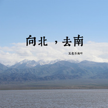

向北，去南
============================

|  |  |
| :--: | :-- |
| [ 向北，去南](https://emumo.xiami.com/album/2100243260) | **艺人**: [五色石南叶](../index.md) **语种**: 国语 **唱片公司**: 独立发行 **发行时间**: 2015年12月01日 **专辑类别**: EP, 单曲 **专辑风格**: 国语流行 Mandarin Pop **播放数**: 36318 **收藏数**: 81 **评论数**: 8  |

## 简介

 单曲

## 曲目

## 评论

|  |  |  |
| :-- | :-- | :-- |
|  [虾米用户](https://emumo.xiami.com/u/60403238) 从长白踏雪，他不是归人只... 2015-12-06 10:42 赞(2) 踩(0) | 
高调表白！
 |
|  [虾米用户](https://emumo.xiami.com/u/7081785) 生而为人，百年孤独。 2015-12-04 16:12 赞(2) 踩(0) | 
(*@ο@*) 哇～
 |
|  [虾米用户](https://emumo.xiami.com/u/6241124)  2015-12-03 15:42 赞(0) 踩(0) | 
五哥(๑ •̀∀-)و✧！【 这边楼层没那么拥挤，顺便给PV摄影表个白~
 |
|  [虾米用户](https://emumo.xiami.com/u/9477494) 人山人海，边走边爱。 2015-12-03 08:42 赞(0) 踩(0) | 
五哥么么哒
 |
|  [虾米用户](https://emumo.xiami.com/u/7735735)  2015-12-02 18:44 赞(0) 踩(0) | 
呃，真是不一样的感受。我倒是觉得这种尝试也不错了。
 |
|  [虾米用户](https://emumo.xiami.com/u/5867670) 物無美惡，過則為災。 2015-12-02 09:47 赞(0) 踩(0) | 
客觀的說，這首歌五哥的嗓音和唱法的特點都沒體現出來~~尤其是高音的時候，感覺五哥是在壓著唱~~聽著不暢快~~不過還是支持~~支持五哥加油出新~~
 |
|  [虾米用户](https://emumo.xiami.com/u/29560589) 我还没想好要写什么... 2015-12-02 08:27 赞(0) 踩(0) | 
板凳！
 |
|  [虾米用户](https://emumo.xiami.com/u/34222440) Give me the ... 2015-12-02 00:59 赞(0) 踩(0) | 
沙发(ง •̀_•́)ง。五哥么么哒！
 |
