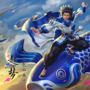

赴梦王者荣耀庄周同人曲
============================

|  |  |
| :--: | :-- |
| [ 赴梦王者荣耀庄周同人曲](https://emumo.xiami.com/album/2103490500) | **艺人**: [五色石南叶](../index.md) **语种**: 国语 **唱片公司**: 独立发行 **发行时间**: 2018年01月14日 **专辑类别**: EP, 单曲 **专辑风格**: 国语流行 Mandarin Pop **播放数**: 14988 **收藏数**: 26 **评论数**: 8  |

## 简介

 

子非鱼，安知鱼之乐？恋一枕黄粱，拥漫天星野。  
这次唱的是王者荣耀中庄周同人曲《赴梦》，庄子也是我非常喜欢的历史人物。
 

​希望大家喜欢！
 

 
 

 
 

## 曲目

## 评论

|  |  |  |
| :-- | :-- | :-- |
|  [虾米用户](https://emumo.xiami.com/u/1271812) WX:Likejazzm... 2018-11-18 13:23 赞(0) 踩(0) | 
庄周补助很滑，抓不住。 
 |
|  [虾米用户](https://emumo.xiami.com/u/115211402) 暂无签名~ 2018-03-12 19:36 赞(0) 踩(0) | 
好听
 |
|  [虾米用户](https://emumo.xiami.com/u/335472041)   2018-02-12 10:32 赞(1) 踩(0) | 
五哥真是仙气满满
 |
|  [虾米用户](https://emumo.xiami.com/u/13696133) SO…… 2018-01-27 14:15 赞(1) 踩(0) | 
词真好 唱糟践了
 |
| ⇒ |  [虾米用户](https://emumo.xiami.com/u/140222788)  2018-02-01 17:14 赞(0) 踩(0) | 
国内一线艺人有几个能把这首歌唱好的？五哥的唱功很不错的。
 |
|  [虾米用户](https://emumo.xiami.com/u/96794356) 直到约定融化成笑颜 2018-01-16 10:01 赞(2) 踩(0) | 
给你100昏！！！
 |
|  [虾米用户](https://emumo.xiami.com/u/55124828) Stay Gold 2018-01-16 00:02 赞(1) 踩(0) | 
给五哥打call！！感觉很久很久没听五哥的歌了，考试周来补充能量
 |
|  [虾米用户](https://emumo.xiami.com/u/299790739)  2018-01-15 22:57 赞(2) 踩(0) | 
大爱五五&amp;hellip;&amp;hellip;
 |
