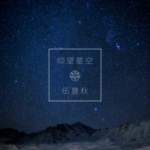

仰望星空记《流浪地球》
============================

|  |  |
| :--: | :-- |
| [ 仰望星空记《流浪地球》](https://emumo.xiami.com/album/2104605027) | **艺人**: [五色石南叶](../index.md) **语种**: 国语 **唱片公司**: 独立发行 **发行时间**: 2019年02月19日 **专辑类别**: EP, 单曲 **专辑风格**: 流行摇滚 Pop Rock, 独立摇滚 Indie Rock **播放数**: 60 **收藏数**: 3 **评论数**: 0  |

## 简介

 记《流浪地球》

## 曲目

## 评论

|  |  |  |  |
| :-- | :-- | :-- | :-- |
