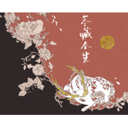

冬藏春生
============================

|  |  |
| :--: | :-- |
| [ 冬藏春生](https://emumo.xiami.com/album/2104996999) | **艺人**: [五色石南叶](../index.md) **语种**: 国语 **唱片公司**: 独立发行 **发行时间**: 2019年07月14日 **专辑类别**: 录音室专辑 **专辑风格**: 国语流行 Mandarin Pop **播放数**: 4551 **收藏数**: 26 **评论数**: 18  |

## 简介

历经两年余的沉淀积累和仔细打磨，五色石南叶的第三张个人音乐专辑——《冬藏春生》以冬春季的十二个节气为灵感，延续了广受好评的《五声·十色》、《夏花秋实》专辑精神内核。专辑内的歌曲除了一贯的鲜明个人风格外，还邀请了数位多年挚友共同演绎，共同为大家带来这件精彩纷呈的作品。 

## 曲目

## 评论

|  |  |  |
| :-- | :-- | :-- |
|  [虾米用户](https://emumo.xiami.com/u/410308402)  2019-07-19 11:19 赞(0) 踩(0) | 
灵性歌唱之人
 |
|  [虾米用户](https://emumo.xiami.com/u/55332224)  2019-07-18 09:26 赞(0) 踩(0) | 
很用心！
 |
|  [虾米用户](https://emumo.xiami.com/u/10570682) 等到房顶开满了花 2019-07-17 22:48 赞(0) 踩(0) | 
Upup 
 |
|  [虾米用户](https://emumo.xiami.com/u/1082696) ❤️ 2019-07-16 20:02 赞(1) 踩(0) | 
去下app(｡･ω･｡)想打钱
 |
|  [虾米用户](https://emumo.xiami.com/u/316286808) 愿与草木饮清茶 2019-07-16 14:03 赞(0) 踩(0) | 
余音绕梁。
 |
|  [虾米用户](https://emumo.xiami.com/u/11799881) 太多好歌。。。 2019-07-15 15:10 赞(0) 踩(0) | 
好期待！！！
 |
| ⇒ |  [虾米用户](https://emumo.xiami.com/u/11799881) 太多好歌。。。 2019-07-15 15:11 赞(0) 踩(0) | 
众筹准备！
 |
| ⇒ |  [虾米用户](https://emumo.xiami.com/u/328882166) 天地与我并生，万物与我为... 2019-07-20 23:04 赞(0) 踩(0) | 
<q><b>Sylvia说：</b></q>
 |
| ⇒ |  [虾米用户](https://emumo.xiami.com/u/13558964) wrong 2019-07-21 21:59 赞(0) 踩(0) | 
<q><b>Mirage说：</b></q>
 |
|  [虾米用户](https://emumo.xiami.com/u/350268310) 夏洛特烦恼 2019-07-15 14:39 赞(0) 踩(0) | 
这个音乐形式不错，挺有意思的
 |
|  [虾米用户](https://emumo.xiami.com/u/232175705)  2019-07-15 13:33 赞(1) 踩(0) | 
搓手，这次一定抢到签名～
 |
|  [虾米用户](https://emumo.xiami.com/u/727696) 永别了！勿念！ 2019-07-15 07:43 赞(1) 踩(0) | 
等等等～
 |
|  [虾米用户](https://emumo.xiami.com/u/273770936) 年轻就要疯狂要美丽要精彩... 2019-07-14 22:46 赞(1) 踩(0) | 
期待ing
 |
|  [虾米用户](https://emumo.xiami.com/u/39547229)  2019-07-14 22:30 赞(1) 踩(0) | 
爱了
 |
|  [虾米用户](https://emumo.xiami.com/u/13558964) wrong 2019-07-14 21:54 赞(1) 踩(0) | 
五哥每次的专都坚持免费，让穷人感动，想强行给专辑打钱   
 |
| ⇒ |  [虾米用户](https://emumo.xiami.com/u/13558964) wrong 2019-07-14 21:56 赞(0) 踩(0) | 
好的，听到了，滚去众筹了 
 |
|  [虾米用户](https://emumo.xiami.com/u/357436795) 世間所有相遇，都是久別重... 2019-07-14 21:48 赞(0) 踩(0) | 
听十秒就被迷住了！
 |
|  [虾米用户](https://emumo.xiami.com/u/292469239) It  must be ... 2019-07-14 21:46 赞(2) 踩(0) | 
来了！！！
 |
