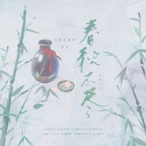

春秋不尽
============================

|  |  |
| :--: | :-- |
| [ 春秋不尽](https://emumo.xiami.com/album/5021332263) | **艺人**: [五色石南叶](../index.md) **语种**: 国语 **唱片公司**: 独立发行 **发行时间**: 2020年08月21日 **专辑类别**: EP, 单曲 **专辑风格**: 国语流行 Mandarin Pop, 古风 GuFeng Music **播放数**: 2540 **收藏数**: 11 **评论数**: 5  |

## 简介

无论是从天光乍破到暮雪白头，还是多年后通过多方寻找实现一战夙愿……策藏的故事似乎永远带着我们对这个江湖的所有想象。  
赤子纯心，武中至性。每个喜爱策藏的玩家心中都有那样一对策藏——  
岁月漫漫如流水而过，他们并肩而行，意气相投，不离不弃。陪伴是他们最真诚的誓言，剑戟是他们最尽兴的碰杯。  
如此，朝朝暮暮，不问春秋。

## 曲目

## 评论

|  |  |  |  |
| :-- | :-- | :-- | :-- |
|  [虾米用户](https://emumo.xiami.com/u/131069456) 不为无益之事，何遣有生之... 2020-09-01 16:43 赞(0) 踩(0) | 
袅袅侠情。
 |
|  [虾米用户](https://emumo.xiami.com/u/116311138) 善良和柔软，可有，不可多... 2020-08-25 19:43 赞(0) 踩(0) | 
侠骨柔情，不外如是。
 |
|  [虾米用户](https://emumo.xiami.com/u/269245815) 偷得浮生半日闲，写意潇洒... 2020-08-23 07:45 赞(1) 踩(0) | 
好听！配乐很用心，间奏很喜欢。有点遗憾的是歌词堆砌痕迹重了点……在自然点就更好啦！
 |
| ⇒ |  [虾米用户](https://emumo.xiami.com/u/341983638) 冬天的花惦记着夏夜晚风 2020-08-25 14:29 赞(0) 踩(0) | 
我觉得还挺好的耶 
 |
|  [虾米用户](https://emumo.xiami.com/u/45925586)  2020-08-21 14:15 赞(1) 踩(0) | 
循环   喜听   不多言语   静心听就好
 |
