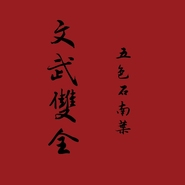

文武双全
============================

|  |  |
| :--: | :-- |
| [ 文武双全](https://emumo.xiami.com/album/575784) | **艺人**: [五色石南叶](../index.md) **语种**: 国语 **唱片公司**: 伍夏秋 **发行时间**: 2013年08月04日 **专辑类别**: 录音室专辑 **专辑风格**: 古风 GuFeng Music **播放数**: 2400979 **收藏数**: 873 **评论数**: 86  |

## 简介

（均可免费下载，非商业专辑）
 

00《文武双全》专辑预告  
01侠义——五色石南叶+Tacke竹桑  
02末路疏狂——五色石南叶+小曲儿  
03柒寒——五色石南叶+重小烟  
04剑网三·非鱼——五色石南叶+慕寒  
05是我乎——五色石南叶+小爱的妈  
06青城山下白素贞——五色石南叶+苏郁青  
07落花时节又逢君——五色石南叶+倾夜  
08玉关白发人——五色石南叶+木野信  
09花堪渡——五色石南叶+纪川久  
10醉仙歌——五色石南叶+大象  
11九方述念——五色石南叶+HITA  
12蒿里行——五色石南叶+紫凌孤君 

## 曲目

## 评论

|  |  |  |
| :-- | :-- | :-- |
|  [虾米用户](https://emumo.xiami.com/u/352140230)  2020-03-16 19:52 赞(0) 踩(0) | 
太太太太棒了，每次听九方述念都想哭
 |
|  [虾米用户](https://emumo.xiami.com/u/428433442) 我还没想好要写什么... 2019-08-20 13:43 赞(0) 踩(0) | 
好好好好好太好听啦
 |
|  [虾米用户](https://emumo.xiami.com/u/12329001) 谁能超世累 2016-04-11 16:02 赞(0) 踩(0) | 
这首歌听得我鸡皮疙瘩一阵一阵的
 |
|  [虾米用户](https://emumo.xiami.com/u/13956039) 听风而行 2016-03-16 15:29 赞(0) 踩(0) | 
因为《落花时节又逢君》的伴奏版进来听的，结果人声一出感觉整个人被震出来了。。。。我还是比较适合纯音乐啊。PS：男声还是蛮合曲调，主要还是女声太出戏了，还有莫名其妙的旁白。。。
 |
|  [虾米用户](https://emumo.xiami.com/u/51631029)   2016-01-01 01:58 赞(0) 踩(0) | 
，
 |
|  [虾米用户](https://emumo.xiami.com/u/8163430) 很蓝很蓝的家伙 2015-09-08 15:55 赞(0) 踩(0) | 
~~
 |
|  [虾米用户](https://emumo.xiami.com/u/6875314) ★ 2015-03-08 17:06 赞(2) 踩(0) | 
慕寒好苏啊啊啊(*/ω＼*)
 |
|  [虾米用户](https://emumo.xiami.com/u/3776442)  2014-12-01 00:19 赞(0) 踩(0) | 
原来非鱼在这里啊！
 |
|  [虾米用户](https://emumo.xiami.com/u/11504298) ようこそ 2014-11-30 04:23 赞(0) 踩(0) | 
第15首的问题.<a href="http://www.xiami.com/play?ids=/song/playlist/id/1769866643/object_name/default/object_id/0#loaded" target="_blank" rel="nofollow noreferrer noopener">http://www.xiami.com/play?ids=/song/playlist/id/1769866643/object_name/default/object_id/0#loaded</a> 时间大家可以参考.
 |
| ⇒ |  [虾米用户](https://emumo.xiami.com/u/44230534)  2014-11-30 15:54 赞(0) 踩(0) | 
所以？非商业用途有什么不可以？
 |
| ⇒ |  [虾米用户](https://emumo.xiami.com/u/44230534)  2014-11-30 16:35 赞(0) 踩(0) | 
法律方面，我不太懂。打个比方，阁下对于泥轰音乐似乎很了解。那么请问泥轰是不是也有翻唱歌手的存在？被称为唱见是吗？他们非商业性质的对原曲的演绎，按照阁下的说法，也算照抄侵权是吗？是否一个逻辑呢？
 |
| ⇒ |  [虾米用户](https://emumo.xiami.com/u/44230534)  2014-11-30 16:37 赞(0) 踩(0) | 
一码归一码事，我们摊开来说。阁下不必因此就给我与此事没有关系的一句专辑评价也打个弱吧？
 |
| ⇒ |  [虾米用户](https://emumo.xiami.com/u/11504298) ようこそ 2014-12-01 20:24 赞(0) 踩(0) | 
<q><b>浅浅的_8说：</b></q>
 |
| ⇒ |  [虾米用户](https://emumo.xiami.com/u/11504298) ようこそ 2014-12-02 00:39 赞(0) 踩(0) | 
<q><b>浅浅的_8说：</b></q>
 |
| ⇒ |  [虾米用户](https://emumo.xiami.com/u/44230534)  2014-12-18 23:10 赞(0) 踩(0) | 
<q><b>レモン爆弾说：</b></q>
 |
| ⇒ |  [虾米用户](https://emumo.xiami.com/u/44230534)  2014-12-18 23:11 赞(0) 踩(0) | 
<q><b>レモン爆弾说：</b></q>
 |
| ⇒ |  [虾米用户](https://emumo.xiami.com/u/11504298) ようこそ 2014-12-19 20:36 赞(0) 踩(0) | 
<q><b>浅浅的_8说：</b></q>
 |
| ⇒ |  [虾米用户](https://emumo.xiami.com/u/44230534)  2014-12-20 20:14 赞(0) 踩(0) | 
<q><b>レモン爆弾说：</b></q>
 |
| ⇒ |  [虾米用户](https://emumo.xiami.com/u/11504298) ようこそ 2014-12-22 10:51 赞(0) 踩(0) | 
<q><b>浅浅的_8说：</b></q>
 |
| ⇒ |  [虾米用户](https://emumo.xiami.com/u/1217512)  2015-08-18 15:04 赞(0) 踩(0) | 
我不太清楚这个说明方法，是说标明原曲还不够么？因为还是说明不清？ 顺便想问一下一些歌手专辑里也会翻唱一些其他歌手的歌，他们是怎么写的？
 |
|  [虾米用户](https://emumo.xiami.com/u/44230534)  2014-11-29 22:37 赞(2) 踩(0) | 
五哥的和别人的对唱超棒。用珠联璧合来形容，不为过。
 |
|  [虾米用户](https://emumo.xiami.com/u/44230534)  2014-11-29 22:31 赞(1) 踩(0) | 
某些楼智商感人23333秀优越秀得有智商行不？
 |
|  [虾米用户](https://emumo.xiami.com/u/6740212) 没有希望，没有仁慈，没有... 2014-11-20 23:58 赞(0) 踩(0) | 
这不是商业碟…翻唱的多了，不至于唱的好就要被骂吧
 |
|  [虾米用户](https://emumo.xiami.com/u/10191423) 约，叔叔我们约！ 2014-11-20 21:17 赞(1) 踩(0) | 
可是，最喜欢的，还是杀马特杀马特洗剪吹吹吹吹……
 |
|  [虾米用户](https://emumo.xiami.com/u/42771641) Don't mercy ... 2014-10-28 23:20 赞(0) 踩(0) | 
五哥么么哒！！！
 |
|  [虾米用户](https://emumo.xiami.com/u/27758299)  2014-10-04 12:44 赞(0) 踩(0) | 
这本来就是翻唱专辑啊拜托!!!又不是出商业专辑，又不是没表明是翻唱，网络古风圈翻唱歌手有什么大惊小怪的=_=五哥翻唱原创的都有的
 |
|  [虾米用户](https://emumo.xiami.com/u/34357899) 我不觉得自己很屌啊你也别... 2014-09-17 19:41 赞(0) 踩(0) | 
为一些人智商醉了
 |
|  [虾米用户](https://emumo.xiami.com/u/11504298) ようこそ 2014-09-17 17:46 赞(0) 踩(0) | 
《蒿里行》抄的泽野弘之的医龙伴奏，这也敢抄？泽野的识别率那么高一听就听出来了…
 |
| ⇒ |  [虾米用户](https://emumo.xiami.com/u/8607229)  2014-09-23 10:11 赞(0) 踩(0) | 
听了一下，这是直接拿来用的啊……起了一身鸡皮疙瘩 最爱医龙的伴奏了 受不了……
 |
| ⇒ |  [虾米用户](https://emumo.xiami.com/u/8607229)  2014-11-17 23:57 赞(0) 踩(0) | 
<q><b>说：</b></q>
 |
| ⇒ |  [虾米用户](https://emumo.xiami.com/u/11504298) ようこそ 2014-11-19 00:18 赞(0) 踩(0) | 
<q><b>天然呆说：</b></q>
 |
| ⇒ |  [虾米用户](https://emumo.xiami.com/u/11504298) ようこそ 2015-01-10 23:59 赞(0) 踩(0) | 
<q><b>说：</b></q>
 |
|  [虾米用户](https://emumo.xiami.com/u/10370907) 暂无签名~ 2014-09-16 14:49 赞(0) 踩(0) | 
柒寒的词好像少了，是我的错觉嘛QvQ
 |
|  [虾米用户](https://emumo.xiami.com/u/10370907) 暂无签名~ 2014-09-16 14:25 赞(0) 踩(0) | 
文本歌词什么的，快找不到词唱到哪了QvQ真是醉了专辑循环已get✔
 |
|  [虾米用户](https://emumo.xiami.com/u/2923080) 聆听东方无限美妙。 2014-09-01 08:30 赞(0) 踩(0) | 
牛人
 |
|  [虾米用户](https://emumo.xiami.com/u/37470443) 我还没想好要写什么... 2014-08-09 11:46 赞(1) 踩(0) | 
楼下的智商也真是醉了 人家预告视频里标注了原曲这其实就是张翻唱集 你们知道原曲是什么就这么了不起等不及来秀智商下限？还过分还功夫深浅... 这脑洞真是给跪 现实生活找不到存在感吧
 |
|  [虾米用户](https://emumo.xiami.com/u/33042329) 鼎阿哥 2014-06-08 23:33 赞(0) 踩(0) | 
专辑
 |
|  [虾米用户](https://emumo.xiami.com/u/9072755)  2014-06-08 11:20 赞(0) 踩(0) | 
花堪渡的旋律居然是抄東方碎夢想
 |
| ⇒ |  [虾米用户](https://emumo.xiami.com/u/34357899) 我不觉得自己很屌啊你也别... 2014-09-17 19:41 赞(0) 踩(0) | 
哈哈哈哈哈哈哈哈哈哈
 |
|  [虾米用户](https://emumo.xiami.com/u/7335042) QAQ 2014-06-08 09:01 赞(0) 踩(0) | 
..落花时节又逢君里面的女声念白真是要多棒读有多棒读。。。。。。可惜了这么好的填词......
 |
|  [虾米用户](https://emumo.xiami.com/u/8188296) 由于地区限制，精选集都停... 2014-06-05 10:08 赞(0) 踩(0) | 
虽然很好听，但是出商业专辑的话。。。是侵权吧？
 |
| ⇒ |  [虾米用户](https://emumo.xiami.com/u/7584539)  2014-07-01 23:16 赞(0) 踩(0) | 
这不是商业专辑，五哥微博上都放出来整张专辑的大礼包下载地址，根本没有圈一分钱
 |
|  [虾米用户](https://emumo.xiami.com/u/2576597) 我还没想好要写什么... 2014-05-31 15:25 赞(0) 踩(0) | 
呵呵了。专辑预告确定不是rin的紫のゆかり、ふたたび 么 真的大丈夫么！！！
 |
| ⇒ |  [虾米用户](https://emumo.xiami.com/u/34357899) 我不觉得自己很屌啊你也别... 2014-09-17 19:41 赞(0) 踩(0) | 
哈哈哈哈哈哈哈哈哈
 |
|  [虾米用户](https://emumo.xiami.com/u/8950625)  2014-04-08 03:20 赞(0) 踩(0) | 
编曲直接拿好妹妹乐队的 这样好么
 |
| ⇒ |  [虾米用户](https://emumo.xiami.com/u/21216195) 我还没想好要写什么... 2014-04-10 11:33 赞(0) 踩(0) | 
几乎没差别。真的有点过分。
 |
|  [虾米用户](https://emumo.xiami.com/u/540260) hard work 2014-03-21 17:03 赞(0) 踩(0) | 
(ง •_•)ง有点停不下来~
 |
|  [虾米用户](https://emumo.xiami.com/u/10438167) 虾米猜越来越不准了，江湖... 2014-03-06 03:44 赞(12) 踩(0) | 
这张专辑中我最喜欢的歌似乎是.......专辑预告？
 |
|  [虾米用户](https://emumo.xiami.com/u/33480679)  2014-03-02 20:24 赞(0) 踩(0) | 
hhhh女神不要念白啊女神！
 |
|  [虾米用户](https://emumo.xiami.com/u/20972224)  2014-02-17 22:52 赞(0) 踩(0) | 
喜欢小曲儿。鉴定完毕。
 |
|  [虾米用户](https://emumo.xiami.com/u/6304769)  2014-01-25 02:39 赞(0) 踩(0) | 
最好的一首是白素贞，功夫深浅真是一目了然。
 |
| ⇒ |  [虾米用户](https://emumo.xiami.com/u/3050532) not of the w... 2014-01-25 12:54 赞(0) 踩(0) | 
去听一下好妹妹的版本，你会知道什么叫功夫深.
 |
| ⇒ |  [虾米用户](https://emumo.xiami.com/u/2864261)  2014-02-09 11:14 赞(0) 踩(0) | 
<q><b>Walker说：</b></q>
 |
|  [虾米用户](https://emumo.xiami.com/u/13046174) 请尝试我 2014-01-11 11:36 赞(0) 踩(0) | 
今日推荐歌曲到飞鱼，原本带着耳机看书听到这首歌也专注在屏幕，以前一直听说过古风歌曲界，这是第一次认真听，好棒啊啊啊啊好喜欢那个叫慕寒的男声啊啊啊
 |
| ⇒ |  [虾米用户](https://emumo.xiami.com/u/11811199) 多少唏嘘的你在人海　 2014-01-20 09:47 赞(0) 踩(0) | 
确实，从小二班开始就一直喜欢了呀
 |
|  [虾米用户](https://emumo.xiami.com/u/29411353)  2013-12-31 03:03 赞(0) 踩(0) | 
末路疏狂真是神曲啊，五哥和蛐蛐合作的每首歌都太完美了，声音契合度很高
 |
|  [虾米用户](https://emumo.xiami.com/u/1467619)  2013-12-27 10:23 赞(0) 踩(0) | 
很好听，整张专辑循环中
 |
|  [虾米用户](https://emumo.xiami.com/u/9137587)  2013-12-17 13:51 赞(1) 踩(0) | 
声音美
 |
|  [虾米用户](https://emumo.xiami.com/u/29741950)  2013-12-14 18:47 赞(0) 踩(0) | 
好几首的版本都算是我听过的最好~五哥好赞~~
 |
|  [虾米用户](https://emumo.xiami.com/u/29741950)  2013-12-14 18:47 赞(0) 踩(0) | 
虽然都是翻唱歌曲，但是五哥是少有的念白和唱都不错~~有几首略有用力过猛的感觉，但是总体水平在古风专辑中还是很赞的！
 |
|  [虾米用户](https://emumo.xiami.com/u/10521416)  2013-11-20 23:03 赞(0) 踩(0) | 
《非鱼》很惊艳。。。
 |
| ⇒ |  [虾米用户](https://emumo.xiami.com/u/32795753) 原谅我这一生不羁放纵爱自... 2014-08-26 11:03 赞(0) 踩(0) | 
+1⊙▽⊙两人的声音简直相得益彰，凑在一起，莫名就给人舒服的感觉，真期待他们再次合作~\(≧▽≦)/~
 |
|  [虾米用户](https://emumo.xiami.com/u/1111376)  2013-11-20 00:04 赞(0) 踩(0) | 
中国风音乐，好听。
 |
|  [虾米用户](https://emumo.xiami.com/u/8316887)  2013-11-09 09:01 赞(0) 踩(0) | 
终于有个正经的。。。哈哈
 |
|  [虾米用户](https://emumo.xiami.com/u/2883703)   2013-11-04 14:25 赞(0) 踩(0) | 
耳朵怀孕了。
 |
| ⇒ |  [虾米用户](https://emumo.xiami.com/u/2548738) 爱音乐，爱游戏~ 2013-11-15 13:32 赞(0) 踩(0) | 
哈哈哈~
 |
|  [虾米用户](https://emumo.xiami.com/u/4312008) O(∩_∩)O 2013-10-28 14:27 赞(0) 踩(0) | 
每一首都好好听！
 |
|  [虾米用户](https://emumo.xiami.com/u/8975976) 我还没想好要写什么... 2013-10-28 13:57 赞(0) 踩(0) | 
必须循环啊感动CRY了┭─┮ ﹏ ┭─┮❀《九方述念》《非鱼》《玉关白发人》《蒿里行》《柒寒》《末路疏狂》都是大爱啊┭─┮ ﹏ ┭─┮❀
 |
|  [虾米用户](https://emumo.xiami.com/u/8975976) 我还没想好要写什么... 2013-10-28 11:59 赞(0) 踩(0) | 
！！！这张传上来了！！！！！
 |
|  [虾米用户](https://emumo.xiami.com/u/347473) 闭站前好友打捞计划正式启... 2013-10-27 21:01 赞(0) 踩(0) | 
五哥男神我爱你！
 |
|  [虾米用户](https://emumo.xiami.com/u/25430653)  2013-10-26 19:17 赞(0) 踩(0) | 
赞！
 |
|  [虾米用户](https://emumo.xiami.com/u/12346831) 生前何必久睡 2013-10-26 19:06 赞(0) 踩(0) | 
男神（经）么么哒~
 |
|  [虾米用户](https://emumo.xiami.com/u/9236456)  2013-10-25 21:36 赞(0) 踩(0) | 
话说歌词是要五哥自己传的还是虾米自己配的？我这边播的时候都错乱了。。。。
 |
| ⇒ |  [虾米用户](https://emumo.xiami.com/u/355865) Let it go, l... 2013-10-31 21:26 赞(0) 踩(0) | 
好像是自己传的= =
 |
| ⇒ |  [虾米用户](https://emumo.xiami.com/u/9236456)  2013-11-02 12:28 赞(0) 踩(0) | 
<q><b>Desperado说：</b></q>
 |
|  [虾米用户](https://emumo.xiami.com/u/15979130)  2013-10-25 20:58 赞(0) 踩(0) | 
五哥给力！！！好多大大！！
 |
|  [虾米用户](https://emumo.xiami.com/u/13548063) 暂无签名~ 2013-10-25 18:58 赞(0) 踩(0) | 
五哥出品
 |
|  [虾米用户](https://emumo.xiami.com/u/7081785) 生而为人，百年孤独。 2013-10-25 18:55 赞(0) 踩(0) | 
发布后第一个路过。。
 |
|  [虾米用户](https://emumo.xiami.com/u/347473) 闭站前好友打捞计划正式启... 2013-10-13 21:59 赞(0) 踩(0) | 
求发布
 |
|  [虾米用户](https://emumo.xiami.com/u/13952858) 远方的猫咪 2013-09-26 19:25 赞(0) 踩(0) | 
等发布啊！
 |
|  [虾米用户](https://emumo.xiami.com/u/4324957) 嵐饭蓝担 爱日剧日影 抓... 2013-09-26 12:34 赞(0) 踩(0) | 
太棒！！
 |
|  [虾米用户](https://emumo.xiami.com/u/4324957) 嵐饭蓝担 爱日剧日影 抓... 2013-09-26 12:33 赞(0) 踩(0) | 
一定要入！！！太棒了
 |
|  [虾米用户](https://emumo.xiami.com/u/3868179) 不在人间 2013-09-25 21:25 赞(0) 踩(0) | 
这张专辑一定要入啊！全是大神！
 |
|  [虾米用户](https://emumo.xiami.com/u/1306309)  2013-09-25 18:55 赞(0) 踩(0) | 
谁知道侠义的原曲是什么
 |
| ⇒ |  [虾米用户](https://emumo.xiami.com/u/9236456)  2013-10-25 21:18 赞(0) 踩(0) | 
Rin&amp;#039; - 紫のゆかり、ふたたび
 |
|  [虾米用户](https://emumo.xiami.com/u/7960635) 没可喜 不算悲 2013-09-20 05:27 赞(0) 踩(0) | 
五哥！！！！！！！！！！
 |
