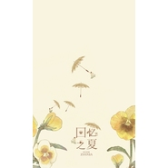

回忆之夏夏天之歌
============================

|  |  |
| :--: | :-- |
| [ 回忆之夏夏天之歌](https://emumo.xiami.com/album/1772142708) | **艺人**: [只有影子](../index.md) **语种**: 国语 **唱片公司**: 独立发行 **发行时间**: 2013年06月01日 **专辑类别**: EP, 单曲 **专辑风格**:  **播放数**: 86993 **收藏数**: 32 **评论数**: 3  |

## 简介

原曲：Secret Base 君がくれたもの～  
企划：蟲子  
填词：火火  
演唱：馒头妞 只有影子 重小烟 木槿白 梦岚 末路xxx 褋子 奇怪的儿童  
后期：蟲子  
海报：舒念慈 

## 曲目

## 评论

|  |  |  |
| :-- | :-- | :-- |
|  [虾米用户](https://emumo.xiami.com/u/16719116) 潮起潮落，聚散随风 2014-12-06 10:10 赞(1) 踩(0) | 
温暖清新的夏日回忆
 |
|  [虾米用户](https://emumo.xiami.com/u/24067215) 日月翻转 2014-07-29 10:45 赞(1) 踩(0) | 
喜欢这种风格
 |
|  [虾米用户](https://emumo.xiami.com/u/12744441) 只要很美就好。 2013-12-24 16:03 赞(0) 踩(0) | 
我们仍未知道那天所看见的那朵花的名字
 |
