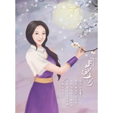

月弯弯
============================

|  |  |
| :--: | :-- |
| [ 月弯弯](https://emumo.xiami.com/album/275079407) | **艺人**: [只有影子](../index.md) **语种**: 国语 **唱片公司**: 独立发行 **发行时间**: 2013年07月22日 **专辑类别**: EP, 单曲 **专辑风格**: 古风 GuFeng Music **播放数**: 1278363 **收藏数**: 46 **评论数**: 10  |

## 简介

月弯弯  
填词：小鱼萝莉  
演唱：只有影子&amp;重小烟  
后期：嘉嘉不爱喝中药

## 曲目

## 评论

|  |  |  |
| :-- | :-- | :-- |
|  [虾米用户](https://emumo.xiami.com/u/10985526) 静静的，暖暖的 2016-09-28 16:04 赞(0) 踩(0) | 
个人感觉这首歌比较适合古风的词，更有意境。男生版的月弯弯听起来也很赞
 |
|  [虾米用户](https://emumo.xiami.com/u/8624983) 我以前的评论都好孩子气啊 2016-02-17 01:08 赞(0) 踩(0) | 
封面是月如么
 |
|  [虾米用户](https://emumo.xiami.com/u/82707188) 愿做蒲草随秋风 2016-02-11 22:16 赞(0) 踩(0) | 
不错的
 |
|  [虾米用户](https://emumo.xiami.com/u/50865442)  2015-11-13 19:44 赞(0) 踩(0) | 
你翻唱有经过谢金燕的同意吗……好好的一首曲，直接被毁，闽南语版才是精髓
 |
|  [虾米用户](https://emumo.xiami.com/u/9044864)  2015-08-04 10:21 赞(0) 踩(0) | 
轻
 |
|  [虾米用户](https://emumo.xiami.com/u/8971942) 暂无签名~ 2015-01-24 18:23 赞(0) 踩(0) | 
怎么让我想起林月如
 |
|  [虾米用户](https://emumo.xiami.com/u/16719116) 潮起潮落，聚散随风 2014-12-06 10:18 赞(0) 踩(0) | 
喜欢
 |
|  [虾米用户](https://emumo.xiami.com/u/10221705) 诡 2014-05-06 09:57 赞(0) 踩(0) | 
赞
 |
|  [虾米用户](https://emumo.xiami.com/u/26271821) 双子座的爱 2014-03-29 08:23 赞(0) 踩(0) | 
不错啊，为什么没人
 |
|  [虾米用户](https://emumo.xiami.com/u/17007739)   2014-03-16 10:10 赞(0) 踩(0) | 
喜欢
 |
