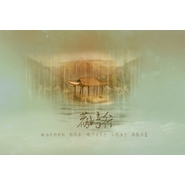

旧诗行
============================

|  |  |
| :--: | :-- |
| [ 旧诗行](https://emumo.xiami.com/album/285364962) | **艺人**: [只有影子](../index.md) **语种**: 国语 **唱片公司**: 独立发行 **发行时间**: 2013年11月23日 **专辑类别**: EP, 单曲 **专辑风格**: 国语流行 Mandarin Pop **播放数**: 2777124 **收藏数**: 104 **评论数**: 3  |

## 简介

旧诗行  
  
曲：为我好好的  
词：纪夜  
唱：只有影子  
后期：虫子  
海报：天蓝  
统筹：幺唠 

## 曲目

## 评论

|  |  |  |
| :-- | :-- | :-- |
|  [虾米用户](https://emumo.xiami.com/u/274778968) 我值得拥有温暖。付出关爱... 2019-09-11 14:57 赞(0) 踩(0) | 
喜欢
 |
|  [虾米用户](https://emumo.xiami.com/u/15512106)  2015-05-17 00:03 赞(0) 踩(0) | 
好听
 |
|  [虾米用户](https://emumo.xiami.com/u/10061385)  2014-08-11 21:38 赞(0) 踩(0) | 
沙发~~
 |
