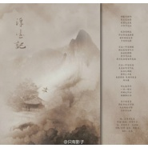
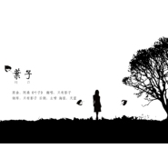
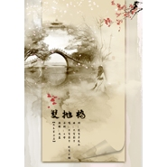
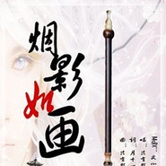

只有影子
============================

|  |  |
| :--: | :-- |
| [ 只有影子](https://i.xiami.com/zhiyouyingzi) | **地区**: China 中国大陆 **风格**: 古风 GuFeng Music, 华语唱作人 Chinese Singer-Songwriter **播放数**: 8413502 **粉丝数**: 2297 **评论数**: 40  |

## 档案

原创音乐人，华研国际签约作曲人，代表作《小丑》，《烟影如画》，《湖心亭》等

## 专辑

| 名称 | 语种 | 唱片公司 | 发行时间 | 专辑类别 | 专辑风格 |
| :--: | :-- | :-- | :-- | :-- | :-- |
| [ 灯月似我](./albums/2103940349.md) | 国语 | 贰伍陆文化传媒 | 2018年08月22日 | EP, 单曲 | 中国风 China-Wave, 国乐 Guoyue |
| [ 浮生记](./albums/1007750432.md) | 国语 | 独立发行 | 2014年07月11日 | EP, 单曲 | 中国风 China-Wave |
| [ 云河谣](./albums/1711450764.md) | 国语 | 独立发行 | 2014年06月17日 | EP, 单曲 |  |
| [ 惊蛰·归云](./albums/2000652551.md) | 国语 | 独立发行 | 2014年03月05日 | EP, 单曲 | 古风 GuFeng Music |
| [ 旧诗行](./albums/285364962.md) | 国语 | 独立发行 | 2013年11月23日 | EP, 单曲 | 国语流行 Mandarin Pop |
| [ 叶子](./albums/1184742299.md) | 国语 | 独立发行 | 2013年10月01日 | EP, 单曲 |  |
| [ 双抛桥](./albums/1178192108.md) | 国语 | 独立发行 | 2013年08月21日 | EP, 单曲 | 古风 GuFeng Music |
| [ 月弯弯](./albums/275079407.md) | 国语 | 独立发行 | 2013年07月22日 | EP, 单曲 | 古风 GuFeng Music |
| [ 故梦](./albums/772663514.md) | 国语 | 独立发行 | 2013年06月13日 | EP, 单曲 |  |
| [ 春天的歌咏春](./albums/1072142979.md) | 国语 | 独立发行 | 2013年06月03日 | EP, 单曲 |  |
| [ 回忆之夏夏天之歌](./albums/1772142708.md) | 国语 | 独立发行 | 2013年06月01日 | EP, 单曲 |  |
| [ 烟影如画(周年复刻版)](./albums/860219059.md) | 国语 | 独立发行 | 2012年05月20日 | EP, 单曲 | 古风 GuFeng Music |

## 评论

|  |  |  |
| :-- | :-- | :-- |
|  [虾米用户](https://emumo.xiami.com/u/430259062)  2019-10-26 14:02 赞(0) 踩(0) | 
好作品会经久不息的流传期待更多好作品，为你点赞
 |
|  [虾米用户](https://emumo.xiami.com/u/428267519)  2019-08-22 05:40 赞(0) 踩(0) | 
喜欢的东西，喜欢的人，唯有不忘初心方得始终。简单对待方得长久
 |
|  [虾米用户](https://emumo.xiami.com/u/338718668)  2019-06-07 09:32 赞(0) 踩(0) | 
有时活在别人的影子后是很痛苦的，早点走出来才会有机会找到新的只属于自己的辛福！
 |
|  [虾米用户](https://emumo.xiami.com/u/375109823)  2019-04-22 01:20 赞(0) 踩(0) | 
夜深人静听这首歌，好听！
 |
|  [虾米用户](https://emumo.xiami.com/u/269822103)  2019-02-17 14:12 赞(0) 踩(0) | 
好喜欢，真的好喜欢你，如梦如幻如真………………
 |
|  [虾米用户](https://emumo.xiami.com/u/253880394) 我还没想好要写什么... 2018-10-11 22:11 赞(0) 踩(0) | 
喜欢这意境，逍遥江湖。
 |
|  [虾米用户](https://emumo.xiami.com/u/309372353) 正在写歌的情歌手噢 2018-01-16 05:33 赞(1) 踩(0) | 
哈哈，我和你合唱，会不错
 |
|  [虾米用户](https://emumo.xiami.com/u/277914084) 青松碎云蹁跹，饮风共醉月... 2018-01-08 02:57 赞(0) 踩(0) | 
加油！百听不厌の    
 |
|  [虾米用户](https://emumo.xiami.com/u/285342803) 从今天开始爱上音乐 2017-11-22 10:26 赞(1) 踩(0) | 
我也是影子
 |
|  [虾米用户](https://emumo.xiami.com/u/294095911) 听自己的音乐，快乐过好每... 2017-09-27 16:33 赞(0) 踩(0) | 
唱的好好听，加油，爱豆支持你 
 |
|  [虾米用户](https://emumo.xiami.com/u/306405876) 如果不快乐，活再久又有什... 2017-08-10 09:19 赞(1) 踩(0) | 
好听好听
 |
|  [虾米用户](https://emumo.xiami.com/u/246136536)  2017-06-19 17:29 赞(2) 踩(0) | 
很有诗情画意，好xi&amp;#39;h&amp;#39;q
 |
|  [虾米用户](https://emumo.xiami.com/u/243046962)  2017-04-07 14:33 赞(1) 踩(0) | 
老师。。。
 |
|  [虾米用户](https://emumo.xiami.com/u/260174317)  2017-02-17 12:16 赞(0) 踩(0) | 
恩
 |
|  [虾米用户](https://emumo.xiami.com/u/117929866)  2017-01-29 18:23 赞(0) 踩(0) | 
听说影子和贰婶是一对儿？
 |
|  [虾米用户](https://emumo.xiami.com/u/252597969)  2017-01-07 06:14 赞(0) 踩(0) | 
好好听 
 |
|  [虾米用户](https://emumo.xiami.com/u/252597969)  2017-01-07 06:13 赞(0) 踩(0) | 
求婚唱的。9000
 |
|  [虾米用户](https://emumo.xiami.com/u/86052574) 我一个人跳舞，从清晨到日... 2016-09-17 00:33 赞(2) 踩(0) | 
雁过留声
 |
|  [虾米用户](https://emumo.xiami.com/u/44622180)  2016-07-25 12:41 赞(2) 踩(0) | 
影子的声音真的是美 我不吹虚
 |
|  [虾米用户](https://emumo.xiami.com/u/119001240) music替我say，y... 2016-06-18 07:37 赞(0) 踩(0) | 
好美的声音
 |
|  [虾米用户](https://emumo.xiami.com/u/189888495) 在所有物是人非的景色里 ... 2016-06-14 14:59 赞(1) 踩(0) | 
又是一个凌晨三点半这首歌我就搜索到了只有影子 可是我找不到
 |
|  [虾米用户](https://emumo.xiami.com/u/8029913)  2016-05-06 16:59 赞(1) 踩(0) | 
^
 |
|  [虾米用户](https://emumo.xiami.com/u/93226796) 只见雪色映衣袂，抚琴月显... 2016-03-30 18:50 赞(0) 踩(0) | 
怎么没有遇萤
 |
|  [虾米用户](https://emumo.xiami.com/u/100492890)   2016-02-09 18:47 赞(0) 踩(0) | 
好听，喜欢。
 |
|  [虾米用户](https://emumo.xiami.com/u/108632054) 一生一世，谁也不许中途下... 2016-02-04 10:12 赞(0) 踩(0) | 
大爱 
 |
|  [虾米用户](https://emumo.xiami.com/u/36846740) ヽ(ﾟ∀ﾟ)ﾉ米娜桑 哦... 2016-01-10 22:51 赞(0) 踩(0) | 
挺喜欢的 ✿✿ヽ(ﾟ▽ﾟ)ノ✿
 |
|  [虾米用户](https://emumo.xiami.com/u/44636422) 爱我所爱，即便杂乱无章。 2016-01-07 21:45 赞(2) 踩(0) | 
喜欢你的声音
 |
|  [虾米用户](https://emumo.xiami.com/u/61833616)  2015-10-25 17:14 赞(0) 踩(0) | 
胖翠儿好喜欢你的歌 
 |
|  [虾米用户](https://emumo.xiami.com/u/1801615)  2015-09-21 21:22 赞(0) 踩(0) | 
影子我の爱^_^
 |
|  [虾米用户](https://emumo.xiami.com/u/13789795) 与其期待万千未来，不如活... 2015-06-08 19:56 赞(0) 踩(0) | 
只有影子还有一首《白茶相依》和小曲儿一起唱的，力荐<a href="http://www.xiami.com/song/1770567814?spm=a1z1s.7154410.1996860142.1.lBcAFB" target="_blank" rel="nofollow noreferrer noopener">http://www.xiami.com/song/1770567814?spm=a1z1s.7154410.1996860142.1.lBcAFB</a>
 |
|  [虾米用户](https://emumo.xiami.com/u/48953097)  2015-06-01 11:13 赞(0) 踩(0) | 
歌曲都很好听 随喜讚歎
 |
|  [虾米用户](https://emumo.xiami.com/u/16719116) 潮起潮落，聚散随风 2015-04-13 22:28 赞(0) 踩(0) | 
很喜欢的声音~支持~
 |
|  [虾米用户](https://emumo.xiami.com/u/10438167) 虾米猜越来越不准了，江湖... 2014-11-23 12:16 赞(0) 踩(0) | 
只有影子和重小烟合作了好多首歌啊......
 |
| ⇒ |  [虾米用户](https://emumo.xiami.com/u/1801615)  2015-09-21 21:28 赞(0) 踩(0) | 
嗯，烟影美如画嘛
 |
|  [虾米用户](https://emumo.xiami.com/u/41716355)  2014-09-26 19:37 赞(0) 踩(0) | 
爱不需要原因
 |
|  [虾米用户](https://emumo.xiami.com/u/2145855) 舍生取义，民贵君轻，任重... 2014-03-06 10:28 赞(0) 踩(0) | 
头像怎么是秦时的兰妹子？？
 |
|  [虾米用户](https://emumo.xiami.com/u/6988215)  2013-12-16 19:11 赞(4) 踩(0) | 
《烟影如画》首当经典，曲词搭配堪称完美。甜而不腻，犹，其词句句不沾爱字 然听者闻之尽道情。好歌词，真是写得一首好歌词，创作团队功力深厚！《旧诗行 》则正好映衬《烟影如画》。
 |
|  [虾米用户](https://emumo.xiami.com/u/6988215)  2013-12-16 18:53 赞(18) 踩(0) | 
友人自叹！黑暗中，即使影子也会离开你。 顾影自怜吗？ 非也，实乃造化弄人。 豪放如子瞻，不也失去往日情态。 借酒纳喊那心中郁结“夜来幽梦忽还乡，小轩窗，正梳妆。相顾无言，惟有泪千行。” “不羁”如唐寅，不也豁然于功名抱负。沈九娘贴心之言使之凤凰涅盘，思境豁达，不朽于中华文坛。 九娘有幸，识于伯虎。相识了这样一位重视她、钟爱她的男人。 伯虎有幸，九娘知我。蹉跎半辈，一生缘，随你到天边。 世事无常，世上之事，谁与说清，言语万化，思绪千奇，神情百态，唯包容尔，海纳百川，有容乃大。 这一季，错过了花期。只怪我比你先入戏，愿错过繁花三千？亦或 相濡以沫，不如忘于江湖？
 |
|  [虾米用户](https://emumo.xiami.com/u/357897)  2013-03-11 14:47 赞(0) 踩(0) | 
。
 |
|  [虾米用户](https://emumo.xiami.com/u/3235848)  2012-05-12 19:03 赞(1) 踩(0) | 
只有影子
 |
