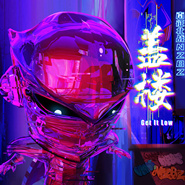
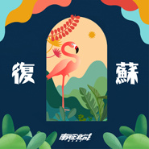
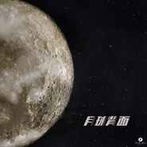
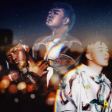
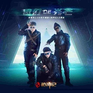
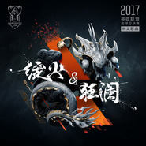
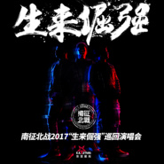
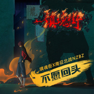
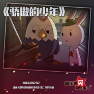
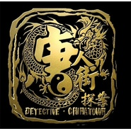

南征北战NZBZ
============================

|  |  |
| :--: | :-- |
| [ 南征北战NZBZ](https://i.xiami.com/nzbz) | **地区**: China 中国大陆 **风格**: 国语流行 Mandarin Pop **播放数**: 99381620 **粉丝数**: 61662 **评论数**: 684  |

## 档案

小档案 
中   文   名：   南征北战 
外   文   名：   NZBZ 
国        籍：   中国 
职        业：   歌手、作曲、编曲、作词、录音 
经纪公司：   南征北战  NZBZ 
代表作品：   《萨瓦迪卡》《我的天空》《站起来》《回忆》 
主要成就：   《中国好歌曲第三季》陶喆组三强之一 
简介 
南征北战组合，英文缩写  NZBZ  ，成员共有三名：分别是汀洋（音乐制作人）、赵辰龙（词人  /  混音师）、尼成（录音师）。   三位成员既是艺人也是幕后创作人，各个成员擅长风格各异，例如赵辰龙擅长粗狂、高亢歌曲的主唱；尼成擅长高音、清新的主唱；汀洋擅长整体的音乐制作偶尔客串  rap  演绎等。出道年份是  2012  年。自出道以来，他们为多部影视剧打造并演唱主题曲、插曲、片尾曲等，例如陈思诚导演电影《唐人街探案》片尾曲《萨瓦迪卡》、华谊兄弟《太极》主题曲《站起来》、中影集团《青春派》主题曲《我的天空》、镇魂街主题曲《不愿回头》等，其创作作品在主流市场表现良好。 
南征北战认为任何一种小众的元素都有成为流行的可能，不能用老一代的思维去界定一个新时代的音乐产物，所以他们把自己的音乐风格定义为  V-POP  ，代表多元化流行元素音乐。 
成员介绍 
汀洋 
汀洋来自辽宁沈阳，毕业于沈阳音乐学院作曲系，职业作曲人，南征北战音乐团体团长。从小学习钢琴，与中国传统作曲家徐振民，贾国平等几位恩师学习传统作曲。   10  岁接触  Hip-Hop  ，摇滚，电子文化，曾为证明流行音乐的学术性，把古典艺术管弦乐与潮流音乐高度结合，并在中央音乐学院演奏厅做现场演唱会。 
网易娱乐汀洋操刀《青春派》成为  85  后电影配乐第一人。 
2014  年受到百事可乐国际的邀请，打造  2014  年世界杯歌曲《  shake your body  》，这首歌由华语金牌词人方文山填词，汀洋作曲，与  U2  制作人联手制作，郭富城，蔡依林，罗志祥，吴莫愁演唱，黄晓明客串。 
2014  年中国第五代著名导演李少红指导，担任全篇配乐的《茧镇奇缘》，更是力邀实力唱将周笔畅演唱主题曲。 
2013  年担任中影集团电影《青春派》主题曲《我的天空》及全片配乐创作。 
2013  年   广化寺十周年大典主题歌《心家》作曲、编曲。 
2013  年电影《爱拼北京》配乐及主题曲创作。 
2012  年担任华谊兄弟巨资电影《太极》主题曲、片尾曲作曲、编曲及音乐总监。 
2012  年鸟巢与体育明星李小双，林丹，杨威，莱昂纳刘易斯汇演活动。 
2012  年   李承鹏诚意导演电影《可以在一起》全片配乐，作曲，编曲，混音。 
2012  年为北京电影学院导演系专业选送电影作品《疾速调头》全片作曲、配乐获釜山电影节竞赛类二等奖；   现代艺术歌曲作品《凤凰吟》获鲁艺杯一等奖。 
2012  年为  CCTV  ——“  3.15  晚会”宣传片制作音乐以及  2012  年  3.15  形象短歌。 
2011  年电视剧东北往事  -  黑道风云主题曲《黑道风云》。 
2011  年为  CCTV  重新制作改编郭蓉《红旗飘飘》等。 
赵辰龙 
来自广西壮族自治区赵辰龙，又名醉人，既是主唱也是一名出色的词人及制作人。包揽所有南征北战的词和后期混音，醉人撕裂的金属唱腔，独具特色。嗓音独特仅仅是他的一个招牌，制作能力，无论是采样技术还是作词、编曲、混音实力，都在国内首屈一指。 
2014  年由华语金牌词人方文山填词，汀洋作曲，与  U2  制作人联手制作，郭富城，蔡依林，罗志祥，吴莫愁演唱，黄晓明客串  2014  世界杯歌曲《  shake your body  》后期混音。 
2013  年担任中影集团电影《青春派》主题曲后期混音及演唱。 
2013  年广化寺十周年大典主题歌《心家》作词、混音等。 
2013  年电影《爱拼北京》主题曲后期混音。 
2012  年担任华谊兄弟巨资电影《太极》宣传曲、片尾曲作词、编曲及音乐总监。 
2012  年为  CCTV  ——“  3.15  ”晚会宣传片制作音乐以及  2012  年  3.15  形象短歌。 
2011  年东北往事  -  黑道风云主题曲《黑道风云》作词、编曲，演唱。 
尼成 
尼成来自云南，又名中国黑人，佤族的他堪称皮肤最黑的中国人。作为一名歌手及录音师的他，同时也是个出色的街球  player  。与生俱来的黑色皮肤，更增添了他的神秘感。尼成包揽了南征北战所有音乐录音的同时也和其他艺人有录音合作，合作艺人有歌手周笔畅，吴莫愁，张咪，熊汝霖，快乐女声杨洋，完美声音苏思蓉，中国最强音  hope  组合，演员刘仪伟   ，王李丹妮，蒋小涵，江一燕，导演冯小宁等。 
2014  年华谊兄弟电影《微爱》配乐录音。 
2014  年冯小宁导演电视剧《东方有大海》配乐以及主题曲录音。 
2014  年由南征北战汀洋作曲   方文山作词百事群星之世界杯主题曲《  Shake Your Body  》录音。 
2014  年南征北战创作撸时代第二季主题曲《超越极限》录音。 
2014  年电视剧《不是冤家不恋爱》配乐和主题曲录音。 
2013  年南征北战创作电影《青春派》电影配乐和主题曲《我的天空》录音。 
2013  年南征北战创作微电影《光棍奇遇记》主题曲《盛夏的幻想》录音。 
2013  年南征北战创作电影《爱拼北京》配乐和主题曲《飞跃吧》录音。 
2012  年南征北战创作电影《太极》主题曲《站起来》录音。 
2012  年南宁青春万岁演唱会（飞儿乐团   信乐团   叶世荣   牛仔   韩庚南征北战）担任主持。 
2009  年曾参加  CCTV3  李咏主持的节目《欢乐英雄》、  CCTV3  毕福剑主持的栏目《星光大道》、东方卫视《中国达人秀》以及黄健翔主演电影《谋杀章鱼保罗》的拍摄。 
2008  年为肯德基全国三人篮球冠军挑战赛拍摄篮球纪录片，并前往广州参加总决赛。

## 专辑

| 名称 | 语种 | 唱片公司 | 发行时间 | 专辑类别 | 专辑风格 |
| :--: | :-- | :-- | :-- | :-- | :-- |
| [ 不让我的眼泪陪我过夜](./albums/5021014387.md) | 国语 | 制作家 | 2020年07月02日 | EP, 单曲 |  |
| [ 盖楼Get it Low](./albums/5021015441.md) | 国语 | 凤凰鸣众文化 | 2020年04月30日 | EP, 单曲 |  |
| [ 神魔大陆](./albums/2108203980.md) | 国语 | 博轩音乐 | 2020年03月19日 | EP, 单曲 | 国语流行 Mandarin Pop |
| [ 酷你吉娃](./albums/2105631345.md) | 国语 | 听见时代 | 2019年12月24日 | EP, 单曲 | 国语流行 Mandarin Pop |
| [ 祖国](./albums/2105322252.md) | 国语 | 看见文娱 | 2019年10月01日 | EP, 单曲 |  |
| [ 加速改变](./albums/2104727273.md) | 国语 | 东亚星光 | 2019年03月29日 | EP, 单曲 | 国语流行 Mandarin Pop |
| [ 复苏](./albums/2104663966.md) | 国语 | 东亚星光 | 2019年03月12日 | EP, 单曲 | 国语流行 Mandarin Pop |
| [ 如果还有时间](./albums/2104629201.md) | 国语 | 东亚星光 | 2019年02月26日 | EP, 单曲 | 国语流行 Mandarin Pop |
| [ 月球背面](./albums/2104454491.md) | 国语 | 东亚星光 | 2019年01月08日 | EP, 单曲 | 国语流行 Mandarin Pop |
| [ 北京的夜](./albums/2104439353.md) | 国语 | 东亚星光 | 2019年01月01日 | EP, 单曲 | 国语流行 Mandarin Pop |
| [ 地球两端](./albums/2104373548.md) | 国语 | 东亚星光 | 2018年12月17日 | EP, 单曲 | 国语流行 Mandarin Pop |
| [ 沉默的誓言](./albums/2104301335.md) | 国语 | 东亚星光 | 2018年11月30日 | EP, 单曲 | 国语流行 Mandarin Pop |
| [ 不说永远](./albums/2104224158.md) | 国语 | 东亚星光 | 2018年11月19日 | EP, 单曲 | 国语流行 Mandarin Pop |
| [ 唱首歌](./albums/2104151559.md) | 国语 | 东亚星光 | 2018年10月29日 | EP, 单曲 | 国语流行 Mandarin Pop |
| [ 半梦半醒](./albums/2104110610.md) | 国语 | 东亚星光 | 2018年10月15日 | EP, 单曲 |  |
| [ 微笑](./albums/2104058309.md) | 国语 | 东亚星光 | 2018年09月27日 | EP, 单曲 |  |
| [ 以肥为美](./albums/2104017389.md) | 国语 | 东亚星光 | 2018年09月15日 | EP, 单曲 |  |
| [ 午夜的列车](./albums/2103986972.md) | 国语 | 东亚星光 | 2018年09月06日 | EP, 单曲 | 流行说唱 Pop Rap |
| [ 我们是谁Who We Are](./albums/2103796250.md) | 国语 | 东亚星光 | 2018年07月12日 | EP, 单曲 |  |
| [ 最美的期待](./albums/2103768438.md) | 国语 | 东亚星光 | 2018年06月29日 | EP, 单曲 | 国语流行 Mandarin Pop |
| [ 大胆爱](./albums/2103731163.md) | 国语 | 东亚星光 | 2018年04月24日 | EP, 单曲 |  |
| [ 远大前程](./albums/2103643603.md) | 国语 | 东亚星光 | 2018年03月26日 | EP, 单曲 | 国语流行 Mandarin Pop |
| [ Happy扭腰](./albums/2103463002.md) | 国语 | 听见时代 | 2017年12月26日 | EP, 单曲 | 国语流行 Mandarin Pop |
| [ 不再遥远](./albums/2102977609.md) | 国语 | 东亚星光 | 2017年12月20日 | EP, 单曲 | 国语流行 Mandarin Pop |
| [ 我们的光芒](./albums/2102968257.md) | 国语 | 腾讯游戏 | 2017年12月05日 | EP, 单曲 | 国语流行 Mandarin Pop |
| [ 3 on 3](./albums/2102902579.md) | 国语 | 东亚星光 | 2017年11月02日 | EP, 单曲 | 国语流行 Mandarin Pop |
| [ 绽火·狂澜](./albums/2102867846.md) | 国语 | 腾讯 | 2017年10月05日 | EP, 单曲 | 国语流行 Mandarin Pop |
| [ Amrica 2 China](./albums/2102851532.md) | 国语 | 东亚星光 | 2017年09月04日 | EP, 单曲 |  |
| [ America 2 China](./albums/2102821877.md) | 国语 | 东亚星光 | 2017年08月29日 | EP, 单曲 | 嘻哈 Hip-Hop |
| [ 独一无二](./albums/2102804610.md) | 国语 | 东亚星光 | 2017年07月31日 | EP, 单曲 | 电音流行 Electropop, 国语流行 Mandarin Pop |
| [ 生来倔强 巡回演唱会](./albums/2102800685.md) | 国语 | 东亚星光 | 2017年07月21日 | 现场专辑 | 流行说唱 Pop Rap |
| [ 迈克尔·杰克逊](./albums/2102770572.md) | 国语 | 东亚星光 | 2017年06月23日 | EP, 单曲 | 中国地下说唱 Chinese Underground Hip Hop |
| [ 骄傲的少年2017](./albums/2102751951.md) | 国语 | 东亚星光 | 2017年05月22日 | EP, 单曲 |  |
| [ 生来倔强](./albums/2102719490.md) | 国语 | 东亚星光 | 2017年03月23日 | EP, 单曲 | 流行说唱 Pop Rap |
| [ 非凡时代](./albums/2102718743.md) | 国语 | 完美世界 | 2017年03月22日 | EP, 单曲 | 国语流行 Mandarin Pop |
| [ 我们的热血传奇](./albums/2102694979.md) | 国语 | 腾讯 | 2017年02月17日 | EP, 单曲 |  |
| [ 权力与荣耀](./albums/2102692816.md) | 国语 | 百纳娱乐 | 2017年02月13日 | EP, 单曲 |  |
| [ 饕餮](./albums/2102661691.md) | 国语 | 自在天浩 | 2016年12月09日 | EP, 单曲 |  |
| [ 6415](./albums/2103713063.md) | 国语 | 看见文娱 | 2016年11月19日 | 录音室专辑 | 国语流行 Mandarin Pop |
| [ 天高路远](./albums/2102653373.md) | 国语 | 东亚星光 | 2016年11月12日 | EP, 单曲 |  |
| [ 闪耀](./albums/2100363834.md) | 国语 | 看见音乐 (上海) | 2016年07月07日 | EP, 单曲 |  |
| [ 破影而出](./albums/2100353481.md) | 国语 | 看见音乐 (上海) | 2016年06月14日 | EP, 单曲 |  |
| [ 不愿回头](./albums/2100309314.md) | 国语 | 看见音乐 (上海) | 2016年04月08日 | EP, 单曲 | 流行说唱 Pop Rap |
| [ 骄傲的少年](./albums/2100305670.md) | 国语 | 翼下之风动漫 | 2016年04月01日 | EP, 单曲 | 国语流行 Mandarin Pop |
| [ 伪流行](./albums/2100254878.md) | 国语 | 看见音乐 (上海) | 2016年01月04日 | 录音室专辑 | 国语流行 Mandarin Pop, 流行说唱 Pop Rap |
| [ 萨瓦迪卡](./albums/2100231660.md) | 国语 | 华谊音乐 | 2015年11月03日 | EP, 单曲 | 流行说唱 Pop Rap |
| [ 超越极限](./albums/1118179712.md) | 国语 | 胜鵾博亚 | 2014年12月09日 | EP, 单曲 |  |
| [ 青春派 电影原声](./albums/378103810.md) | 国语 | 大藏艺术 | 2013年07月30日 | 原声带, 影视音乐 | 电影原声 Film Score |
| [ 青春派 电影原声带](./albums/5020690120.md) | 国语 |  | 2013年06月14日 | 录音室专辑 | 原声 Soundtrack |

## 评论

|  |  |  |
| :-- | :-- | :-- |
|  [虾米用户](https://emumo.xiami.com/u/441704410) 喜爱音乐，热爱音乐，音乐... 2021-01-24 15:28 赞(1) 踩(0) | 
NZBZ，乘风破浪，2021加油，我会关注你到大学毕业。  00后
 |
| ⇒ |  [虾米用户](https://emumo.xiami.com/u/441704410) 喜爱音乐，热爱音乐，音乐... 2021-01-24 15:34 赞(0) 踩(0) | 
特喜欢NZBZ的风格
 |
|  [虾米用户](https://emumo.xiami.com/u/413822552)  2020-12-24 11:27 赞(0) 踩(0) | 
超级喜欢小黑尼成
 |
|  [虾米用户](https://emumo.xiami.com/u/242789101)  2020-11-27 18:01 赞(0) 踩(0) | 
每次听你们的歌，都很开心 
 |
|  [虾米用户](https://emumo.xiami.com/u/330577149)  2020-11-02 10:52 赞(0) 踩(0) | 
不需要多言，两个字，喜欢
 |
|  [虾米用户](https://emumo.xiami.com/u/346545746) 虾米不要关闭啊！ 2020-10-15 23:54 赞(0) 踩(0) | 
ETOS，永远滴神
 |
|  [虾米用户](https://emumo.xiami.com/u/411238851) 听就得了~嗨就够了~ 2020-10-04 20:48 赞(0) 踩(0) | 
很阳光
 |
|  [虾米用户](https://emumo.xiami.com/u/335102379)  2020-08-29 21:33 赞(0) 踩(0) | 
小黑可以去抬棺了   
 |
|  [虾米用户](https://emumo.xiami.com/u/444203176) 火炎焱燚孓 2020-08-26 19:17 赞(2) 踩(0) | 
不是抄袭，是原创！！！！！别成天把别人的努力不当回事儿！有本事你也来一段儿
 |
| ⇒ |  [虾米用户](https://emumo.xiami.com/u/444203176) 火炎焱燚孓 2020-08-26 19:18 赞(0) 踩(0) | 
兄弟，我挺你！南征北战最棒！
 |
|  [虾米用户](https://emumo.xiami.com/u/442470943)  2020-08-15 21:12 赞(1) 踩(0) | 
唱的不错，加油！ 
 |
|  [虾米用户](https://emumo.xiami.com/u/401174589)  2020-07-20 23:04 赞(3) 踩(0) | 
顶你上春晚啊！去争取下！！！继续努力！记得小黑是云南的，骄傲啊 
 |
|  [虾米用户](https://emumo.xiami.com/u/363936865)  2020-07-16 22:07 赞(0) 踩(0) | 
从最美的期待开始喜欢上了这只乐队
 |
|  [虾米用户](https://emumo.xiami.com/u/342038768) pucikaka don... 2020-07-04 18:55 赞(0) 踩(0) | 

 |
|  [虾米用户](https://emumo.xiami.com/u/16106651)  2020-05-30 16:04 赞(0) 踩(0) | 
最正能量的组合。没有之一！！！
 |
|  [虾米用户](https://emumo.xiami.com/u/352038109) 我呆但我不傻 2020-04-27 16:32 赞(0) 踩(0) | 
很喜欢你们的风格
 |
|  [虾米用户](https://emumo.xiami.com/u/23687161)  2020-04-01 19:46 赞(0) 踩(0) | 
你们是国人的骄傲！
 |
|  [虾米用户](https://emumo.xiami.com/u/345835332)  2020-03-29 01:38 赞(1) 踩(0) | 
啊啊啊啊啊啊啊啊啊太好听了
 |
| ⇒ |  [虾米用户](https://emumo.xiami.com/u/15634637)  2020-05-10 07:54 赞(0) 踩(0) | 
以要题要youttiyyiyiyyttiit#4#ttorttr认得rt$fdoo
 |
|  [虾米用户](https://emumo.xiami.com/u/375420853)  2020-03-26 20:39 赞(0) 踩(0) | 
前奏很好听
 |
|  [虾米用户](https://emumo.xiami.com/u/441476761) 每天都要开心鸭！ 2020-03-19 19:30 赞(1) 踩(0) | 
唐探的音乐被他们包了！！！
 |
|  [虾米用户](https://emumo.xiami.com/u/441063424)  2020-03-05 10:10 赞(0) 踩(0) | 
加油
 |
|  [虾米用户](https://emumo.xiami.com/u/346850430)  2020-02-26 00:42 赞(0) 踩(0) | 
最喜欢《我的天空》
 |
|  [虾米用户](https://emumo.xiami.com/u/6041964) 杂食级音乐饕餮怪兽，品的... 2020-02-23 11:02 赞(2) 踩(0) | 
一柔一刚，听着倍儿精神
 |
|  [虾米用户](https://emumo.xiami.com/u/436484133)   2020-02-02 17:18 赞(2) 踩(0) | 
6666666666!   太好听了！  [中国旗帜][中国旗帜][中国旗帜]
 |
|  [虾米用户](https://emumo.xiami.com/u/147146814)  2020-01-03 21:50 赞(3) 踩(0) | 
他们诠释了，你只管努力，剩下交给天意
 |
|  [虾米用户](https://emumo.xiami.com/u/22749733)  2020-01-03 11:15 赞(4) 踩(0) | 
主唱的声音，爱了爱了
 |
|  [虾米用户](https://emumo.xiami.com/u/406876775)  2019-12-17 19:09 赞(4) 踩(0) | 
爱你们！一定要去看你们的演唱会！！
 |
|  [虾米用户](https://emumo.xiami.com/u/426798341) 飞越万里长里长空 2019-12-15 20:28 赞(3) 踩(0) | 
期待你更好的作品 给广大歌迷 ！因为你那首 （我的天空 ）我听完后彻底入魂 ！
 |
|  [虾米用户](https://emumo.xiami.com/u/409827522)  2019-12-14 19:31 赞(3) 踩(0) | 
亮点是民歌那部分  自主唱词那部分真的很一般！
 |
|  [虾米用户](https://emumo.xiami.com/u/338088049)   2019-11-19 06:00 赞(1) 踩(0) | 
挺好一组合被胖子毁了
 |
|  [虾米用户](https://emumo.xiami.com/u/318796748)  2019-11-08 19:00 赞(1) 踩(0) | 
爱国团结的好团队，加油，加油。
 |
|  [虾米用户](https://emumo.xiami.com/u/230046286)  2019-11-01 08:50 赞(2) 踩(0) | 
  
 |
|  [虾米用户](https://emumo.xiami.com/u/105286576)  2019-10-14 00:10 赞(1) 踩(0) | 
牛掰的团队，我一个40的老年人也喜欢听他们的歌，很赞
 |
|  [虾米用户](https://emumo.xiami.com/u/410412216) 当你需要我的时候，我会在... 2019-09-20 06:30 赞(1) 踩(0) | 
加油，哥哥们
 |
|  [虾米用户](https://emumo.xiami.com/u/283040611) 不忘初心，方得始终。 2019-09-15 12:56 赞(3) 踩(0) | 
小清新与酷炫拽的完美结合   
 |
|  [虾米用户](https://emumo.xiami.com/u/283040611) 不忘初心，方得始终。 2019-09-15 07:55 赞(3) 踩(0) | 
希望你们可以一如既往的优秀下去，永远不老，鲜活依旧    
 |
|  [虾米用户](https://emumo.xiami.com/u/2334965)  2019-09-12 13:24 赞(1) 踩(0) | 
突然发现南征北战的歌好适合跑马拉松时听
 |
|  [虾米用户](https://emumo.xiami.com/u/263909509)  2019-09-03 20:36 赞(0) 踩(0) | 
2019-9-3
 |
|  [虾米用户](https://emumo.xiami.com/u/43155429) 虾米不见了，以后何去何从 2019-08-30 11:40 赞(0) 踩(0) | 
声音太喜欢 
 |
|  [虾米用户](https://emumo.xiami.com/u/215723) 我还没想好要写什么... 2019-08-26 14:15 赞(0) 踩(0) | 
每次听他们的歌都会让我充满能量。
 |
|  [虾米用户](https://emumo.xiami.com/u/283040611) 不忘初心，方得始终。 2019-08-23 14:47 赞(2) 踩(0) | 
真男人，有血性，帅
 |
|  [虾米用户](https://emumo.xiami.com/u/319309746)  2019-07-15 15:03 赞(0) 踩(0) | 
为你们点赞，优秀的音乐人
 |
|  [虾米用户](https://emumo.xiami.com/u/130521046)  2019-07-04 20:55 赞(0) 踩(0) | 
失落了就来听听，循环循环循环心情就好了
 |
|  [虾米用户](https://emumo.xiami.com/u/426035910)  2019-06-15 15:18 赞(0) 踩(0) | 
极品
 |
|  [虾米用户](https://emumo.xiami.com/u/424986261)  2019-05-25 13:39 赞(2) 踩(0) | 
最爱   南征北战
 |
|  [虾米用户](https://emumo.xiami.com/u/5045815) 终有一天猫狗双全 2019-05-05 22:29 赞(3) 踩(0) | 
五月!
 |
|  [虾米用户](https://emumo.xiami.com/u/22356659) 敬……信…… 2019-05-03 10:41 赞(3) 踩(0) | 
看了五四晚会听到这首歌，看到词曲来搜南征北战，听了好多首，能发现你们太好了。 
 |
|  [虾米用户](https://emumo.xiami.com/u/301609082) goodbye 虾米 2019-04-23 00:21 赞(3) 踩(0) | 
从100多粉丝到五万粉丝了，哎，时间啊
 |
|  [虾米用户](https://emumo.xiami.com/u/85568296) 只有阳光而无阴影 只有欢... 2019-03-27 04:56 赞(0) 踩(0) | 
很有力量呢！！！
 |
|  [虾米用户](https://emumo.xiami.com/u/33560603)  2019-03-26 23:59 赞(0) 踩(0) | 
戴帽的和张震岳风格很像 音色也像
 |
|  [虾米用户](https://emumo.xiami.com/u/377044685)  2019-03-23 14:37 赞(2) 踩(0) | 
为什么不出新歌 
 |
|  [虾米用户](https://emumo.xiami.com/u/325374787)  2019-03-18 08:17 赞(0) 踩(0) | 
好
 |
|  [虾米用户](https://emumo.xiami.com/u/419026641) 无可奉告。 2019-03-16 13:45 赞(0) 踩(0) | 
加油
 |
|  [虾米用户](https://emumo.xiami.com/u/342038768) pucikaka don... 2019-03-15 23:33 赞(0) 踩(0) | 
真的好！！！
 |
|  [虾米用户](https://emumo.xiami.com/u/303079707)  2019-03-13 08:58 赞(1) 踩(0) | 
  
 |
|  [虾米用户](https://emumo.xiami.com/u/33830759)  2019-03-01 11:43 赞(3) 踩(0) | 
如果胖子不老站C位转做幕后，南征北战能红的
 |
|  [虾米用户](https://emumo.xiami.com/u/364914280)  2019-02-17 00:49 赞(0) 踩(0) | 
弱弱的问一句，这首最美的期待的原创到底是谁？有大神知道么？愿听详解
 |
| ⇒ |  [虾米用户](https://emumo.xiami.com/u/168741670) 做自己就好 2019-02-22 11:50 赞(0) 踩(0) | 
很明显啊，看词曲作者
 |
| ⇒ |  [虾米用户](https://emumo.xiami.com/u/256109139) 书生 2019-02-23 19:14 赞(0) 踩(0) | 
原创是南征北战的醉人，原唱是周笔畅，这首歌是周笔畅找醉人邀的歌，南征北战和周笔畅都为这首歌的出现作出贡献。
 |
|  [虾米用户](https://emumo.xiami.com/u/374136882) 我还没想好要写什么... 2019-02-16 10:41 赞(1) 踩(0) | 
   
 |
|  [虾米用户](https://emumo.xiami.com/u/404632041)  2019-02-13 22:47 赞(0) 踩(0) | 
好听，加油
 |
|  [虾米用户](https://emumo.xiami.com/u/342038768) pucikaka don... 2019-02-02 00:44 赞(0) 踩(0) | 
加油！！！！！
 |
|  [虾米用户](https://emumo.xiami.com/u/298635831) 我不想写嘿嘿 2019-02-01 19:36 赞(0) 踩(0) | 
领风者？
 |
|  [虾米用户](https://emumo.xiami.com/u/401180378)  2019-01-25 15:36 赞(1) 踩(0) | 
(o^?^o)? YunOS 真棒！(o^?^o)? YunOS 真棒！(o^?^o)? YunOS 真棒！(o^?^o)? YunOS 真棒！(o^?^o)? YunOS 真棒！(o^?^o)? YunOS 真棒！(o^?^o)? YunOS 真棒！(o^?^o)? YunOS 真棒！(o^?^o)? YunOS 真棒！(o^?^o)? YunOS 真棒！(o^?^o)? YunOS 真棒！(o^?^o)? YunOS 真棒！(o^?^o)? YunOS 真棒！(o^?^o)? YunOS 真棒！(o^?^o)? YunOS 真棒！(o^?^o)? YunOS 真棒！
 |
|  [虾米用户](https://emumo.xiami.com/u/412755035) 伤心而死亡。 2019-01-22 09:47 赞(0) 踩(0) | 
 
 |
|  [虾米用户](https://emumo.xiami.com/u/377044685)  2019-01-19 21:24 赞(1) 踩(0) | 
今天开始每天一个评论，加油nzbz. 
 |
| ⇒ |  [虾米用户](https://emumo.xiami.com/u/436484133)   2020-02-02 17:20 赞(0) 踩(0) | 

 |
|  [虾米用户](https://emumo.xiami.com/u/334737729)  2019-01-18 20:03 赞(1) 踩(0) | 
好
 |
| ⇒ |  [虾米用户](https://emumo.xiami.com/u/239831184)  2019-03-03 10:33 赞(0) 踩(0) | 
才只有Ok？
 |
|  [虾米用户](https://emumo.xiami.com/u/345322652)  2019-01-17 21:19 赞(3) 踩(0) | 
南征北战最厉害了，希望能出点新歌
 |
|  [虾米用户](https://emumo.xiami.com/u/410568953)  2019-01-12 10:52 赞(1) 踩(0) | 
   
 |
|  [虾米用户](https://emumo.xiami.com/u/7730240) 卫星发射基地 2019-01-08 14:42 赞(0) 踩(0) | 

 |
|  [虾米用户](https://emumo.xiami.com/u/7730240) 卫星发射基地 2019-01-08 00:06 赞(1) 踩(0) | 
么么叽
 |
|  [虾米用户](https://emumo.xiami.com/u/353157765)  2019-01-02 23:00 赞(2) 踩(0) | 
南征北战，是我最喜欢的rap，没有之一
 |
|  [虾米用户](https://emumo.xiami.com/u/408567201)  2018-12-23 19:43 赞(2) 踩(0) | 
好听
 |
|  [虾米用户](https://emumo.xiami.com/u/13748724) 依然热爱～是以前写给虾米... 2018-12-23 11:42 赞(0) 踩(0) | 
听过各种歌曲，还是想回到这里，听听你们的歌
 |
|  [虾米用户](https://emumo.xiami.com/u/278558755) 没理由爱到没结果 2018-12-12 13:03 赞(3) 踩(0) | 
感谢我啥啊！我可是你n年前的老粉！淡定淡定
 |
| ⇒ |  [虾米用户](https://emumo.xiami.com/u/410568953)  2019-01-12 10:50 赞(0) 踩(0) | 
 
 |
| ⇒ |  [虾米用户](https://emumo.xiami.com/u/278558755) 没理由爱到没结果 2019-01-13 10:13 赞(0) 踩(0) | 
<q><b>浮梦52000说：</b></q>
 |
|  [虾米用户](https://emumo.xiami.com/u/95331944) 我还没想好要写什么... 2018-12-07 23:49 赞(1) 踩(0) | 
我憧憬着，唱这首歌，对最美的期待求婚，亲爱的，我整颗心都给你融化了
 |
|  [虾米用户](https://emumo.xiami.com/u/90959268) 我与你的相遇，既充满爱，... 2018-11-30 14:40 赞(4) 踩(0) | 
如果开演唱会了我一定要去看你们，我真的好喜欢那种热泪盈眶的感觉   好多个撑不下去的日子因为有了你们才显得有那么一丝生机。
 |
|  [虾米用户](https://emumo.xiami.com/u/281273466) 让时间带走生命中的一切。 2018-11-27 08:55 赞(0) 踩(0) | 
脑残粉打卡
 |
|  [虾米用户](https://emumo.xiami.com/u/377044685)  2018-11-23 21:29 赞(5) 踩(0) | 
为什么这么好的组合不火？
 |
|  [虾米用户](https://emumo.xiami.com/u/371182464)  2018-11-13 14:37 赞(0) 踩(0) | 
南征北战，感动，微笑 都去哪了？？
 |
|  [虾米用户](https://emumo.xiami.com/u/300508619)  2018-11-12 15:35 赞(0) 踩(0) | 

 |
|  [虾米用户](https://emumo.xiami.com/u/400690954)  2018-11-11 23:47 赞(0) 踩(0) | 
6666好
 |
|  [虾米用户](https://emumo.xiami.com/u/408312025)  2018-11-11 23:44 赞(0) 踩(0) | 
66666666666666
 |
|  [虾米用户](https://emumo.xiami.com/u/47864146)  2018-11-09 18:04 赞(0) 踩(0) | 
不是我想收藏，是你要收费
 |
|  [虾米用户](https://emumo.xiami.com/u/375872884)  2018-10-30 07:25 赞(3) 踩(0) | 
我觉得还是还是和以前的风格不一样 喜欢以前的说唱
 |
|  [虾米用户](https://emumo.xiami.com/u/22295186) 好久好久 2018-10-27 00:13 赞(4) 踩(0) | 
抄袭确实不对，可那不是听众的事。刷抄袭的你可以替原唱告他们啊，不要在这炫耀你的“乐历”。好的音乐在听众耳里应该是享受，不是争议。
 |
|  [虾米用户](https://emumo.xiami.com/u/1721718) headbanger 2018-10-20 11:01 赞(1) 踩(0) | 
南征北战的歌挺简单的，没有复杂的旋律作词，但却给了这个时代逐梦后丧失斗志的人们再次起航的信心
 |
|  [虾米用户](https://emumo.xiami.com/u/2178414)  2018-10-18 22:08 赞(4) 踩(0) | 
我的天空抄袭Kim Gloss的Fiasco～～～
 |
|  [虾米用户](https://emumo.xiami.com/u/88817728) 你觉得 2018-10-18 20:26 赞(3) 踩(0) | 
 差点哭出来，感动。
 |
|  [虾米用户](https://emumo.xiami.com/u/403518207)  2018-10-14 17:06 赞(1) 踩(0) | 
6666666666666
 |
|  [虾米用户](https://emumo.xiami.com/u/403518207)  2018-10-14 17:06 赞(2) 踩(0) | 
           好听
 |
|  [虾米用户](https://emumo.xiami.com/u/402761510)  2018-10-14 10:57 赞(1) 踩(0) | 
666666666666666
 |
|  [虾米用户](https://emumo.xiami.com/u/405967907)  2018-10-13 11:57 赞(1) 踩(0) | 
66666
 |
|  [虾米用户](https://emumo.xiami.com/u/404656130)  2018-10-01 21:08 赞(1) 踩(0) | 
加油
 |
|  [虾米用户](https://emumo.xiami.com/u/404656130)  2018-10-01 21:08 赞(1) 踩(0) | 
 
 |
|  [虾米用户](https://emumo.xiami.com/u/404656130)  2018-10-01 21:08 赞(2) 踩(0) | 
来
 |
|  [虾米用户](https://emumo.xiami.com/u/2409614)  2018-09-28 16:32 赞(1) 踩(0) | 
汉化王接班人？？？
 |
|  [虾米用户](https://emumo.xiami.com/u/287674743)  2018-09-18 11:47 赞(1) 踩(0) | 
&amp;ldquo;黑道风云&amp;rdquo;的作曲来自 Eternal Tears Of Sorrow乐队的&amp;ldquo;Aeon&amp;rdquo;
 |
|  [虾米用户](https://emumo.xiami.com/u/404166657)  2018-09-15 13:58 赞(1) 踩(0) | 
6666666
 |
|  [虾米用户](https://emumo.xiami.com/u/320211114)  2018-09-14 20:49 赞(0) 踩(0) | 
叔叔
 |
|  [虾米用户](https://emumo.xiami.com/u/224449755)  2018-09-11 14:31 赞(0) 踩(0) | 
唱首歌。。。。为什么下架了
 |
|  [虾米用户](https://emumo.xiami.com/u/224449755)  2018-09-11 14:31 赞(0) 踩(0) | 
唱首歌。。。为啥下架了
 |
|  [虾米用户](https://emumo.xiami.com/u/379147359)  2018-08-30 02:50 赞(0) 踩(0) | 
有点幼杀的味道
 |
|  [虾米用户](https://emumo.xiami.com/u/354048157)  2018-08-21 13:52 赞(3) 踩(0) | 
我觉得赵辰龙帅惨了，没救了
 |
|  [虾米用户](https://emumo.xiami.com/u/145918774) 本是青春正当年.悔过年少... 2018-08-19 03:23 赞(30) 踩(0) | 
幼稚园杀手～
 |
|  [虾米用户](https://emumo.xiami.com/u/342038768) pucikaka don... 2018-08-16 13:23 赞(2) 踩(0) | 
神作  超级厉害！！
 |
|  [虾米用户](https://emumo.xiami.com/u/328292276) running with... 2018-08-12 12:25 赞(1) 踩(0) | 
最喜欢的中国嘻哈组合~歌曲都很励志，充满正能量
 |
|  [虾米用户](https://emumo.xiami.com/u/52595249)  2018-08-07 22:15 赞(1) 踩(0) | 
黑道风云封了？
 |
|  [虾米用户](https://emumo.xiami.com/u/243589407) 最好的一天 2018-08-02 21:31 赞(2) 踩(0) | 
歌这么经典为什么歌火人不火 
 |
|  [虾米用户](https://emumo.xiami.com/u/3619853)   2018-07-30 16:39 赞(1) 踩(0) | 
捡到好的旋律段一再重复，还有没完没了的riff
 |
|  [虾米用户](https://emumo.xiami.com/u/367701759)  2018-07-15 21:45 赞(4) 踩(0) | 
8段抄6段算抄吗？这是致敬！没把作者名抄过来，说明我还是用心抄的！
 |
| ⇒ |  [虾米用户](https://emumo.xiami.com/u/405722092)  2018-12-03 14:41 赞(0) 踩(0) | 
我听南征北战的第一首歌，后来发现他是抄的曲，填的词
 |
|  [虾米用户](https://emumo.xiami.com/u/100451670) 唯爱与美食不可辜负。 2018-06-30 17:14 赞(19) 踩(0) | 
趁现在还没收费，赶紧下载！喜欢他们的歌&amp;middot;原来最美的期待是他们的原唱啊。。。。意外和惊喜中！
 |
|  [虾米用户](https://emumo.xiami.com/u/264824430)  2018-06-29 18:09 赞(2) 踩(0) | 
忽然发现他们的歌还挺符合我的胃口 
 |
|  [虾米用户](https://emumo.xiami.com/u/377043879)  2018-06-28 18:54 赞(2) 踩(0) | 
我   南征北战    今生挚爱
 |
|  [虾米用户](https://emumo.xiami.com/u/192604650) 劝君更尽一杯酒，西出阳关... 2018-06-25 20:54 赞(1) 踩(0) | 
很喜欢生来倔强。。。
 |
|  [虾米用户](https://emumo.xiami.com/u/376100371)  2018-06-18 19:17 赞(1) 踩(0) | 

 |
|  [虾米用户](https://emumo.xiami.com/u/353616088)  2018-06-10 18:36 赞(0) 踩(0) | 
喜欢你们唱的歌!
 |
|  [虾米用户](https://emumo.xiami.com/u/318671252) 666666 2018-06-07 14:41 赞(0) 踩(0) | 
不错
 |
|  [虾米用户](https://emumo.xiami.com/u/232097958)  2018-06-07 07:52 赞(1) 踩(0) | 
好喜欢你们的歌。
 |
|  [虾米用户](https://emumo.xiami.com/u/9640472) 蓝白色手表，黑金色手表，... 2018-05-31 19:41 赞(1) 踩(0) | 
可能沙哑的声音是加分点吧 (⊙_⊙)&amp;hellip;&amp;hellip;？
 |
|  [虾米用户](https://emumo.xiami.com/u/354993271)  2018-05-26 17:45 赞(0) 踩(0) | 
是2个人唱.加油.少年加油.
 |
|  [虾米用户](https://emumo.xiami.com/u/355671830)  2018-05-22 23:35 赞(1) 踩(0) | 
道友，请留步，贫道看汝骨骼乃人间至高之骨至尊骨，曰后乃是一方神佛，这样吧，看右下角，点-下，等吾破封而出，便把吾一生之学交付与汝，吾等一起伐仙灭魔如何?
 |
| ⇒ |  [虾米用户](https://emumo.xiami.com/u/369748619)  2018-05-24 23:23 赞(0) 踩(0) | 
渣渣
 |
|  [虾米用户](https://emumo.xiami.com/u/351459730)  2018-05-20 20:32 赞(0) 踩(0) | 

 |
|  [虾米用户](https://emumo.xiami.com/u/351459730)  2018-05-20 20:31 赞(1) 踩(0) | 
666666666666
 |
|  [虾米用户](https://emumo.xiami.com/u/354993271)  2018-05-19 17:46 赞(1) 踩(0) | 
好听的 少年很高兴 得分100
 |
|  [虾米用户](https://emumo.xiami.com/u/346956845)  2018-05-19 01:56 赞(0) 踩(0) | 
好听
 |
|  [虾米用户](https://emumo.xiami.com/u/349237704)   2018-05-07 07:08 赞(0) 踩(0) | 
7777777777777777777777777777777777777777 7777777777
 |
|  [虾米用户](https://emumo.xiami.com/u/312132179)  2018-04-29 18:38 赞(2) 踩(0) | 
 
 |
|  [虾米用户](https://emumo.xiami.com/u/312132179)  2018-04-29 18:37 赞(2) 踩(0) | 
加油呀！
 |
|  [虾米用户](https://emumo.xiami.com/u/337423331)  2018-04-25 23:20 赞(0) 踩(0) | 
有那么一部分国人总是带着一骨子奴性
 |
|  [虾米用户](https://emumo.xiami.com/u/54528613) 生命就是一次倒计时 2018-04-24 14:57 赞(0) 踩(0) | 
2018全新EP 大胆爱！
 |
|  [虾米用户](https://emumo.xiami.com/u/94960458)  2018-04-23 18:56 赞(0) 踩(0) | 
好听,看完青春派后再听，巨好听还很感动! 加油  
 |
|  [虾米用户](https://emumo.xiami.com/u/354746434)  2018-04-21 07:02 赞(1) 踩(0) | 
加油
 |
|  [虾米用户](https://emumo.xiami.com/u/25792309) 顺其自然，一切随心 2018-04-20 16:43 赞(1) 踩(0) | 
好
 |
|  [虾米用户](https://emumo.xiami.com/u/283384787) 17岁的hiphop爱好... 2018-04-17 23:52 赞(1) 踩(0) | 
醉人
 |
|  [虾米用户](https://emumo.xiami.com/u/93092514) 不求闻达于诸侯 2018-04-16 16:57 赞(1) 踩(0) | 
很喜欢，但是《我的天空》的说唱部分真的几乎和《hall of fame》一模一样，不知道是英雄所见略同还是借鉴
 |
| ⇒ |  [虾米用户](https://emumo.xiami.com/u/347351319) 我还没想好要写什么... 2018-04-27 14:06 赞(0) 踩(0) | 
推荐你听一下，waerst du immer noch hier。我非常喜欢南征北战，不过他们还是抄袭了。
 |
| ⇒ |  [虾米用户](https://emumo.xiami.com/u/93092514) 不求闻达于诸侯 2018-04-28 16:38 赞(0) 踩(0) | 
<q><b>在林肯公园闲逛的呆子说：</b></q>
 |
| ⇒ |  [虾米用户](https://emumo.xiami.com/u/408391644)  2018-11-15 01:19 赞(0) 踩(0) | 
<q><b>在林肯公园闲逛的呆子说：</b></q>
 |
|  [虾米用户](https://emumo.xiami.com/u/338668787) 00后，#老歌/流行/电... 2018-04-16 13:44 赞(1) 踩(0) | 
喜欢
 |
|  [虾米用户](https://emumo.xiami.com/u/308415905) 眞物 2018-04-16 11:29 赞(2) 踩(0) | 
我只想听黑道风云
 |
|  [虾米用户](https://emumo.xiami.com/u/340305944)  2018-04-14 13:57 赞(1) 踩(0) | 
南征北战加油                             
 |
|  [虾米用户](https://emumo.xiami.com/u/357641917)  2018-04-10 23:15 赞(2) 踩(0) | 
好厉害666
 |
|  [虾米用户](https://emumo.xiami.com/u/178176102) 找一首歌… 2018-04-01 23:05 赞(1) 踩(0) | 
我的天，我听好多九零后零零后都狂唱这个，就是这歌啊
 |
| ⇒ |  [虾米用户](https://emumo.xiami.com/u/326412982)  2018-04-09 12:38 赞(0) 踩(0) | 
好听  
 |
| ⇒ |  [虾米用户](https://emumo.xiami.com/u/94960458)  2018-04-23 18:58 赞(0) 踩(0) | 
看看青春派就会有答案 
 |
|  [虾米用户](https://emumo.xiami.com/u/54528613) 生命就是一次倒计时 2018-03-29 00:41 赞(0) 踩(0) | 
期待新EP!
 |
|  [虾米用户](https://emumo.xiami.com/u/338400439)  2018-03-18 11:40 赞(0) 踩(0) | 
(๑&amp;acute;&amp;bull;&amp;omega;&amp;bull;)有点意思
 |
|  [虾米用户](https://emumo.xiami.com/u/338400439)  2018-03-18 11:39 赞(0) 踩(0) | 
666666666666
 |
|  [虾米用户](https://emumo.xiami.com/u/54528613) 生命就是一次倒计时 2018-03-16 01:07 赞(0) 踩(0) | 
想去演唱会
 |
|  [虾米用户](https://emumo.xiami.com/u/337229697)  2018-03-13 19:50 赞(3) 踩(0) | 
南征北战 加油啊!   ，你们都是最棒的!o((*^▽^*))o，你们十分有才能！   ，   ，如： ， ， ， ，盘]， 等.   ，我十分爱听      
 |
| ⇒ |  [虾米用户](https://emumo.xiami.com/u/326412982)  2018-03-18 15:54 赞(0) 踩(0) | 
对这首歌好听                         
 |
|  [虾米用户](https://emumo.xiami.com/u/353616088)  2018-03-11 18:20 赞(0) 踩(0) | 
加油漆NZBZ
 |
|  [虾米用户](https://emumo.xiami.com/u/309268981)  2018-03-09 18:28 赞(0) 踩(0) | 
666
 |
|  [虾米用户](https://emumo.xiami.com/u/11341014)  2018-03-09 10:43 赞(3) 踩(0) | 
云南的兄弟对不住了，我一直以为你来自非洲
 |
| ⇒ |  [虾米用户](https://emumo.xiami.com/u/355123445)  2018-03-24 20:03 赞(0) 踩(0) | 
厉害了
 |
|  [虾米用户](https://emumo.xiami.com/u/353475690)  2018-03-07 20:41 赞(0) 踩(0) | 
(o^?^o)? YunOS 真棒！
 |
|  [虾米用户](https://emumo.xiami.com/u/353247592)  2018-03-05 17:07 赞(1) 踩(0) | 
6666666666666666666666666666666666666666 66666666666
 |
|  [虾米用户](https://emumo.xiami.com/u/307398443)  2018-03-04 21:30 赞(0) 踩(0) | 
高考以前励志的歌曲，仿佛又回到了那段拼尽全力的日子，充实，踏实，怀念，可是回不去了
 |
|  [虾米用户](https://emumo.xiami.com/u/329878345)  2018-03-02 12:41 赞(0) 踩(0) | 
无冕之王！ 佩服你们的才华横溢！ 加油！ No.1      [文字up]
 |
|  [虾米用户](https://emumo.xiami.com/u/329878345)  2018-03-02 12:40 赞(0) 踩(0) | 
这能代表乐团第一的水平了！ 首首经典！ 已经成为无冕之王了！
 |
|  [虾米用户](https://emumo.xiami.com/u/222050858)  2018-02-23 18:38 赞(0) 踩(0) | 
                        
 |
|  [虾米用户](https://emumo.xiami.com/u/222050858)  2018-02-23 18:38 赞(0) 踩(0) | 
                         
 |
|  [虾米用户](https://emumo.xiami.com/u/350940639)  2018-02-16 22:41 赞(1) 踩(0) | 
我们有未来吗？
 |
|  [虾米用户](https://emumo.xiami.com/u/319395557) 努力向前，无所畏惧，勇敢... 2018-02-15 08:58 赞(1) 踩(0) | 
我喜欢亮晶晶这首歌。我希望南征北战能多创情歌。。
 |
|  [虾米用户](https://emumo.xiami.com/u/282730105)  2018-02-14 00:59 赞(3) 踩(0) | 
一切不管怎样，我觉得他们之所以更名为南征北战，只是为了前身凤凰鸣里所有人的心血。叫它得以发挥！你不理解也好，怎么看也好。他们对外面的妥协，有可能不是自己愿意为之。我记得最清楚记忆犹新的是那句，我们要把中国说唱发扬光大！后来一切都物是人非，他们也变了。醉人就是幼杀，在这之前我自己有感觉想法，罪人和幼杀，你把他们的歌曲放到一块听，他们的旋律flow和唱法非常相似。而且第二个就是他们在每一首歌里注入的感情和想法可以想到90%！懂的人都说十年内没有团队能超越凤凰鸣！这个事实也被证实到2017年。他们将他们的歌曲写出每首故事，这就是真正有经历和背景的人！
 |
|  [虾米用户](https://emumo.xiami.com/u/349431840)  2018-02-10 21:20 赞(1) 踩(0) | 
满满的power
 |
|  [虾米用户](https://emumo.xiami.com/u/226048290) 寻找你 2018-02-10 11:38 赞(1) 踩(0) | 
加油哦！我的朋友们
 |
|  [虾米用户](https://emumo.xiami.com/u/349099736)  2018-02-09 22:06 赞(1) 踩(0) | 
考上一本
 |
|  [虾米用户](https://emumo.xiami.com/u/301609082) goodbye 虾米 2018-02-03 11:45 赞(1) 踩(0) | 
如果不喜欢现在南征北战的曲风可以听听他们以前的作品，原来
 |
|  [虾米用户](https://emumo.xiami.com/u/336053986)  2018-01-26 21:13 赞(2) 踩(0) | 
66666666
 |
|  [虾米用户](https://emumo.xiami.com/u/336053986)  2018-01-26 21:11 赞(1) 踩(0) | 

 |
|  [虾米用户](https://emumo.xiami.com/u/174652108)  2018-01-26 00:08 赞(1) 踩(0) | 
改名了
 |
|  [虾米用户](https://emumo.xiami.com/u/292326598) 虾米，不说再见，一定要回... 2018-01-24 20:35 赞(2) 踩(0) | 
黑人我猜他爸爸是非洲人 
 |
| ⇒ |  [虾米用户](https://emumo.xiami.com/u/325358574)  2018-02-01 00:03 赞(0) 踩(0) | 
看不起我们少数民族？还好我们不是穆无王法的人，不然你要被打死的(滑稽)
 |
| ⇒ |  [虾米用户](https://emumo.xiami.com/u/350940639)  2018-02-16 22:44 赞(0) 踩(0) | 
那黑人真的爸爸是非洲人？
 |
|  [虾米用户](https://emumo.xiami.com/u/340315716) 齐秦 2018-01-16 23:41 赞(3) 踩(0) | 
南征北战，希望你们以何 南征北战，希望你们创作越来越好，到了初中我还是喜欢听你们的歌。
 |
|  [虾米用户](https://emumo.xiami.com/u/24289492)  2018-01-13 04:27 赞(3) 踩(0) | 
第500 
 |
|  [虾米用户](https://emumo.xiami.com/u/341676415)  2018-01-10 19:04 赞(2) 踩(0) | 
5868
 |
|  [虾米用户](https://emumo.xiami.com/u/340393341)  2018-01-10 00:53 赞(1) 踩(0) | 
加油，加油，
 |
|  [虾米用户](https://emumo.xiami.com/u/339654880)  2018-01-09 18:15 赞(1) 踩(0) | 
不做不错 
 |
|  [虾米用户](https://emumo.xiami.com/u/334935388)  2018-01-09 08:03 赞(1) 踩(0) | 
好听
 |
|  [虾米用户](https://emumo.xiami.com/u/1658342) 我还没想好要写什么... 2018-01-07 11:21 赞(3) 踩(0) | 
为什么都说他们抄袭？？？？？说唱的本来就会采样啊。
 |
|  [虾米用户](https://emumo.xiami.com/u/11692229) blablabla~~ 2018-01-05 01:48 赞(2) 踩(0) | 
为何总感觉最近出的歌都不如从前？ 
 |
| ⇒ |  [虾米用户](https://emumo.xiami.com/u/340393341)  2018-01-10 00:52 赞(0) 踩(0) | 
，，，
 |
|  [虾米用户](https://emumo.xiami.com/u/321615361)  2018-01-02 21:45 赞(1) 踩(0) | 
   
 |
|  [虾米用户](https://emumo.xiami.com/u/128558582) 我还没想好要写什么... 2017-12-20 16:37 赞(0) 踩(0) | 
可以說是中國大陸第一個上主流媒體的說唱團體 respect
 |
|  [虾米用户](https://emumo.xiami.com/u/339284038) 大家好 2017-12-11 19:41 赞(0) 踩(0) | 
加油
 |
|  [虾米用户](https://emumo.xiami.com/u/189237042) 能力越大，责任越大 2017-12-05 16:42 赞(0) 踩(0) | 
爽爽爽[带墨镜笑][带墨镜笑][带墨镜笑]
 |
|  [虾米用户](https://emumo.xiami.com/u/39703041) 向前跑，迎着赤子的骄傲 2017-12-04 21:22 赞(0) 踩(0) | 
NZBZ
 |
|  [虾米用户](https://emumo.xiami.com/u/293692544) 你敢给我说话吗？我咬你 2017-11-30 22:48 赞(1) 踩(0) | 
好听
 |
|  [虾米用户](https://emumo.xiami.com/u/337993380)  2017-11-30 20:21 赞(1) 踩(0) | 
这首歌好听
 |
|  [虾米用户](https://emumo.xiami.com/u/305060453) 我还没想好要写什么... 2017-11-27 21:42 赞(3) 踩(0) | 
NZBZ加油，粉丝一定会超过20万的
 |
|  [虾米用户](https://emumo.xiami.com/u/102960676) 一切终将逝去 2017-11-27 09:56 赞(1) 踩(0) | 
有一个是黑人&amp;hellip;
 |
| ⇒ |  [虾米用户](https://emumo.xiami.com/u/54528613) 生命就是一次倒计时 2017-12-10 00:13 赞(0) 踩(0) | 
是云南佤族 
 |
|  [虾米用户](https://emumo.xiami.com/u/33839610)   2017-11-26 13:07 赞(1) 踩(0) | 
这个歌手是大赛冠军吗？
 |
|  [虾米用户](https://emumo.xiami.com/u/9474688) 迷茫的30岁 2017-11-12 20:38 赞(1) 踩(0) | 
嗓音相当喜欢
 |
|  [虾米用户](https://emumo.xiami.com/u/249892050) 万事不抵我愿意 2017-11-11 12:57 赞(1) 踩(0) | 
杀手
 |
|  [虾米用户](https://emumo.xiami.com/u/309934979)  2017-11-06 22:59 赞(1) 踩(0) | 
南征北战加油！！！！
 |
|  [虾米用户](https://emumo.xiami.com/u/333452992)  2017-11-05 20:26 赞(1) 踩(0) | 
我的天空真好听
 |
|  [虾米用户](https://emumo.xiami.com/u/54528613) 生命就是一次倒计时 2017-11-02 00:30 赞(1) 踩(0) | 
新歌快快出现～
 |
|  [虾米用户](https://emumo.xiami.com/u/328693203)  2017-10-27 11:39 赞(1) 踩(0) | 
 
 |
|  [虾米用户](https://emumo.xiami.com/u/328693203)  2017-10-27 11:38 赞(1) 踩(0) | 
 
 |
|  [虾米用户](https://emumo.xiami.com/u/331319225)  2017-10-22 18:32 赞(1) 踩(0) | 
我喜欢的
 |
| ⇒ |  [虾米用户](https://emumo.xiami.com/u/8237296) 穿梭风中 2018-01-10 17:36 赞(0) 踩(0) | 
test
 |
|  [虾米用户](https://emumo.xiami.com/u/54091770) P  i  n  g 2017-10-21 00:18 赞(2) 踩(0) | 
中国没人比醉人牛逼。。如果你不知道谁是醉人我告诉你。赵辰龙
 |
|  [虾米用户](https://emumo.xiami.com/u/208735521)  2017-10-14 12:35 赞(1) 踩(0) | 
咯
 |
|  [虾米用户](https://emumo.xiami.com/u/5991734) 我的挪威黑金属梦想...... 2017-10-13 09:40 赞(2) 踩(0) | 
听了黑道风云，路人转黑粉   
 |
|  [虾米用户](https://emumo.xiami.com/u/293615336)  2017-10-11 20:48 赞(2) 踩(0) | 
6666
 |
|  [虾米用户](https://emumo.xiami.com/u/48650050) 没有签名 2017-10-08 15:02 赞(1) 踩(0) | 
南抄北盗
 |
|  [虾米用户](https://emumo.xiami.com/u/316153016)   2017-10-03 11:08 赞(2) 踩(0) | 
醉人牛逼&amp;hellip;
 |
|  [虾米用户](https://emumo.xiami.com/u/2923080) 聆听东方无限美妙。 2017-10-01 18:42 赞(1) 踩(0) | 
必须收藏
 |
|  [虾米用户](https://emumo.xiami.com/u/318442977)  2017-09-10 20:13 赞(56) 踩(0) | 
这个组合的歌都是励志的，适合奋斗的时候听
 |
|  [虾米用户](https://emumo.xiami.com/u/54528613) 生命就是一次倒计时 2017-09-08 22:50 赞(1) 踩(0) | 
喜欢听你们说唱
 |
|  [虾米用户](https://emumo.xiami.com/u/323439812)  2017-09-06 15:19 赞(1) 踩(0) | 
音乐不倒，倍我到老。
 |
|  [虾米用户](https://emumo.xiami.com/u/300223551)  2017-09-03 17:47 赞(3) 踩(0) | 
力挺南征北战！！！
 |
|  [虾米用户](https://emumo.xiami.com/u/186389489)  2017-09-01 18:03 赞(1) 踩(0) | 
666666666666
 |
|  [虾米用户](https://emumo.xiami.com/u/313784822)  2017-08-30 17:23 赞(1) 踩(0) | 
   
 |
|  [虾米用户](https://emumo.xiami.com/u/274249090)  2017-08-29 17:34 赞(1) 踩(0) | 
太帅了，永远支持你们
 |
|  [虾米用户](https://emumo.xiami.com/u/1235558) Music 4 Fun 2017-08-25 00:15 赞(3) 踩(0) | 
真会抄的组合
 |
| ⇒ |  [虾米用户](https://emumo.xiami.com/u/51694498) 麻婆豆腐！ 2017-09-24 12:54 赞(0) 踩(0) | 
抄了好多英文歌，可恶
 |
|  [虾米用户](https://emumo.xiami.com/u/311541228)  2017-08-21 10:13 赞(1) 踩(0) | 
 
 |
|  [虾米用户](https://emumo.xiami.com/u/131577036)  2017-08-13 21:41 赞(3) 踩(0) | 
正能量的南征北战，支持！！！！！
 |
|  [虾米用户](https://emumo.xiami.com/u/181775712) 拜拜 2017-08-13 11:20 赞(1) 踩(0) | 
好棒的组合，歌好
 |
|  [虾米用户](https://emumo.xiami.com/u/318022667)  2017-08-08 10:26 赞(2) 踩(0) | 
南征北战加油！是你们的《我的天空》在低谷期鼓励到了我。谢谢你们。
 |
|  [虾米用户](https://emumo.xiami.com/u/314595488)  2017-08-06 21:05 赞(1) 踩(0) | 
我非常喜欢你们的歌几乎我都会不过还是有点跟不上我长大后也要当一名歌手
 |
|  [虾米用户](https://emumo.xiami.com/u/84524216) 我需要一个把我名字当口头... 2017-08-06 11:25 赞(2) 踩(0) | 
醉人醉人醉人 幼稚园杀手幼稚园杀手幼稚园杀手   
 |
|  [虾米用户](https://emumo.xiami.com/u/258614761) 无虾米 不音乐 2017-08-03 08:44 赞(0) 踩(0) | 

 |
|  [虾米用户](https://emumo.xiami.com/u/265931409)  2017-07-30 20:04 赞(2) 踩(0) | 
这个组合会汉化英文歌，关注了！
 |
|  [虾米用户](https://emumo.xiami.com/u/70271654)  2017-07-29 23:18 赞(1) 踩(0) | 
满满的正能量，我要飞了啊 。。真的很南征北战！
 |
|  [虾米用户](https://emumo.xiami.com/u/313131137)  2017-07-29 16:33 赞(0) 踩(0) | 
你是我的偶像
 |
|  [虾米用户](https://emumo.xiami.com/u/314228496)  2017-07-23 10:59 赞(0) 踩(0) | 
骄傲的少年好听    
 |
|  [虾米用户](https://emumo.xiami.com/u/313417496)  2017-07-19 19:28 赞(0) 踩(0) | 
好听
 |
|  [虾米用户](https://emumo.xiami.com/u/4814868)   2017-07-18 09:52 赞(0) 踩(0) | 
说唱
 |
|  [虾米用户](https://emumo.xiami.com/u/307559073)  2017-07-09 12:48 赞(0) 踩(0) | 
666
 |
|  [虾米用户](https://emumo.xiami.com/u/292650257)  2017-07-09 08:53 赞(1) 踩(0) | 
好听
 |
|  [虾米用户](https://emumo.xiami.com/u/71422602) 是我为落叶而飘落。 2017-07-09 08:21 赞(2) 踩(0) | 
很难找到这么励志的中文歌了，满满的力量
 |
|  [虾米用户](https://emumo.xiami.com/u/310288725)  2017-07-07 03:59 赞(1) 踩(0) | 
好听
 |
|  [虾米用户](https://emumo.xiami.com/u/309973169)  2017-07-05 20:49 赞(0) 踩(0) | 
南征北战你们真牛逼，我靠(#‵&amp;prime;)靠。
 |
|  [虾米用户](https://emumo.xiami.com/u/308891687)  2017-07-01 17:26 赞(1) 踩(0) | 
66666
 |
|  [虾米用户](https://emumo.xiami.com/u/305799365)  2017-06-29 12:06 赞(2) 踩(0) | 
南征北战加油，你们是最棒的
 |
|  [虾米用户](https://emumo.xiami.com/u/288298709)  2017-06-26 19:47 赞(1) 踩(0) | 
加油↖(^&amp;omega;^)↗好听  
 |
|  [虾米用户](https://emumo.xiami.com/u/194981981)  2017-06-26 12:34 赞(1) 踩(0) | 
后悔试听了
 |
| ⇒ |  [虾米用户](https://emumo.xiami.com/u/301263335) 刘家亮 2017-07-05 11:44 赞(0) 踩(0) | 
i
 |
|  [虾米用户](https://emumo.xiami.com/u/36437549) abcdefg 2017-06-26 00:34 赞(1) 踩(0) | 
南征北战确实相当不错。
 |
|  [虾米用户](https://emumo.xiami.com/u/36773110) 无以为继的靡靡之音 2017-06-25 20:21 赞(3) 踩(0) | 
旋律不错 歌词挺正能量 从小厂牌走到现在的公众舞台 他们少了几许狂放和偏执 但是 但是 独立精神没丢 年轻正能量没丢 ps：话说你们火了 阴3看了会心痛~ pps：英文rap和后续的几句旋律 倍儿像韩国说唱了呢？？？？问问其他人听起来有同感没....
 |
|  [虾米用户](https://emumo.xiami.com/u/300468932)   2017-06-24 08:26 赞(0) 踩(0) | 
.？？？
 |
|  [虾米用户](https://emumo.xiami.com/u/306793415)  2017-06-23 15:32 赞(0) 踩(0) | 
你们是我的偶像(づ￣3￣)づ╭❤～
 |
|  [虾米用户](https://emumo.xiami.com/u/306765821)  2017-06-23 13:28 赞(0) 踩(0) | 

 |
|  [虾米用户](https://emumo.xiami.com/u/255120914) LIFE IS A ST... 2017-06-17 09:20 赞(1) 踩(0) | 
我的天空居然写的是作曲。。这就过分了吧。。。remix差不多 作曲就过分了
 |
|  [虾米用户](https://emumo.xiami.com/u/303102040)  2017-06-09 17:22 赞(2) 踩(0) | 
好听
 |
|  [虾米用户](https://emumo.xiami.com/u/4443930) Null 2017-06-04 16:47 赞(103) 踩(0) | 
看完昨天的演唱会，绝对的路转粉，他们的歌我原以为都是录音室产品，因为实在太高，也不好唱，昨天那么一演，连蹦带唱俩小时，除了台风略显稚嫩，其他的我觉得作为次新人已经是诚意满满的惊喜了，虽说被戏称是&amp;ldquo;专业汉化&amp;rdquo;，旋律听多了好像有些口水，但去看看网易云音乐他们的歌下面的评论，基本上都是带给高考的娃力量的，有这么一个正面的音乐组合，难道不是好事吗？下次演唱会还会去，加油！
 |
|  [虾米用户](https://emumo.xiami.com/u/297114471)  2017-06-02 15:46 赞(0) 踩(0) | 
  
 |
| ⇒ |  [虾米用户](https://emumo.xiami.com/u/286467296)  2017-06-11 08:12 赞(0) 踩(0) | 
额
 |
|  [虾米用户](https://emumo.xiami.com/u/282545394)  2017-05-30 23:47 赞(0) 踩(0) | 
加油！加油！加油！做自己得音乐！让他们说去吧！！
 |
|  [虾米用户](https://emumo.xiami.com/u/283342997)  2017-05-30 10:13 赞(0) 踩(0) | 
怎回事
 |
|  [虾米用户](https://emumo.xiami.com/u/13385679)  2017-05-29 21:29 赞(1) 踩(0) | 
亚洲文化靠日本
 |
|  [虾米用户](https://emumo.xiami.com/u/298971906)  2017-05-25 01:44 赞(3) 踩(0) | 
永远支持南征北战
 |
|  [虾米用户](https://emumo.xiami.com/u/296178037)  2017-05-20 07:03 赞(2) 踩(0) | 
加油我关注你们
 |
|  [虾米用户](https://emumo.xiami.com/u/35153549) Doom 2017-05-17 14:09 赞(1) 踩(0) | 
烂
 |
| ⇒ |  [虾米用户](https://emumo.xiami.com/u/334149209)  2018-12-12 20:40 赞(0) 踩(0) | 
滚吧
 |
|  [虾米用户](https://emumo.xiami.com/u/8859500) vx:thejesusa... 2017-05-14 09:17 赞(1) 踩(0) | 
我不会制冷，我还不能说空调不够凉么？
 |
| ⇒ |  [虾米用户](https://emumo.xiami.com/u/255120914) LIFE IS A ST... 2017-06-17 09:21 赞(0) 踩(0) | 
二爹
 |
|  [虾米用户](https://emumo.xiami.com/u/34217439)  2017-05-01 11:29 赞(2) 踩(0) | 
好听。
 |
| ⇒ |  [虾米用户](https://emumo.xiami.com/u/286467296)  2017-06-11 08:12 赞(0) 踩(0) | 
(⊙o⊙)&amp;hellip;
 |
|  [虾米用户](https://emumo.xiami.com/u/281317838)  2017-05-01 09:18 赞(2) 踩(0) | 
加油
 |
|  [虾米用户](https://emumo.xiami.com/u/281317838)  2017-05-01 09:18 赞(2) 踩(0) | 
666
 |
|  [虾米用户](https://emumo.xiami.com/u/111933748) 天涯海角，矢志不渝 2017-05-01 06:33 赞(123) 踩(0) | 
南征北戰加油，希望多出專輯 ，你們比內tf好幾千倍，萬倍！
 |
| ⇒ |  [虾米用户](https://emumo.xiami.com/u/350736938)  2018-02-28 08:24 赞(0) 踩(0) | 
对
 |
| ⇒ |  [虾米用户](https://emumo.xiami.com/u/297608302) 时间的电影结局才知道，原... 2018-06-25 01:16 赞(0) 踩(0) | 
对
 |
| ⇒ |  [虾米用户](https://emumo.xiami.com/u/209540287) 然后呢一起走吧 2018-07-12 01:31 赞(0) 踩(0) | 
<q><b>陈小五说：</b></q>
 |
| ⇒ |  [虾米用户](https://emumo.xiami.com/u/297608302) 时间的电影结局才知道，原... 2018-07-12 07:21 赞(0) 踩(0) | 
<q><b>陈北七说：</b></q>
 |
| ⇒ |  [虾米用户](https://emumo.xiami.com/u/322446701)  2019-12-09 18:23 赞(0) 踩(0) | 
套粪
 |
| ⇒ |  [虾米用户](https://emumo.xiami.com/u/15634637)  2020-05-10 07:53 赞(0) 踩(0) | 
我
 |
| ⇒ |  [虾米用户](https://emumo.xiami.com/u/15634637)  2020-05-10 07:53 赞(0) 踩(0) | 
<q><b>星海7727说：</b></q>
 |
| ⇒ |  [虾米用户](https://emumo.xiami.com/u/15634637)  2020-05-10 07:53 赞(0) 踩(0) | 
<q><b>星海7727说：</b></q>
 |
| ⇒ |  [虾米用户](https://emumo.xiami.com/u/15634637)  2020-05-10 07:53 赞(0) 踩(0) | 
<q><b>星海7727说：</b></q>
 |
|  [虾米用户](https://emumo.xiami.com/u/292699153)  2017-04-30 18:31 赞(0) 踩(0) | 
比如自己少年时代的苦可以写在音乐上。
 |
|  [虾米用户](https://emumo.xiami.com/u/292699153)  2017-04-30 18:29 赞(3) 踩(0) | 
能不能出新音乐
 |
|  [虾米用户](https://emumo.xiami.com/u/268535761)  2017-04-29 23:12 赞(1) 踩(0) | 
有没有出新歌
 |
|  [虾米用户](https://emumo.xiami.com/u/190364496) 独立音乐人 2017-04-25 17:25 赞(3) 踩(0) | 
喜欢醉人
 |
|  [虾米用户](https://emumo.xiami.com/u/284926951)   2017-04-24 19:06 赞(2) 踩(0) | 
❤️一直伴随
 |
|  [虾米用户](https://emumo.xiami.com/u/258144360)  2017-04-21 20:02 赞(2) 踩(0) | 
还不错
 |
|  [虾米用户](https://emumo.xiami.com/u/32174940)  2017-04-21 17:21 赞(2) 踩(0) | 
你行你上，不行别BB。
 |
|  [虾米用户](https://emumo.xiami.com/u/290222946)  2017-04-21 02:08 赞(0) 踩(0) | 
c&amp;#39;est super!
 |
|  [虾米用户](https://emumo.xiami.com/u/289145862)  2017-04-16 15:22 赞(2) 踩(0) | 
我支持你们
 |
|  [虾米用户](https://emumo.xiami.com/u/261574500)  2017-04-16 09:59 赞(1) 踩(0) | 
中国黑人是什么意思
 |
| ⇒ |  [虾米用户](https://emumo.xiami.com/u/32174940)  2017-04-21 17:20 赞(0) 踩(0) | 
小黑之前的艺名
 |
|  [虾米用户](https://emumo.xiami.com/u/284929701)  2017-04-15 08:25 赞(1) 踩(0) | 
支持你们
 |
|  [虾米用户](https://emumo.xiami.com/u/1906479)  2017-04-14 21:46 赞(1) 踩(0) | 
独特激励人心 感动
 |
|  [虾米用户](https://emumo.xiami.com/u/72949504)  2017-04-12 16:01 赞(1) 踩(0) | 
镇魂街
 |
|  [虾米用户](https://emumo.xiami.com/u/284419027)  2017-04-09 12:55 赞(1) 踩(0) | 
加油！！！！！我永远 支持你们！！！！！中国人就要支持中国组合！！！！！
 |
|  [虾米用户](https://emumo.xiami.com/u/286203895)  2017-04-09 11:16 赞(4) 踩(0) | 
还不错，至少人家还知道唱，有一些人自己什么也不会，还笑别人，我支持南征北战，加油!  
 |
|  [虾米用户](https://emumo.xiami.com/u/287188181)  2017-04-08 18:13 赞(1) 踩(0) | 
hi
 |
|  [虾米用户](https://emumo.xiami.com/u/261371648)  2017-04-06 18:07 赞(0) 踩(0) | 
燕青，于禁，许诸
 |
|  [虾米用户](https://emumo.xiami.com/u/6830968) 我还没想好要写什么... 2017-04-06 13:24 赞(0) 踩(0) | 
没什么就是恶心了一下
 |
|  [虾米用户](https://emumo.xiami.com/u/284533402)  2017-04-05 23:17 赞(2) 踩(0) | 
歌好听就行 管他什么 如何来  什么都东西你是原创 还是你发明的 以后都别吃别喝 因为你不是原创  
 |
|  [虾米用户](https://emumo.xiami.com/u/49884614)  2017-04-03 16:08 赞(0) 踩(0) | 
音乐
 |
|  [虾米用户](https://emumo.xiami.com/u/112550240)   2017-04-03 11:46 赞(1) 踩(0) | 
说抄袭的 你TM又编词又作曲还TM说唱还尼玛的是地下党  草你们妈 选择这条路的人 谁TM知道明天吃不吃得起饭？ 为了自己的梦想不是TM让所有人听  如果是有缘人在意什么呢  喷狗懂说唱吗 我一直在想  觉得音乐永远不如外国因为你听不到地下的声音  中国底下说唱已经很成熟了只是眼瞎的人又太多  在意的人又无能为力  传媒给你们看的都是你们想看的东西  不要指望别人能提供什么好东西或者你拥有的就是好东西  好的永远都在前方 往前走不管未来怎么样  地下让我听到的是平凡的低吼  而你们却看不到那些创作的意志。
 |
|  [虾米用户](https://emumo.xiami.com/u/265811967)  2017-04-02 16:42 赞(0) 踩(0) | 
一直都很喜欢
 |
| ⇒ |  [虾米用户](https://emumo.xiami.com/u/272926811)  2017-04-03 20:53 赞(0) 踩(0) | 
南征北战的歌都很燃
 |
|  [虾米用户](https://emumo.xiami.com/u/285258707)  2017-04-02 09:29 赞(0) 踩(0) | 
棒 
 |
|  [虾米用户](https://emumo.xiami.com/u/285148863)  2017-04-01 20:46 赞(0) 踩(0) | 
我觉的我自己非常喜欢你们逆流而上的精神，我挺你们
 |
|  [虾米用户](https://emumo.xiami.com/u/5691092) 爱生活 爱音乐 爱影视 2017-03-27 18:37 赞(0) 踩(0) | 
让五星红旗自由的飘扬
 |
|  [虾米用户](https://emumo.xiami.com/u/279536538)  2017-03-23 21:43 赞(1) 踩(0) | 
谁知道镇魂街第二季咋时候出来？
 |
| ⇒ |  [虾米用户](https://emumo.xiami.com/u/345790644)  2018-04-07 20:08 赞(0) 踩(0) | 
19年年末
 |
|  [虾米用户](https://emumo.xiami.com/u/279536538)  2017-03-23 21:37 赞(0) 踩(0) | 
  
 |
|  [虾米用户](https://emumo.xiami.com/u/282413033)  2017-03-22 13:43 赞(0) 踩(0) | 
强
 |
|  [虾米用户](https://emumo.xiami.com/u/282149869)  2017-03-21 12:27 赞(0) 踩(0) | 
汪
 |
|  [虾米用户](https://emumo.xiami.com/u/35153549) Doom 2017-03-20 00:56 赞(1) 踩(0) | 
哈哈哈哈看见热评就放心
 |
|  [虾米用户](https://emumo.xiami.com/u/15191916)  2017-03-19 11:04 赞(0) 踩(0) | 
三位外风上了热评，真胜煞风景。只是群美日韩潮流追捧者罢了，即喷中国音乐。
 |
|  [虾米用户](https://emumo.xiami.com/u/281568008)  2017-03-19 09:43 赞(0) 踩(0) | 
  
 |
|  [虾米用户](https://emumo.xiami.com/u/280839692)  2017-03-17 13:20 赞(0) 踩(0) | 
        
 |
|  [虾米用户](https://emumo.xiami.com/u/277693575)  2017-03-10 19:47 赞(2) 踩(0) | 
南征北战加油
 |
|  [虾米用户](https://emumo.xiami.com/u/211763130)  2017-03-09 14:05 赞(0) 踩(0) | 

 |
|  [虾米用户](https://emumo.xiami.com/u/90959268) 我与你的相遇，既充满爱，... 2017-03-07 00:23 赞(0) 踩(0) | 
听你们的歌总会有种涅槃重生的感觉，高考狗表示很幸运呢
 |
| ⇒ |  [虾米用户](https://emumo.xiami.com/u/259743663)   2017-03-20 17:58 赞(0) 踩(0) | 
加油，还有2个多月
 |
|  [虾米用户](https://emumo.xiami.com/u/277034266)  2017-03-04 10:08 赞(0) 踩(0) | 

 |
|  [虾米用户](https://emumo.xiami.com/u/277034266)  2017-03-04 08:14 赞(0) 踩(0) | 
     
 |
|  [虾米用户](https://emumo.xiami.com/u/277034266)  2017-03-04 08:13 赞(0) 踩(0) | 
    
 |
|  [虾米用户](https://emumo.xiami.com/u/276378838)  2017-02-26 20:39 赞(2) 踩(0) | 
永远支持南征北战
 |
| ⇒ |  [虾米用户](https://emumo.xiami.com/u/254982110)  2017-03-20 09:33 赞(0) 踩(0) | 
你说的好去尼玛币
 |
| ⇒ |  [虾米用户](https://emumo.xiami.com/u/127900292)   2017-04-01 12:57 赞(0) 踩(0) | 
<q><b>爱＆狠 一 体 机说：</b></q>
 |
|  [虾米用户](https://emumo.xiami.com/u/275772056)  2017-02-26 13:06 赞(0) 踩(0) | 
    
 |
| ⇒ |  [虾米用户](https://emumo.xiami.com/u/276378838)  2017-02-26 20:39 赞(0) 踩(0) | 
100000000000000&amp;hellip;&amp;hellip;
 |
|  [虾米用户](https://emumo.xiami.com/u/275903536)  2017-02-25 00:34 赞(0) 踩(0) | 
666666
 |
|  [虾米用户](https://emumo.xiami.com/u/267415824)  2017-02-22 20:47 赞(0) 踩(0) | 
666
 |
|  [虾米用户](https://emumo.xiami.com/u/122688364) 生在愤坑，长在赤圈；挣脱 2017-02-19 21:17 赞(0) 踩(0) | 
8151
 |
|  [虾米用户](https://emumo.xiami.com/u/256109139) 书生 2017-02-12 14:28 赞(72) 踩(0) | 
热评那三位看他们的累计播放，他们早就和中文歌绝缘了。 他们听中文歌可能听不懂歌词，只能听懂曲。我的天空真正吸引我的是歌词中的那股力量 ，曲只是一点没有多么重要配色。
 |
| ⇒ |  [虾米用户](https://emumo.xiami.com/u/32876782) 欧美冷热   日漫刚柔 2018-02-19 17:04 赞(0) 踩(0) | 
对，腾讯游戏最吸引人的是里面的精妙收费制度，跟游戏玩法关系不大。不玩国产游戏，没氪过金的无权发言，因为你早和国产游戏绝缘了。
 |
| ⇒ |  [虾米用户](https://emumo.xiami.com/u/256109139) 书生 2018-02-19 18:23 赞(0) 踩(0) | 
<q><b>Fitz说：</b></q>
 |
| ⇒ |  [虾米用户](https://emumo.xiami.com/u/407831689)  2018-11-05 07:03 赞(0) 踩(0) | 
<q><b>永风minister说：</b></q>
 |
| ⇒ |  [虾米用户](https://emumo.xiami.com/u/362151533) 生而为人，我很抱歉。 2019-09-22 00:20 赞(0) 踩(0) | 
恕我直言你说的话跟*一样，你可能不知道现在的大多数歌都是先写曲再填词的，看到“曲不重要这句话”我真是无语了。你最沙的一点莫过于把那两首歌的词来做比较，它们的词都是励志风格，英文的那首是写给将步入社会或已步入社会的人，而我的天空是写给正值青春年华的高中生，对象不同，你是如何比较的？再加上两首歌词都是励志风格，你是如何分出高低的？我也只能认为你在发出这条评论时或许还是个高中生，或许你当时很激动，奉劝你一句话：别以为自己在冲动时还能保持理智，多多回头看看曾经的自己，思考一下当时的对错。
 |
|  [虾米用户](https://emumo.xiami.com/u/271064863)  2017-02-12 08:06 赞(1) 踩(0) | 
好听
 |
|  [虾米用户](https://emumo.xiami.com/u/256870343)  2017-02-10 21:16 赞(1) 踩(0) | 
支持
 |
|  [虾米用户](https://emumo.xiami.com/u/12925596)  2017-02-10 16:07 赞(1) 踩(0) | 
声音很特别
 |
|  [虾米用户](https://emumo.xiami.com/u/270528286)  2017-02-07 18:01 赞(2) 踩(0) | 
我支持你
 |
|  [虾米用户](https://emumo.xiami.com/u/270332894)  2017-02-03 11:04 赞(1) 踩(0) | 

 |
|  [虾米用户](https://emumo.xiami.com/u/269040490)  2017-01-29 17:43 赞(1) 踩(0) | 
他妈的这么难听，你们还听。
 |
| ⇒ |  [虾米用户](https://emumo.xiami.com/u/271053551)  2017-02-07 12:15 赞(0) 踩(0) | 
咋滴？不服？
 |
| ⇒ |  [虾米用户](https://emumo.xiami.com/u/275772056)  2017-02-26 13:08 赞(0) 踩(0) | 
不懂得欣赏 
 |
|  [虾米用户](https://emumo.xiami.com/u/49453327) 不同的人有不同的活法 2017-01-29 16:55 赞(1) 踩(0) | 
。。 还是名人堂好听
 |
|  [虾米用户](https://emumo.xiami.com/u/263313799)   2017-01-24 13:10 赞(1) 踩(0) | 
刷粉➕
 |
|  [虾米用户](https://emumo.xiami.com/u/266125391)  2017-01-23 14:05 赞(2) 踩(0) | 
我的天空666
 |
|  [虾米用户](https://emumo.xiami.com/u/55380398)  2017-01-15 10:08 赞(31) 踩(0) | 
你们喷子难道只听到过我的天空?去听听镇魂街的插曲再说话好么
 |
| ⇒ |  [虾米用户](https://emumo.xiami.com/u/316978517) “无需祝福，我想相忘于江... 2017-08-04 20:01 赞(0) 踩(0) | 
以前上课下课没事就唱，以至于后来，同桌都会了，真的很喜欢
 |
| ⇒ |  [虾米用户](https://emumo.xiami.com/u/277139534) 归置零点，一同带入太空 2019-09-15 00:37 赞(0) 踩(0) | 
听我的天空就是喷子？
 |
| ⇒ |  [虾米用户](https://emumo.xiami.com/u/362151533) 生而为人，我很抱歉。 2019-09-22 00:02 赞(0) 踩(0) | 
看过镇魂街的我表示，那个插曲还没有片头的bgm好听。
 |
|  [虾米用户](https://emumo.xiami.com/u/50041082)  2017-01-13 21:38 赞(3) 踩(0) | 
永远支持你，喜欢你们的作品“南征北战”，加油
 |
|  [虾米用户](https://emumo.xiami.com/u/10686071) crazy diamon... 2017-01-13 03:18 赞(1) 踩(0) | 
这瘠薄东西可以上春晚了，真棒，黑怕的骄傲
 |
|  [虾米用户](https://emumo.xiami.com/u/3566357)  2017-01-11 18:29 赞(3) 踩(0) | 
好听 就这样简单
 |
|  [虾米用户](https://emumo.xiami.com/u/2279444) 爱在左，同情在右。 2017-01-09 16:52 赞(4) 踩(0) | 
趁还能骗到钱的时候赶紧多捞点
 |
|  [虾米用户](https://emumo.xiami.com/u/36514939) 她留着超酷的短发 网易云... 2017-01-09 00:11 赞(0) 踩(0) | 
⚙
 |
|  [虾米用户](https://emumo.xiami.com/u/255050398)  2016-12-31 16:16 赞(0) 踩(0) | 
  你们
 |
|  [虾米用户](https://emumo.xiami.com/u/115741966)  2016-12-18 15:26 赞(2) 踩(0) | 
喜欢  你们的音乐        歌声   
 |
|  [虾米用户](https://emumo.xiami.com/u/13211311) 公安喊你坐后排的中间 2016-12-12 19:22 赞(13) 踩(0) | 
爆炸了。饕餮  。。。开场就是对多年真爱粉的回馈吗。 这才是真实的实力啊。
 |
| ⇒ |  [虾米用户](https://emumo.xiami.com/u/316978517) “无需祝福，我想相忘于江... 2017-08-04 20:00 赞(0) 踩(0) | 
那语速，牛
 |
|  [虾米用户](https://emumo.xiami.com/u/46517976) 你在哪儿，来听。 2016-11-28 18:12 赞(1) 踩(0) | 
抄抄抄
 |
|  [虾米用户](https://emumo.xiami.com/u/245219875)  2016-11-27 17:00 赞(2) 踩(0) | 
我要加入南征北战！
 |
|  [虾米用户](https://emumo.xiami.com/u/1425126) biu~~biu~~ 2016-11-19 16:44 赞(0) 踩(0) | 
收
 |
|  [虾米用户](https://emumo.xiami.com/u/94756980)  2016-11-18 18:52 赞(0) 踩(0) | 
怎么这么少人 
 |
|  [虾米用户](https://emumo.xiami.com/u/234840540)  2016-10-31 20:30 赞(2) 踩(0) | 
真好！尤其是关于镇魂街的歌曲！                      
 |
|  [虾米用户](https://emumo.xiami.com/u/36027936) 百年孤独～ 2016-10-22 11:33 赞(0) 踩(0) | 
镇魂街。我是来自镇魂街。
 |
|  [虾米用户](https://emumo.xiami.com/u/236516197)  2016-10-14 16:50 赞(0) 踩(0) | 
花非花  
 |
|  [虾米用户](https://emumo.xiami.com/u/233157019)  2016-10-05 06:35 赞(1) 踩(0) | 
南征北站加油
 |
|  [虾米用户](https://emumo.xiami.com/u/226641584)  2016-09-15 18:55 赞(0) 踩(0) | 
靠
 |
|  [虾米用户](https://emumo.xiami.com/u/222595531)   2016-09-13 18:26 赞(0) 踩(0) | 
233
 |
|  [虾米用户](https://emumo.xiami.com/u/224453160)  2016-09-09 12:57 赞(0) 踩(0) | 
[文字cool]
 |
|  [虾米用户](https://emumo.xiami.com/u/224453160)  2016-09-09 12:57 赞(0) 踩(0) | 

 |
|  [虾米用户](https://emumo.xiami.com/u/222363701)  2016-09-03 18:56 赞(1) 踩(0) | 
好听的要命
 |
|  [虾米用户](https://emumo.xiami.com/u/7947974) 我还没想好要写什么... 2016-09-01 16:41 赞(1) 踩(0) | 
那个周老虎事件，周老虎拍的老虎比挂历上的好看多了，那他妈的是不是也算艺术啊？
 |
|  [虾米用户](https://emumo.xiami.com/u/5045815) 终有一天猫狗双全 2016-08-28 00:03 赞(1) 踩(0) | 
除去我的天空（感觉比原唱还要好听），这个乐队还很不错的。
 |
|  [虾米用户](https://emumo.xiami.com/u/207224724)   2016-08-21 22:05 赞(2) 踩(0) | 
抄袭不太好吧……
 |
|  [虾米用户](https://emumo.xiami.com/u/211253579)  2016-08-10 19:36 赞(4) 踩(0) | 
我发现抄袭，抄的这个也是醉了，比原版还好听
 |
|  [虾米用户](https://emumo.xiami.com/u/50032567) 时光 2016-08-08 22:38 赞(1) 踩(0) | 
我想要求你们不要再说了
 |
|  [虾米用户](https://emumo.xiami.com/u/14589752) 随性如风、自由自我 2016-07-29 20:21 赞(3) 踩(0) | 
看完大家得评论，我发现喷子不只在微博不只在LOL，原来喷子无处不在啊 
 |
|  [虾米用户](https://emumo.xiami.com/u/146927488)   2016-07-17 12:08 赞(0) 踩(0) | 
什么时候开演唱会？
 |
|  [虾米用户](https://emumo.xiami.com/u/2124111)  2016-07-08 10:15 赞(2) 踩(0) | 
虾米的曲库真是让人失望
 |
|  [虾米用户](https://emumo.xiami.com/u/3043730) Slow core 2016-07-06 17:52 赞(4) 踩(0) | 
哎 虽然说虾米支持正版 但那么多下架的歌曲，真的好神伤
 |
|  [虾米用户](https://emumo.xiami.com/u/68909354) 游荡的街头人生 2016-07-06 04:24 赞(2) 踩(0) | 
退一万步说没抄袭 那。。商业化是没跑儿了吧 这锅得背
 |
|  [虾米用户](https://emumo.xiami.com/u/68909354) 游荡的街头人生 2016-07-06 04:22 赞(2) 踩(0) | 
还有说这是摇滚乐队的。。。我也不知道你们怎么想的 
 |
|  [虾米用户](https://emumo.xiami.com/u/5120818) 你是智智智全面发展的三好... 2016-07-04 20:56 赞(0) 踩(0) | 
说好的闪耀呢？
 |
|  [虾米用户](https://emumo.xiami.com/u/8538056) Absolutely 2016-07-04 14:09 赞(2) 踩(0) | 
明明就是抄袭，粉丝们还一个劲儿的洗地
 |
|  [虾米用户](https://emumo.xiami.com/u/100714698) 我是一个爱唱歌的佤族女孩... 2016-07-03 00:44 赞(0) 踩(0) | 
爱他们
 |
|  [虾米用户](https://emumo.xiami.com/u/2124111)  2016-07-01 14:47 赞(3) 踩(0) | 
求新歌：闪耀-镇魂街插曲
 |
|  [虾米用户](https://emumo.xiami.com/u/84664772) I am a snow ... 2016-06-09 15:46 赞(0) 踩(0) | 
流浪法师
 |
|  [虾米用户](https://emumo.xiami.com/u/6542911)  2016-06-07 22:50 赞(2) 踩(0) | 
这好像不是翻唱吧，而是修改， 如果没有得到原作者同意，确实属于抄袭
 |
|  [虾米用户](https://emumo.xiami.com/u/52127742) 呼。啦啦啦，啦啦啦， 2016-06-05 15:19 赞(0) 踩(0) | 
，
 |
|  [虾米用户](https://emumo.xiami.com/u/26166944) 游走在社会边缘的神秘者 2016-06-04 04:20 赞(1) 踩(0) | 
呵呵，当初的凤凰鸣不存在醉人不在唱硬核后再也没听没关注过南征北战
 |
|  [虾米用户](https://emumo.xiami.com/u/13028574) 捅死那个傻逼流行歌手 2016-05-31 15:40 赞(0) 踩(0) | 
不错了
 |
|  [虾米用户](https://emumo.xiami.com/u/60305488) Ü 2016-05-31 14:44 赞(0) 踩(0) | 
回忆呢？我要回忆  
 |
|  [虾米用户](https://emumo.xiami.com/u/183643816)  2016-05-30 23:56 赞(0) 踩(0) | 
多少人都在说抄袭，可我还是喜欢，想自欺欺人地当作不知道。从《青春派》开始，南征北战成了心里最热血的存在。小黑加油！
 |
|  [虾米用户](https://emumo.xiami.com/u/41242878) 听摇滚的 2016-05-29 01:37 赞(0) 踩(0) | 
现在正听着汀洋原来DISS隐藏那首你们丫谁啊 已经乐的不行了
 |
|  [虾米用户](https://emumo.xiami.com/u/97195024) 地下城的痞子 2016-05-26 23:09 赞(0) 踩(0) | 
我看著你們也是好笑，他們不商業化你們覺得能走多久。
 |
|  [虾米用户](https://emumo.xiami.com/u/166195062)  2016-05-14 14:18 赞(2) 踩(0) | 
加油，不要管别人怎么看，做好自己，
 |
|  [虾米用户](https://emumo.xiami.com/u/12749386) 谢树 2016-05-13 20:09 赞(1) 踩(0) | 
好听
 |
|  [虾米用户](https://emumo.xiami.com/u/166507026)  2016-05-10 22:13 赞(10) 踩(0) | 
南征北战-独一无二
 |
|  [虾米用户](https://emumo.xiami.com/u/94245810)  2016-05-09 21:02 赞(2) 踩(0) | 
很喜欢“我的天空”
 |
|  [虾米用户](https://emumo.xiami.com/u/2522610) 啊啊啊啊啊想不出来签名了 2016-05-07 21:00 赞(2) 踩(0) | 
啥也不知道的吃瓜群众觉得“我的天空”比“Hall of Fame&amp;quot;好听？
 |
|  [虾米用户](https://emumo.xiami.com/u/5381604) FIRE有重度强迫症 2016-05-02 01:44 赞(0) 踩(0) | 
最近疯狂迷他们。
 |
|  [虾米用户](https://emumo.xiami.com/u/46184948) 无言以对 2016-04-24 16:14 赞(0) 踩(0) | 
好，节奏大赞了
 |
|  [虾米用户](https://emumo.xiami.com/u/50291940) 有多少志同道合为我捧场 2016-04-17 00:50 赞(1) 踩(0) | 
烂。
 |
|  [虾米用户](https://emumo.xiami.com/u/40736857) 厉害厉害厉害 2016-04-12 00:02 赞(1) 踩(0) | 
看到中国黑吓一跳 
 |
|  [虾米用户](https://emumo.xiami.com/u/139551716)  2016-04-11 19:09 赞(0) 踩(0) | 
别这样说别人也不容易啊
 |
|  [虾米用户](https://emumo.xiami.com/u/138569538)  2016-04-10 11:22 赞(0) 踩(0) | 
只是很小一部分相似而已，再仔细听也是有细微不同的
 |
|  [虾米用户](https://emumo.xiami.com/u/3496718) idle space 2016-04-09 19:37 赞(0) 踩(0) | 
每一次听他们的歌都会被鼓舞到~~~~
 |
|  [虾米用户](https://emumo.xiami.com/u/3496718) idle space 2016-04-09 19:37 赞(1) 踩(0) | 
每一次听他们的歌都会被鼓舞到~~~~
 |
|  [虾米用户](https://emumo.xiami.com/u/21160821)   2016-04-08 00:50 赞(2) 踩(0) | 
难怪会出局，罪有应得。
 |
|  [虾米用户](https://emumo.xiami.com/u/12809580)  2016-04-03 23:26 赞(0) 踩(0) | 
好听就好啊
 |
| ⇒ |  [虾米用户](https://emumo.xiami.com/u/14589752) 随性如风、自由自我 2016-07-29 20:22 赞(0) 踩(0) | 
对呢
 |
|  [虾米用户](https://emumo.xiami.com/u/50291940) 有多少志同道合为我捧场 2016-04-03 00:12 赞(1) 踩(0) | 
垃圾= =
 |
|  [虾米用户](https://emumo.xiami.com/u/42983870)   2016-04-02 15:54 赞(0) 踩(0) | 
求回忆初始版！！私信我发百元红包
 |
| ⇒ |  [虾米用户](https://emumo.xiami.com/u/100368260)  2016-05-17 00:46 赞(0) 踩(0) | 
真的
 |
|  [虾米用户](https://emumo.xiami.com/u/43360538) 不会是你 2016-03-30 17:55 赞(2) 踩(0) | 
叛逆的正能量，fighting南征北战
 |
|  [虾米用户](https://emumo.xiami.com/u/50134767)  2016-03-23 19:27 赞(1) 踩(0) | 
我就说ETOS。你们觉得是粉就粉。觉得是黑就算黑了。 恕我直言，在座的各位，都是辣鸡
 |
|  [虾米用户](https://emumo.xiami.com/u/125584314)  2016-03-21 20:59 赞(1) 踩(0) | 
南征北战永远支持你们
 |
|  [虾米用户](https://emumo.xiami.com/u/125584314)  2016-03-21 20:58 赞(0) 踩(0) | 
支持南征北战
 |
|  [虾米用户](https://emumo.xiami.com/u/5120818) 你是智智智全面发展的三好... 2016-03-19 00:39 赞(1) 踩(0) | 
《不愿回头》啥时候发布？
 |
|  [虾米用户](https://emumo.xiami.com/u/52378185)  2016-03-11 12:44 赞(3) 踩(0) | 
我听着都好听，不论是多年前的Hall of Fame还是 我的天空，其他的……呵呵！！
 |
|  [虾米用户](https://emumo.xiami.com/u/47901128)  2016-03-06 15:56 赞(2) 踩(0) | 
工地了，
 |
|  [虾米用户](https://emumo.xiami.com/u/47901128)  2016-03-06 15:55 赞(2) 踩(0) | 
密码锁和心灵鸡汤喝多了546758646434646
 |
|  [虾米用户](https://emumo.xiami.com/u/47901128)  2016-03-06 15:54 赞(2) 踩(0) | 
您你
 |
|  [虾米用户](https://emumo.xiami.com/u/120539776)  2016-03-06 09:57 赞(12) 踩(0) | 
内容已删除
 |
| ⇒ |  [虾米用户](https://emumo.xiami.com/u/23516503)   2017-08-31 00:37 赞(0) 踩(0) | 
我顶你   那些喷子也就能在这BB几句。
 |
|  [虾米用户](https://emumo.xiami.com/u/40496746)  2016-02-29 17:36 赞(1) 踩(0) | 
难得
 |
|  [虾米用户](https://emumo.xiami.com/u/116528098)  2016-02-22 17:35 赞(10) 踩(0) | 
喜欢他们的顶 
 |
|  [虾米用户](https://emumo.xiami.com/u/114632736)  2016-02-21 15:18 赞(4) 踩(0) | 
听了好多说唱，但是一不小心听到你们的以后。感觉这才是我正真喜欢的风格。喜欢你们，也希望能和你们合作  
 |
|  [虾米用户](https://emumo.xiami.com/u/22236263) 想要看我路怎么走'会有这... 2016-02-21 03:04 赞(2) 踩(0) | 
谁都别说废话、谁能带领说唱走向主流造福了每个独立说唱音乐人谁就牛B
 |
| ⇒ |  [虾米用户](https://emumo.xiami.com/u/49253012)   2016-04-05 16:53 赞(0) 踩(0) | 
如果变了味，真正玩说唱的宁愿继续呆地下
 |
|  [虾米用户](https://emumo.xiami.com/u/2668971)  2016-02-20 03:40 赞(39) 踩(0) | 
再见我的爱，再见我的过去 再见我的懦弱，不再哭喊 再见我的眼泪，跌倒和失败  挫折和离别不过是生命中的点缀 过了多年我才读懂了家人的眼泪  离别的伤感感染了满城的空气 失去后才知道那些有多么的珍贵  如果没有离别如何学会承受打击 如果没有跌倒如何能够学会爬起  在无尽的黑夜所有都快要毁灭 原来黎明的起点就在我的心里面 只要我还有梦就会看到彩虹   我顶歌词，不为别的。
 |
|  [虾米用户](https://emumo.xiami.com/u/2668971)  2016-02-20 03:38 赞(0) 踩(0) | 
歌词写得真是神来之笔，写出了每一个北漂创业的人心声。
 |
|  [虾米用户](https://emumo.xiami.com/u/9334040) 记住我！把我写在你们的基... 2016-02-20 00:15 赞(0) 踩(0) | 
醉人的声音确实醉人！
 |
|  [虾米用户](https://emumo.xiami.com/u/59085500) 发现好音乐的感觉如此愉悦 2016-02-16 10:18 赞(0) 踩(0) | 
刚看好歌曲。黑哥们为什么不说唱走起！！！！
 |
|  [虾米用户](https://emumo.xiami.com/u/16308145) 男人，不该对生命后悔 2016-02-14 23:20 赞(2) 踩(0) | 
中国好歌曲，那首歌曲怎么没有？叫做回忆吧…顶起来，求改进……
 |
|  [虾米用户](https://emumo.xiami.com/u/7410551)   2016-02-14 00:29 赞(0) 踩(0) | 
很喜欢，看了中国好歌曲对你们第一次有了了解
 |
|  [虾米用户](https://emumo.xiami.com/u/31161643) 一切皆游戏。 2016-02-13 21:33 赞(0) 踩(0) | 
好歌曲嘛
 |
|  [虾米用户](https://emumo.xiami.com/u/862094)  2016-02-13 10:26 赞(3) 踩(0) | 
昨晚第一次在《中国好歌曲》上听到他们的歌，我只想说小黑人的音色真好听。
 |
|  [虾米用户](https://emumo.xiami.com/u/44991093) Beautiful Bl... 2016-02-13 01:30 赞(0) 踩(0) | 
可以
 |
|  [虾米用户](https://emumo.xiami.com/u/6934536) no genre 2016-02-12 22:03 赞(0) 踩(0) | 
没想到上好歌曲了
 |
|  [虾米用户](https://emumo.xiami.com/u/14010925) 没有荔枝吃 2016-02-12 21:12 赞(0) 踩(0) | 
上好歌曲了
 |
|  [虾米用户](https://emumo.xiami.com/u/17197747) 就听听歌 2016-01-31 20:54 赞(0) 踩(0) | 
好听 带感 最近很喜欢这种粗粝的男嗓音
 |
|  [虾米用户](https://emumo.xiami.com/u/13602509) Tommy-lee 2016-01-27 00:36 赞(0) 踩(0) | 
v
 |
|  [虾米用户](https://emumo.xiami.com/u/99527060) 愿你是时光盗不走爱人 2016-01-24 22:04 赞(1) 踩(0) | 
我呵呵 至少火了就行
 |
|  [虾米用户](https://emumo.xiami.com/u/3200106) 随心随意 2016-01-24 06:22 赞(3) 踩(0) | 
求 骄傲的少年，刚看完 那兔 需单曲循环！
 |
|  [虾米用户](https://emumo.xiami.com/u/27385906)  2016-01-11 16:44 赞(0) 踩(0) | 
最好听的一首原来是别人的，然后我现在就不怎么听南征北战了，说唱歌手“抄袭”？ 有点不能接受
 |
| ⇒ |  [虾米用户](https://emumo.xiami.com/u/99250282)  2016-01-11 17:37 赞(0) 踩(0) | 
哪首？
 |
|  [虾米用户](https://emumo.xiami.com/u/71127282) 硬核永远 2016-01-07 09:08 赞(10) 踩(0) | 
内容已删除
 |
| ⇒ |  [虾米用户](https://emumo.xiami.com/u/11938451)  2016-02-18 13:06 赞(0) 踩(0) | 
都要吃饭的
 |
| ⇒ |  [虾米用户](https://emumo.xiami.com/u/112738802)  2016-03-26 11:31 赞(0) 踩(0) | 
理解万岁，没有背叛谁。 只是自己放弃了，没有坚持。苹果姐也没玩了。 火了就行了。
 |
| ⇒ |  [虾米用户](https://emumo.xiami.com/u/15158420)  2016-05-21 13:09 赞(0) 踩(0) | 
去它妈的我的天空
 |
| ⇒ |  [虾米用户](https://emumo.xiami.com/u/929370) 我还没想好要写什么... 2017-09-19 12:26 赞(0) 踩(0) | 
吃饭吧 有幼杀这个马甲用可以了
 |
|  [虾米用户](https://emumo.xiami.com/u/48296475) 我不想逃了 2016-01-06 19:28 赞(2) 踩(0) | 
虾米什么时候有《骄傲的少年》啊！酷我都早上市了！
 |
| ⇒ |  [虾米用户](https://emumo.xiami.com/u/53609064)  2016-01-28 22:16 赞(0) 踩(0) | 
同顶
 |
|  [虾米用户](https://emumo.xiami.com/u/2531483) fuck trap 2015-12-26 20:55 赞(1) 踩(0) | 
内容已删除
 |
| ⇒ |  [虾米用户](https://emumo.xiami.com/u/11938451)  2016-02-18 13:07 赞(0) 踩(0) | 
NEED MONEY:
 |
| ⇒ |  [虾米用户](https://emumo.xiami.com/u/138569538)  2016-04-10 11:21 赞(0) 踩(0) | 
<q><b>MalouGuAi说：</b></q>
 |
|  [虾米用户](https://emumo.xiami.com/u/69841056)  2015-12-25 10:14 赞(0) 踩(0) | 
超好听
 |
|  [虾米用户](https://emumo.xiami.com/u/92976510)  2015-12-19 22:51 赞(0) 踩(0) | 
很好听，你们以为唱歌写词那么简单容易啊。
 |
| ⇒ |  [虾米用户](https://emumo.xiami.com/u/50818309) 最是光阴化浮沫 2015-12-24 17:18 赞(0) 踩(0) | 
翻唱可以拿授权就好，剪几首歌拼起来是什么鬼，经典粤语一大堆翻唱的日语歌
 |
|  [虾米用户](https://emumo.xiami.com/u/8482529) 那是我的理想在奔跑 2015-12-18 22:44 赞(2) 踩(0) | 
“骄傲的少年”还是木有啊！好想单曲循环！
 |
|  [虾米用户](https://emumo.xiami.com/u/73441384)  2015-12-18 19:18 赞(1) 踩(0) | 
好听
 |
|  [虾米用户](https://emumo.xiami.com/u/73441384)  2015-12-18 19:18 赞(1) 踩(0) | 
好听
 |
|  [虾米用户](https://emumo.xiami.com/u/88049880)   2015-12-11 08:36 赞(0) 踩(0) | 
都是跟风狗而已
 |
|  [虾米用户](https://emumo.xiami.com/u/392090)  2015-12-05 23:53 赞(12) 踩(0) | 
骄傲的少年 这首歌为何没有，为何为何
 |
|  [虾米用户](https://emumo.xiami.com/u/30583553) for Him. 2015-11-29 01:15 赞(0) 踩(0) | 
：－）
 |
|  [虾米用户](https://emumo.xiami.com/u/1541063) 口嫌体正直 2015-11-27 19:35 赞(1) 踩(0) | 
说得好像论文都是自己写的一样
 |
| ⇒ |  [虾米用户](https://emumo.xiami.com/u/5597903)  2015-12-24 22:41 赞(0) 踩(0) | 
说的好像没有人原创论文一样。
 |
| ⇒ |  [虾米用户](https://emumo.xiami.com/u/1541063) 口嫌体正直 2015-12-25 14:38 赞(0) 踩(0) | 
<q><b>77说：</b></q>
 |
| ⇒ |  [虾米用户](https://emumo.xiami.com/u/5597903)  2015-12-25 16:10 赞(0) 踩(0) | 
<q><b>xy9410说：</b></q>
 |
|  [虾米用户](https://emumo.xiami.com/u/38867555)  2015-11-25 15:13 赞(4) 踩(0) | 
怎么没有骄傲的少年
 |
|  [虾米用户](https://emumo.xiami.com/u/36074786)  2015-11-25 04:06 赞(0) 踩(0) | 
别抄加改 又不是没能力 急功近利玩儿不得 不升调连态度都降下来了....
 |
|  [虾米用户](https://emumo.xiami.com/u/5562620)  2015-11-12 21:25 赞(0) 踩(0) | 
......这个&amp;quot;sample法&amp;quot;没法儿认同,真的过了
 |
|  [虾米用户](https://emumo.xiami.com/u/81138032)  2015-11-08 13:34 赞(1) 踩(0) | 
最美的节奏
 |
|  [虾米用户](https://emumo.xiami.com/u/81138032)  2015-11-08 13:33 赞(1) 踩(0) | 
南征北战、最赞的声音 给你们。
 |
|  [虾米用户](https://emumo.xiami.com/u/36184612) Next Sytle.. 2015-11-05 16:53 赞(0) 踩(0) | 
声音反差产生的碰撞
 |
|  [虾米用户](https://emumo.xiami.com/u/52348206)  2015-11-04 21:48 赞(2) 踩(0) | 
好听就可以了，不喜欢可以不听
 |
| ⇒ |  [虾米用户](https://emumo.xiami.com/u/92976510)  2015-12-19 22:53 赞(0) 踩(0) | 
说得好说到我心里了
 |
| ⇒ |  [虾米用户](https://emumo.xiami.com/u/21160821)   2016-04-08 00:27 赞(0) 踩(0) | 
你脑子有坑吧，抄袭还有理了？
 |
|  [虾米用户](https://emumo.xiami.com/u/45803466)   2015-11-03 12:12 赞(0) 踩(0) | 
抄
 |
|  [虾米用户](https://emumo.xiami.com/u/71995840)  2015-11-01 10:54 赞(2) 踩(0) | 
真好听
 |
|  [虾米用户](https://emumo.xiami.com/u/15812499) 我还没想好要写什么... 2015-10-26 12:25 赞(2) 踩(0) | 
现在是真的垃圾。
 |
|  [虾米用户](https://emumo.xiami.com/u/26166944) 游走在社会边缘的神秘者 2015-10-23 09:36 赞(1) 踩(0) | 
……
 |
|  [虾米用户](https://emumo.xiami.com/u/35951785) 　ʚ ɞ 2015-10-22 15:44 赞(3) 踩(0) | 
幼稚園殺手是醉人嗎
 |
|  [虾米用户](https://emumo.xiami.com/u/7340710)  2015-10-21 19:53 赞(1) 踩(0) | 
还是回去听《遗失的声音》吧，这才是南征北战最好的专辑
 |
|  [虾米用户](https://emumo.xiami.com/u/3483174) 版权流民 2015-10-20 13:59 赞(0) 踩(0) | 
啊，真特么失望，歌曲的励志变的无比虚假 这就是你们的嘻哈精神么，耻辱堕落
 |
|  [虾米用户](https://emumo.xiami.com/u/64713330) 赞个痛快，小心我爆你菊花 2015-10-16 18:08 赞(1) 踩(0) | 
写的哥太好听了！！！！
 |
|  [虾米用户](https://emumo.xiami.com/u/1221101)  2015-10-15 00:48 赞(2) 踩(0) | 
如果组合是几个妹纸，评论的风向会不会变化呢。。
 |
|  [虾米用户](https://emumo.xiami.com/u/28991697)  2015-10-14 12:27 赞(1) 踩(0) | 
抄的歌还能听听 自己的歌凤凰传奇的FU 难听到爆
 |
|  [虾米用户](https://emumo.xiami.com/u/42889328) 你真的   自由了 2015-10-13 15:46 赞(0) 踩(0) | 
摇滚难道就是扯着嗓子吼？
 |
|  [虾米用户](https://emumo.xiami.com/u/9235145)  2015-10-04 17:06 赞(0) 踩(0) | 
好听就行 其他关我屌事
 |
|  [虾米用户](https://emumo.xiami.com/u/9888358)  2015-10-02 00:50 赞(3) 踩(0) | 
内容已删除
 |
| ⇒ |  [虾米用户](https://emumo.xiami.com/u/384752)  2015-10-25 00:56 赞(0) 踩(0) | 
你可别埋汰中国的林肯公园
 |
|  [虾米用户](https://emumo.xiami.com/u/52144673)  2015-09-30 23:33 赞(2) 踩(0) | 
黑人的声音真他妈，，欠砍
 |
| ⇒ |  [虾米用户](https://emumo.xiami.com/u/3307004) 怀念不是深情地告白，而是... 2015-10-24 10:21 赞(0) 踩(0) | 
那个像张震岳的那个赖兮兮的声音？
 |
|  [虾米用户](https://emumo.xiami.com/u/2522127) 疯狂的小蜗牛 2015-09-29 00:28 赞(1) 踩(0) | 
南征北战
 |
|  [虾米用户](https://emumo.xiami.com/u/2655865) 做我的音乐海盗 2015-09-28 01:36 赞(4) 踩(0) | 
都在说抄袭的事，国内流行乐坛随便翻一翻就一大批用国外音乐拿回来重新作词的作品。抄hiphop？？谁去写那些大段的歌词啊。。。这个还有什么好讨论的
 |
|  [虾米用户](https://emumo.xiami.com/u/2655865) 做我的音乐海盗 2015-09-28 01:34 赞(1) 踩(0) | 
中国的hiphop这是要崛起的节奏
 |
|  [虾米用户](https://emumo.xiami.com/u/3379529) 略略略 2015-09-20 10:56 赞(1) 踩(0) | 
我也觉得像 但是微妙的不一样 还是好听
 |
|  [虾米用户](https://emumo.xiami.com/u/36169085) . . .  2015-09-18 08:52 赞(1) 踩(0) | 
不错不错
 |
|  [虾米用户](https://emumo.xiami.com/u/50195986) 我寻寻觅觅 ，一直在等你... 2015-09-05 23:43 赞(1) 踩(0) | 
warst du l m me r no c h hier
 |
|  [虾米用户](https://emumo.xiami.com/u/61144630)  2015-09-05 16:49 赞(0) 踩(0) | 
好不容易。。。好不容易找到对胃口的国语歌啊，现在又没法听了，所有的歌都得删了 没办法，就是这么有“洁癖”，这不是第一次了。。。
 |
| ⇒ |  [虾米用户](https://emumo.xiami.com/u/1520891) 醒醒睡睡的人啊。 2015-09-14 23:39 赞(0) 踩(0) | 
废话真多能听就听不能就别比比咯？
 |
| ⇒ |  [虾米用户](https://emumo.xiami.com/u/61144630)  2015-09-15 12:00 赞(0) 踩(0) | 
<q><b>Youngweenie说：</b></q>
 |
| ⇒ |  [虾米用户](https://emumo.xiami.com/u/1520891) 醒醒睡睡的人啊。 2015-09-15 16:41 赞(0) 踩(0) | 
<q><b>AsakuraKonoha说：</b></q>
 |
| ⇒ |  [虾米用户](https://emumo.xiami.com/u/61144630)  2017-10-27 23:41 赞(0) 踩(0) | 
<q><b>Youngweenie说：</b></q>
 |
|  [虾米用户](https://emumo.xiami.com/u/61144630)  2015-09-05 16:47 赞(4) 踩(0) | 
前奏是抄袭Wärst Du Immer Noch Hier这首歌 直接在虾米搜一下都可以！尼玛别说像我这种学了八年钢琴的人了，稍微有点乐感都知道这一个音符、节奏都tm没碰过啊！！就直接拿上来用了啊！！没听过啥外文的说唱歌，不能判断rap的相似程度到不到抄袭，但是前奏，这真是完完美美的“致敬”哈？！粉转黑 
 |
|  [虾米用户](https://emumo.xiami.com/u/7906879)  2015-09-02 17:24 赞(2) 踩(0) | 
来看看抄袭狗
 |
|  [虾米用户](https://emumo.xiami.com/u/44557194) 暂无签名~ 2015-09-01 18:28 赞(107) 踩(0) | 
内容已删除
 |
| ⇒ |  [虾米用户](https://emumo.xiami.com/u/68909354) 游荡的街头人生 2016-07-06 04:10 赞(0) 踩(0) | 
<q><b>说：</b></q>
 |
| ⇒ |  [虾米用户](https://emumo.xiami.com/u/280950107)  2017-04-04 11:14 赞(0) 踩(0) | 
滚
 |
| ⇒ |  [虾米用户](https://emumo.xiami.com/u/289145862)  2017-04-16 15:19 赞(0) 踩(0) | 
他写的鸽子挺好听的，我，我给他点
 |
| ⇒ |  [虾米用户](https://emumo.xiami.com/u/17716064)  2017-05-28 20:11 赞(0) 踩(0) | 
80、90年代的港台金曲有不少是直接用欧美流行乐的乐曲，重新填了个中文歌词而已。比起这种简单的翻唱，近年来的国内音乐人至少是在借鉴之后二次创作了，从纵向比较也算在缓慢进步了罢
 |
| ⇒ |  [虾米用户](https://emumo.xiami.com/u/192678006) 人生模拟糊涂，偶尔脱轨演... 2017-06-20 14:42 赞(0) 踩(0) | 
我就看你们这些虾米里的小众吵
 |
| ⇒ |  [虾米用户](https://emumo.xiami.com/u/338283546)  2018-03-30 22:16 赞(0) 踩(0) | 
好听就行了！呸
 |
| ⇒ |  [虾米用户](https://emumo.xiami.com/u/256710312) 览洲 2018-12-17 21:39 赞(0) 踩(0) | 
似乎混了几首歌后……就不能说抄袭了吧，这叫原创……
 |
| ⇒ |  [虾米用户](https://emumo.xiami.com/u/410015102)  2019-11-17 22:51 赞(0) 踩(0) | 
<q><b>小白兔说：</b></q>
 |
| ⇒ |  [虾米用户](https://emumo.xiami.com/u/377537374) 接続してください！ 2020-06-22 12:20 赞(0) 踩(0) | 
滚
 |
|  [虾米用户](https://emumo.xiami.com/u/51996934)  2015-08-31 21:55 赞(0) 踩(0) | 
我的天空 最好听
 |
| ⇒ |  [虾米用户](https://emumo.xiami.com/u/14052716)  2015-12-15 09:58 赞(0) 踩(0) | 
装逼装不下去了呗！？？
 |
|  [虾米用户](https://emumo.xiami.com/u/48995265) X 2015-08-31 21:53 赞(0) 踩(0) | 
幼稚园杀手怎么没动静了
 |
|  [虾米用户](https://emumo.xiami.com/u/48995265) X 2015-08-31 21:52 赞(0) 踩(0) | 
开始商业了
 |
|  [虾米用户](https://emumo.xiami.com/u/5371783)  2015-08-31 00:12 赞(0) 踩(0) | 
开始听大家说抄袭很失望 后来听了一下HOF 主歌是挺像 旋律节奏什么的 但觉得说抄袭言重了吧 还有很多不同的部分 但也觉得他们一定是听过那歌并受了影响 总之刚知道这个乐队时很高兴 可是看到有人说他们可以被称为汉化组了 就是一贯抄袭 又很失望 希望多听听他们的音乐 多了解一些 唉
 |
|  [虾米用户](https://emumo.xiami.com/u/39753845)   2015-08-27 17:38 赞(2) 踩(0) | 
不是凤凰鸣时代的醉人了，知道凤凰鸣的人知道在那个年代他们有多么刁，唉，现在沦落到抄袭，做这种明显商业气息的歌
 |
|  [虾米用户](https://emumo.xiami.com/u/5925339) we r human, ... 2015-08-26 21:22 赞(0) 踩(0) | 
哎哟，不错哦
 |
|  [虾米用户](https://emumo.xiami.com/u/46544325) 〰️ 2015-08-25 12:45 赞(0) 踩(0) | 
声音好难听 我肯定不是一个人
 |
|  [虾米用户](https://emumo.xiami.com/u/2339232)  2015-08-25 10:49 赞(1) 踩(0) | 
为啥对味的国语歌都有抄袭的影子！
 |
|  [虾米用户](https://emumo.xiami.com/u/13602712) 爱我所爱。没有人比你的笑 2015-08-24 23:40 赞(1) 踩(0) | 
确实是像楼上们说的，抄袭。。。有点失望哦
 |
|  [虾米用户](https://emumo.xiami.com/u/11761676) Let there be... 2015-08-24 14:22 赞(1) 踩(0) | 
抄袭逼
 |
|  [虾米用户](https://emumo.xiami.com/u/43612522)  2015-08-22 19:31 赞(0) 踩(0) | 
和原曲这么像真的好吗ˊ_&amp;gt;ˋ
 |
|  [虾米用户](https://emumo.xiami.com/u/32051445) 女孩儿的歌。 永爱虾米 2015-08-22 14:39 赞(0) 踩(0) | 
啥玩意
 |
|  [虾米用户](https://emumo.xiami.com/u/16518846) Fuck the wor... 2015-08-22 12:09 赞(0) 踩(0) | 
不说我还不知道，一听才发现好像。。。
 |
|  [虾米用户](https://emumo.xiami.com/u/54616514)  2015-08-18 15:38 赞(1) 踩(0) | 
作曲真好意思写上自己的名字！ 
 |
|  [虾米用户](https://emumo.xiami.com/u/17654506) 晴耕雨种，向死而生。 2015-08-11 10:59 赞(13) 踩(0) | 
内容已删除
 |
| ⇒ |  [虾米用户](https://emumo.xiami.com/u/17654506) 晴耕雨种，向死而生。 2015-08-21 15:09 赞(0) 踩(0) | 
<q><b>说：</b></q>
 |
| ⇒ |  [虾米用户](https://emumo.xiami.com/u/6777217) 我还没想好要写什么... 2015-09-21 19:00 赞(0) 踩(0) | 
好听你麻痹
 |
| ⇒ |  [虾米用户](https://emumo.xiami.com/u/8056279)  2015-10-12 10:31 赞(0) 踩(0) | 
耳朵生屁眼儿里啦？
 |
| ⇒ |  [虾米用户](https://emumo.xiami.com/u/42889328) 你真的   自由了 2015-10-13 15:48 赞(0) 踩(0) | 
<q><b>Darkside_LC说：</b></q>
 |
|  [虾米用户](https://emumo.xiami.com/u/7322777) ∮ 2015-08-02 08:26 赞(0) 踩(0) | 
...A...
 |
|  [虾米用户](https://emumo.xiami.com/u/45385073) 爱虾米期待再相遇为新：t... 2015-07-22 21:08 赞(0) 踩(0) | 
有时候只要心里有谱就好了何必一一指出来 对味就行 
 |
|  [虾米用户](https://emumo.xiami.com/u/45385073) 爱虾米期待再相遇为新：t... 2015-07-22 21:01 赞(0) 踩(0) | 
哇哦
 |
|  [虾米用户](https://emumo.xiami.com/u/45577952) Me, myself, ... 2015-05-30 01:08 赞(0) 踩(0) | 
少了好多
 |
|  [虾米用户](https://emumo.xiami.com/u/50197637)   2015-05-28 08:04 赞(0) 踩(0) | 
能把下面这几首也发布吗
 |
|  [虾米用户](https://emumo.xiami.com/u/50133448)  2015-05-17 22:05 赞(0) 踩(0) | 
哈哈哈哈哈哈哈
 |
|  [虾米用户](https://emumo.xiami.com/u/1246244) 听。。。 2015-05-04 14:51 赞(0) 踩(0) | 
杀手好基友
 |
|  [虾米用户](https://emumo.xiami.com/u/13429052) 古 2015-05-03 19:29 赞(0) 踩(0) | 
好多次发现有不错的国语歌，到虾米一搜后常常发现一些抄袭婊。呵呵。【doge脸
 |
| ⇒ |  [虾米用户](https://emumo.xiami.com/u/13429052) 古 2015-05-24 22:58 赞(0) 踩(0) | 
<q><b>说：</b></q>
 |
|  [虾米用户](https://emumo.xiami.com/u/948203)  2015-04-13 21:17 赞(0) 踩(0) | 
爱说唱，爱中国
 |
|  [虾米用户](https://emumo.xiami.com/u/48565158) 我还没想好要写什么... 2015-04-07 02:22 赞(0) 踩(0) | 
小白求问 为什么fk moses的回忆这首歌有两首
 |
| ⇒ |  [虾米用户](https://emumo.xiami.com/u/49768569)  2015-05-02 19:28 赞(0) 踩(0) | 
一首是原唱，另一首是fk moses自己的remix
 |
| ⇒ |  [虾米用户](https://emumo.xiami.com/u/49768569)  2015-05-02 19:29 赞(0) 踩(0) | 
一首是原唱，一首是moses的remix
 |
|  [虾米用户](https://emumo.xiami.com/u/27879049) 溜儿圆 2015-04-03 00:34 赞(2) 踩(0) | 
中国黑人的声儿真欠
 |
|  [虾米用户](https://emumo.xiami.com/u/2940752) 其实我还用豆瓣fm 2015-02-28 08:53 赞(0) 踩(0) | 
hey yo 幼稚园杀手
 |
|  [虾米用户](https://emumo.xiami.com/u/8276056) 暂无签名~ 2015-02-26 12:11 赞(0) 踩(0) | 
咋听还以为是nobodyknows+来中国捞钱了，再听，差多了
 |
|  [虾米用户](https://emumo.xiami.com/u/45606852)  2015-02-23 18:15 赞(0) 踩(0) | 
好听好听
 |
|  [虾米用户](https://emumo.xiami.com/u/581096)  2015-02-18 13:51 赞(0) 踩(0) | 
风格怎么总让我想起湘南乃风。。。扶额。。。为毛。。。
 |
|  [虾米用户](https://emumo.xiami.com/u/10496903) . 2015-02-16 21:44 赞(0) 踩(0) | 
这首歌教会了我成长,让我懂得如何做人.我要学会感激.谢谢你们,谢谢作曲人,谢谢歌手.
 |
|  [虾米用户](https://emumo.xiami.com/u/8070377) 爱雾瑞性维欧腐漏 2015-01-28 13:30 赞(0) 踩(0) | 
黑黑嘿嘿
 |
|  [虾米用户](https://emumo.xiami.com/u/1037395) 我什么都看不见 2015-01-04 10:54 赞(0) 踩(0) | 
很喜欢黑人的声音
 |
|  [虾米用户](https://emumo.xiami.com/u/5434976)  2014-12-30 16:16 赞(2) 踩(0) | 
里面有个声音好像金坷垃广告里的那个黑人
 |
|  [虾米用户](https://emumo.xiami.com/u/3068366) 扑街！！！！ 2014-12-23 07:37 赞(0) 踩(0) | 
哈哈哈，大哥们还是回到凤凰鸣吧。评论净是说模仿的！  各位，钱还要赚 脸还要翻   在说唱领悟其实他们都很吊，只是在流行的领悟变得有些不伦不类了！ 饶舌集中营 凤凰鸣 从北边到南边    辰龙你个哈卵过年记得回家哟，金刚等你扩大菊花尺寸
 |
|  [虾米用户](https://emumo.xiami.com/u/15941448) Live n da wa... 2014-12-14 12:51 赞(0) 踩(0) | 
新砖？
 |
|  [虾米用户](https://emumo.xiami.com/u/43804374)  2014-12-01 17:00 赞(0) 踩(0) | 
听原来的时候喜欢上的
 |
|  [虾米用户](https://emumo.xiami.com/u/43489255) 只交同类 2014-11-28 09:36 赞(0) 踩(0) | 
这个好屌
 |
|  [虾米用户](https://emumo.xiami.com/u/43934184) 暂无签名~ 2014-11-23 05:44 赞(0) 踩(0) | 
黑怕不怕黑
 |
| ⇒ |  [虾米用户](https://emumo.xiami.com/u/47322257) 如果再见不能红着脸，是否... 2015-03-11 20:54 赞(0) 踩(0) | 
觉得你说的很好！黑怕！
 |
|  [虾米用户](https://emumo.xiami.com/u/25254877)  2014-11-13 16:35 赞(0) 踩(0) | 
能不抄袭吗？
 |
| ⇒ |  [虾米用户](https://emumo.xiami.com/u/43225921) 暂无签名~ 2014-11-16 22:01 赞(0) 踩(0) | 
听完凤凰鸣，醉人合种小号（火星男孩，幼稚园杀手），富裕年轻组，理会农音乐帝国小组，你再来评论吧，你知道他们多么努力么！
 |
| ⇒ |  [虾米用户](https://emumo.xiami.com/u/4457180)  2015-08-23 13:55 赞(0) 踩(0) | 
<q><b>兜里有air说：</b></q>
 |
| ⇒ |  [虾米用户](https://emumo.xiami.com/u/43225921) 暂无签名~ 2015-08-30 23:04 赞(0) 踩(0) | 
<q><b>superv说：</b></q>
 |
| ⇒ |  [虾米用户](https://emumo.xiami.com/u/43225921) 暂无签名~ 2015-08-30 23:04 赞(0) 踩(0) | 
<q><b>superv说：</b></q>
 |
| ⇒ |  [虾米用户](https://emumo.xiami.com/u/43225921) 暂无签名~ 2015-08-30 23:04 赞(0) 踩(0) | 
<q><b>superv说：</b></q>
 |
| ⇒ |  [虾米用户](https://emumo.xiami.com/u/43225921) 暂无签名~ 2015-08-30 23:04 赞(0) 踩(0) | 
<q><b>superv说：</b></q>
 |
| ⇒ |  [虾米用户](https://emumo.xiami.com/u/43225921) 暂无签名~ 2015-08-30 23:04 赞(0) 踩(0) | 
<q><b>superv说：</b></q>
 |
| ⇒ |  [虾米用户](https://emumo.xiami.com/u/43225921) 暂无签名~ 2015-08-30 23:04 赞(0) 踩(0) | 
<q><b>superv说：</b></q>
 |
| ⇒ |  [虾米用户](https://emumo.xiami.com/u/43225921) 暂无签名~ 2015-08-30 23:05 赞(0) 踩(0) | 
<q><b>superv说：</b></q>
 |
| ⇒ |  [虾米用户](https://emumo.xiami.com/u/43225921) 暂无签名~ 2015-08-30 23:05 赞(0) 踩(0) | 
<q><b>superv说：</b></q>
 |
| ⇒ |  [虾米用户](https://emumo.xiami.com/u/43225921) 暂无签名~ 2015-08-30 23:05 赞(0) 踩(0) | 
<q><b>superv说：</b></q>
 |
| ⇒ |  [虾米用户](https://emumo.xiami.com/u/43225921) 暂无签名~ 2015-08-30 23:05 赞(0) 踩(0) | 
<q><b>superv说：</b></q>
 |
| ⇒ |  [虾米用户](https://emumo.xiami.com/u/43225921) 暂无签名~ 2015-08-30 23:09 赞(0) 踩(0) | 
<q><b>兜里有air说：</b></q>
 |
| ⇒ |  [虾米用户](https://emumo.xiami.com/u/4457180)  2015-08-31 19:04 赞(0) 踩(0) | 
<q><b>兜里有air说：</b></q>
 |
|  [虾米用户](https://emumo.xiami.com/u/10155802) 慢半拍 2014-11-10 15:46 赞(0) 踩(0) | 
南征北战
 |
|  [虾米用户](https://emumo.xiami.com/u/27766706) last days of... 2014-11-01 23:05 赞(0) 踩(0) | 
竟没盛夏的幻想
 |
|  [虾米用户](https://emumo.xiami.com/u/43143779)  2014-10-31 08:18 赞(0) 踩(0) | 
比较喜欢这个歌
 |
|  [虾米用户](https://emumo.xiami.com/u/5807749)  2014-10-30 19:39 赞(0) 踩(0) | 
大家试试: <a href="http://www.xiami.com/artist/1771110609" target="_blank" rel="nofollow noreferrer noopener">http://www.xiami.com/artist/1771110609</a> .
 |
|  [虾米用户](https://emumo.xiami.com/u/24810957)  2014-10-25 20:58 赞(0) 踩(0) | 
nanzheng
 |
|  [虾米用户](https://emumo.xiami.com/u/3686677) Z-MUSIC王梓 2014-10-13 18:34 赞(0) 踩(0) | 
但歌缩的和MA的都不错~！
 |
|  [虾米用户](https://emumo.xiami.com/u/3686677) Z-MUSIC王梓 2014-10-13 15:16 赞(0) 踩(0) | 
Hall of Fame 的主歌部分~：）
 |
|  [虾米用户](https://emumo.xiami.com/u/38696570) SILENCE IS B... 2014-10-12 16:21 赞(0) 踩(0) | 
借鉴hhhhh   对于到底是不是借鉴手稿的歌我没法定夺hh但是有些时候也应该有自己的想法吧
 |
|  [虾米用户](https://emumo.xiami.com/u/13095182) 喵~ 2014-09-21 21:50 赞(0) 踩(0) | 
嗓音低沉的那个是谁？声音好棒。。。
 |
| ⇒ |  [虾米用户](https://emumo.xiami.com/u/5807749)  2014-10-30 19:39 赞(0) 踩(0) | 
试试这个: <a href="http://www.xiami.com/artist/1771110609" target="_blank" rel="nofollow noreferrer noopener">http://www.xiami.com/artist/1771110609</a> .
 |
|  [虾米用户](https://emumo.xiami.com/u/33050671) 虾米_最初的喜悦  2014-09-20 22:08 赞(0) 踩(0) | 
哎。。日吗中国也难得有这么一个
 |
| ⇒ |  [虾米用户](https://emumo.xiami.com/u/5807749)  2014-10-30 19:39 赞(0) 踩(0) | 
试试这个: <a href="http://www.xiami.com/artist/1771110609" target="_blank" rel="nofollow noreferrer noopener">http://www.xiami.com/artist/1771110609</a> .
 |
|  [虾米用户](https://emumo.xiami.com/u/374450) GAME MAKER！！ 2014-09-19 09:11 赞(0) 踩(0) | 
我的天空
 |
|  [虾米用户](https://emumo.xiami.com/u/40072041)  2014-09-09 13:32 赞(0) 踩(0) | 
已经很厉害很厉害了
 |
| ⇒ |  [虾米用户](https://emumo.xiami.com/u/5807749)  2014-10-30 19:39 赞(0) 踩(0) | 
试试这个: <a href="http://www.xiami.com/artist/1771110609" target="_blank" rel="nofollow noreferrer noopener">http://www.xiami.com/artist/1771110609</a> .
 |
|  [虾米用户](https://emumo.xiami.com/u/9225571) 啊啊啊啊啊啊 2014-08-27 07:31 赞(0) 踩(0) | 
很少发表评论。编曲 很有功底。唱功也很棒 .学习得也想摸像样！ 部份管弦乐的编配。可能太俗套。但已经很棒了！
 |
| ⇒ |  [虾米用户](https://emumo.xiami.com/u/5807749)  2014-10-30 19:40 赞(0) 踩(0) | 
试试这个: <a href="http://www.xiami.com/artist/1771110609" target="_blank" rel="nofollow noreferrer noopener">http://www.xiami.com/artist/1771110609</a> .
 |
|  [虾米用户](https://emumo.xiami.com/u/39605530) 摇滚是心的摇滚 2014-08-26 00:49 赞(1) 踩(0) | 
通过《青春派》认识←_←
 |
|  [虾米用户](https://emumo.xiami.com/u/35245257)   2014-08-14 19:05 赞(0) 踩(0) | 
11！
 |
|  [虾米用户](https://emumo.xiami.com/u/37422374)  2014-08-13 19:11 赞(0) 踩(0) | 
111111111
 |
|  [虾米用户](https://emumo.xiami.com/u/9722307)  2014-07-13 15:09 赞(0) 踩(0) | 
2种基本风格都很喜欢啊
 |
| ⇒ |  [虾米用户](https://emumo.xiami.com/u/35245257)   2014-08-14 19:04 赞(0) 踩(0) | 
！八错
 |
|  [虾米用户](https://emumo.xiami.com/u/4365507)  2014-07-09 21:06 赞(0) 踩(0) | 
曲风好像Hall of Fame
 |
| ⇒ |  [虾米用户](https://emumo.xiami.com/u/3385618) 仔细看，阳光也会让皮肤变... 2014-10-09 03:28 赞(0) 踩(0) | 
只是像而已，你试试这首？《waerst du immer noch hier》我只能呵呵了
 |
| ⇒ |  [虾米用户](https://emumo.xiami.com/u/235050) 我就说我是穷逼嘛~ 2015-02-13 22:50 赞(0) 踩(0) | 
<q><b>long sun说：</b></q>
 |
|  [虾米用户](https://emumo.xiami.com/u/2575036)  2014-07-04 22:31 赞(0) 踩(0) | 
没找到#撸时代#的插入曲喃。。。
 |
|  [虾米用户](https://emumo.xiami.com/u/37945713) 认真的做音乐。 2014-07-01 12:24 赞(0) 踩(0) | 
hhhhhhp
 |
|  [虾米用户](https://emumo.xiami.com/u/1387600)  2014-06-03 09:36 赞(0) 踩(0) | 
因为你
 |
|  [虾米用户](https://emumo.xiami.com/u/36336851) Hacdcore 2014-05-07 21:15 赞(0) 踩(0) | 
南征北战
 |
|  [虾米用户](https://emumo.xiami.com/u/17090308) :) 2014-04-23 13:21 赞(0) 踩(0) | 
虽然是翻唱 但是 这首“我的天空”给我的感觉还是独特的
 |
|  [虾米用户](https://emumo.xiami.com/u/6858782) 我还没想好要写什么... 2014-04-20 00:26 赞(0) 踩(0) | 
硬核么还是算了。。。
 |
|  [虾米用户](https://emumo.xiami.com/u/3167954)  2014-04-19 22:53 赞(0) 踩(0) | 
噗
 |
|  [虾米用户](https://emumo.xiami.com/u/598431)  2014-04-13 12:44 赞(0) 踩(0) | 
为什么他们tag里没有雷鬼。。
 |
|  [虾米用户](https://emumo.xiami.com/u/3159705)  2014-04-10 20:22 赞(0) 踩(0) | 
Hall of Fame……
 |
|  [虾米用户](https://emumo.xiami.com/u/35031385)  2014-04-10 11:38 赞(0) 踩(0) | 
这嗓子真愿意拥有
 |
|  [虾米用户](https://emumo.xiami.com/u/35031385)  2014-04-10 11:36 赞(0) 踩(0) | 
很想自己唱！！对不起 。。不得行
 |
|  [虾米用户](https://emumo.xiami.com/u/9909251) 简单粗暴 2014-02-13 12:01 赞(0) 踩(0) | 
经历过，走到了低谷。 而现在你的歌声让我沸腾！
 |
|  [虾米用户](https://emumo.xiami.com/u/8899807) 见光死 2014-01-10 16:42 赞(1) 踩(0) | 
我就喜欢他们三个声音层次一起的时候
 |
|  [虾米用户](https://emumo.xiami.com/u/5988777)  2014-01-01 12:48 赞(0) 踩(0) | 
记住他不需要太多理由，何况留住他..
 |
|  [虾米用户](https://emumo.xiami.com/u/1864862)  2013-12-24 23:20 赞(273) 踩(0) | 
我的天空 似  The Script 的 Hall of Fame
 |
| ⇒ |  [虾米用户](https://emumo.xiami.com/u/3496718) idle space 2013-12-24 23:57 赞(0) 踩(0) | 
我也觉得~~
 |
| ⇒ |  [虾米用户](https://emumo.xiami.com/u/2440623)  2013-12-26 13:05 赞(0) 踩(0) | 
同楼上！
 |
| ⇒ |  [虾米用户](https://emumo.xiami.com/u/184225)  2014-01-01 16:46 赞(0) 踩(0) | 
我说怎么这么熟呢！
 |
| ⇒ |  [虾米用户](https://emumo.xiami.com/u/5627309)  2014-01-26 17:32 赞(0) 踩(0) | 
太像了····
 |
| ⇒ |  [虾米用户](https://emumo.xiami.com/u/13489190) 喜欢的拜托请靠近 2014-02-24 22:21 赞(0) 踩(0) | 
同上！
 |
| ⇒ |  [虾米用户](https://emumo.xiami.com/u/2442275)  2014-03-23 06:13 赞(0) 踩(0) | 
谢大神指点
 |
| ⇒ |  [虾米用户](https://emumo.xiami.com/u/92236) 我还没想好要写什么... 2014-04-22 17:45 赞(0) 踩(0) | 
就是翻唱人家的
 |
| ⇒ |  [虾米用户](https://emumo.xiami.com/u/19325694) 爱你与你无关 2014-08-02 21:35 赞(0) 踩(0) | 
就是盗版的名人堂。。
 |
| ⇒ |  [虾米用户](https://emumo.xiami.com/u/35245257)   2014-08-14 19:02 赞(0) 踩(0) | 
<q><b>黑色幽默说：</b></q>
 |
| ⇒ |  [虾米用户](https://emumo.xiami.com/u/35245257)   2014-08-14 19:05 赞(0) 踩(0) | 
<q><b>姑姑家观音说：</b></q>
 |
| ⇒ |  [虾米用户](https://emumo.xiami.com/u/3505620) screamo 2014-09-20 19:08 赞(0) 踩(0) | 
前奏完全一样，中国乐队也就模仿模仿人家国外的 改摇滚点罢了。、
 |
| ⇒ |  [虾米用户](https://emumo.xiami.com/u/29553182) 爱我就别打扰我。 2015-04-06 16:42 赞(0) 踩(0) | 
太像了
 |
| ⇒ |  [虾米用户](https://emumo.xiami.com/u/45621420)  2015-04-23 09:16 赞(0) 踩(0) | 
<q><b>黑色幽默说：</b></q>
 |
| ⇒ |  [虾米用户](https://emumo.xiami.com/u/3505620) screamo 2015-05-31 19:17 赞(0) 踩(0) | 
还似？ 就是抄袭了hall of fame的编曲 在加以改编
 |
| ⇒ |  [虾米用户](https://emumo.xiami.com/u/37460672)  2015-08-24 14:35 赞(0) 踩(0) | 
<q><b>hl112346说：</b></q>
 |
| ⇒ |  [虾米用户](https://emumo.xiami.com/u/61101120)  2015-10-04 14:20 赞(0) 踩(0) | 
恩诺
 |
| ⇒ |  [虾米用户](https://emumo.xiami.com/u/11835000) 承受岁月蹉跎 2016-03-28 23:41 赞(0) 踩(0) | 
本来就是抄袭人家的！
 |
| ⇒ |  [虾米用户](https://emumo.xiami.com/u/268048000) 花开富贵上善若水 2017-06-18 01:17 赞(0) 踩(0) | 
他妈就是抄的 不要脸
 |
| ⇒ |  [虾米用户](https://emumo.xiami.com/u/276378838)  2017-06-18 07:13 赞(0) 踩(0) | 
<q><b>E=mc²说：</b></q>
 |
| ⇒ |  [虾米用户](https://emumo.xiami.com/u/276378838)  2017-06-18 07:13 赞(0) 踩(0) | 
<q><b>E=mc²说：</b></q>
 |
| ⇒ |  [虾米用户](https://emumo.xiami.com/u/31412632) Depression..... 2017-06-19 14:10 赞(0) 踩(0) | 
知道我为什么反感他们了么
 |
| ⇒ |  [虾米用户](https://emumo.xiami.com/u/260076182)  2017-06-24 11:18 赞(0) 踩(0) | 
<q><b>阿狼说：</b></q>
 |
| ⇒ |  [虾米用户](https://emumo.xiami.com/u/317203844)  2017-08-04 14:26 赞(0) 踩(0) | 
<q><b>寒岁饮醉说：</b></q>
 |
| ⇒ |  [虾米用户](https://emumo.xiami.com/u/236066731)   2017-09-14 10:08 赞(0) 踩(0) | 
同感，高度相似
 |
| ⇒ |  [虾米用户](https://emumo.xiami.com/u/51694498) 麻婆豆腐！ 2017-09-24 12:54 赞(0) 踩(0) | 
就是盗版啊
 |
| ⇒ |  [虾米用户](https://emumo.xiami.com/u/279160362) 辰曦 2017-09-26 12:05 赞(0) 踩(0) | 
<q><b>说：</b></q>
 |
| ⇒ |  [虾米用户](https://emumo.xiami.com/u/102960676) 一切终将逝去 2017-11-27 09:47 赞(0) 踩(0) | 
人家是翻唱，不是抄袭&amp;hellip;哈哈哈哈哈哈哈哈哈哈哈哈&amp;hellip;   [18禁][18禁][18禁]
 |
| ⇒ |  [虾米用户](https://emumo.xiami.com/u/2269593)  2017-12-14 13:25 赞(0) 踩(0) | 
何止似
 |
| ⇒ |  [虾米用户](https://emumo.xiami.com/u/12707143)  2017-12-15 10:20 赞(0) 踩(0) | 
<q><b>高普说：</b></q>
 |
| ⇒ |  [虾米用户](https://emumo.xiami.com/u/300882458) 卌  one more 2017-12-16 22:20 赞(0) 踩(0) | 
采样过分  说抄袭也没办法 和弦一样
 |
| ⇒ |  [虾米用户](https://emumo.xiami.com/u/215847755) 还有整理不完的歌单读一半... 2018-02-17 11:12 赞(0) 踩(0) | 
是翻唱bob的airplanes...
 |
| ⇒ |  [虾米用户](https://emumo.xiami.com/u/116691278) 我还没想好要写什么... 2018-09-20 08:48 赞(0) 踩(0) | 
说hall of fame没毛病，但是说翻唱bob那几位，和弦相同的歌曲成千上万，强刷存在感无聊吗？
 |
|  [虾米用户](https://emumo.xiami.com/u/665913) 多的是  你不知道的事· 2013-12-21 03:44 赞(0) 踩(0) | 
cool
 |
|  [虾米用户](https://emumo.xiami.com/u/1667076)  2013-12-15 13:30 赞(0) 踩(0) | 
《我的天空》真不错
 |
| ⇒ |  [虾米用户](https://emumo.xiami.com/u/665913) 多的是  你不知道的事· 2013-12-21 03:44 赞(0) 踩(0) | 
恩恩~~很有感觉~~
 |
|  [虾米用户](https://emumo.xiami.com/u/2427957)  2013-12-07 16:29 赞(0) 踩(0) | 
混合的v-pop曲风，一首《我的天空》足够喜欢，想去看现场的乐队+1。居然需要朋友来跟我讲我高中时候是怎样过来的，比如半夜灵感突发爬起来解数学题，以及，数学竞赛提高班，哈哈。
 |
|  [虾米用户](https://emumo.xiami.com/u/2427957)  2013-12-07 16:19 赞(0) 踩(0) | 
混合的V-POP曲风，一首《我的天空》就足够喜欢！想去听现场的乐队+1.
 |
|  [虾米用户](https://emumo.xiami.com/u/10069165)  2013-11-28 01:40 赞(0) 踩(0) | 
越搞越搞越fucked up了，听着越来越tm像汪峰，还是三个人分开各自干各自的他们比较牛逼
 |
|  [虾米用户](https://emumo.xiami.com/u/3803522)  2013-11-27 21:23 赞(0) 踩(0) | 
未发布……
 |
|  [虾米用户](https://emumo.xiami.com/u/16016121) 自挂东南枝 2013-11-15 23:30 赞(0) 踩(0) | 
中国说唱
 |
|  [虾米用户](https://emumo.xiami.com/u/22575)  2013-11-09 13:51 赞(0) 踩(0) | 
我的天空
 |
|  [虾米用户](https://emumo.xiami.com/u/753582)  2013-11-09 05:16 赞(1) 踩(0) | 
听他们让我想起 铁竹堂
 |
| ⇒ |  [虾米用户](https://emumo.xiami.com/u/4715251) 愿屁屁在喵星开开心心还有... 2014-04-08 10:18 赞(0) 踩(0) | 
和平世界
 |
|  [虾米用户](https://emumo.xiami.com/u/10196810) 歌太多，分不出类，怎么办... 2013-10-17 16:13 赞(0) 踩(0) | 
歌呢？！
 |
|  [虾米用户](https://emumo.xiami.com/u/6497663) 再不见雷峰塔倒 2013-10-12 21:27 赞(0) 踩(0) | 
也许他们会成为地下音乐走向流行音乐的代表团体
 |
|  [虾米用户](https://emumo.xiami.com/u/14435974) 借你耳朵一用 2013-05-21 15:07 赞(0) 踩(0) | 
就是喜欢而已
 |
|  [虾米用户](https://emumo.xiami.com/u/7003725) (ಥ_ಥ) 2013-05-10 19:16 赞(0) 踩(0) | 
!!
 |
|  [虾米用户](https://emumo.xiami.com/u/3113982)  2013-03-26 01:29 赞(0) 踩(0) | 
大牌云集，对了，歌呢？
 |
|  [虾米用户](https://emumo.xiami.com/u/162612) 美丽的怪胎头脑比身体性感 2012-11-29 15:41 赞(0) 踩(0) | 
生与死~
 |
|  [虾米用户](https://emumo.xiami.com/u/2974099) Que sera ser... 2012-11-28 22:34 赞(0) 踩(0) | 
太极 从零开始
 |
|  [虾米用户](https://emumo.xiami.com/u/846359)  2012-11-25 15:06 赞(0) 踩(0) | 
牛逼
 |
|  [虾米用户](https://emumo.xiami.com/u/11445769)  2012-11-11 14:20 赞(0) 踩(0) | 
太爱了！
 |
|  [虾米用户](https://emumo.xiami.com/u/11164203)  2012-10-23 01:29 赞(0) 踩(0) | 
南征北战站起来
 |
|  [虾米用户](https://emumo.xiami.com/u/2696028) 再见，虾米 2012-10-20 01:25 赞(0) 踩(0) | 
趴！歌都没得！
 |
|  [虾米用户](https://emumo.xiami.com/u/752396) 我还没想好要写什么... 2012-09-23 14:46 赞(0) 踩(0) | 
National Campaign
 |
|  [虾米用户](https://emumo.xiami.com/u/1832040)  2012-09-21 17:18 赞(0) 踩(0) | 
Come on 走起来 中国说唱 加油
 |
|  [虾米用户](https://emumo.xiami.com/u/3710235) 一一 2012-09-20 20:35 赞(0) 踩(0) | 
站起来
 |
|  [虾米用户](https://emumo.xiami.com/u/3710235) 一一 2012-09-20 20:34 赞(0) 踩(0) | 
太极
 |
|  [虾米用户](https://emumo.xiami.com/u/6853684)  2011-11-19 21:48 赞(0) 踩(0) | 
yo! 幼稚园杀手!
 |
|  [虾米用户](https://emumo.xiami.com/u/6832151)  2011-11-18 01:21 赞(0) 踩(0) | 
l
 |
|  [虾米用户](https://emumo.xiami.com/u/1748056) 。 2011-11-13 18:39 赞(1) 踩(0) | 
凤凰鸣   南征北战     幼稚园杀手  。。。。中国说唱的希望
 |
|  [虾米用户](https://emumo.xiami.com/u/1748056) 。 2011-11-13 18:38 赞(0) 踩(0) | 
中国说唱大师大集合
 |
|  [虾米用户](https://emumo.xiami.com/u/1742284) ♂ 2011-11-02 15:58 赞(1) 踩(0) | 
南征北战 征战南北
 |
