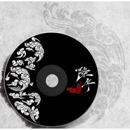

陆年原创同人音乐专辑
============================

|  |  |
| :--: | :-- |
| [ 陆年原创同人音乐专辑](https://emumo.xiami.com/album/372663498) | **艺人**: [归墟原创团队](../index.md) **语种**: 国语 **唱片公司**: 归墟原创团队 **发行时间**: 2013年04月20日 **专辑类别**: 合集, 杂锦 **专辑风格**:  **播放数**: 2474257 **收藏数**: 572 **评论数**: 21  |

## 简介

根据2006年~2013年每一年的代表作而制作的同人原创主题歌曲。与你一起追溯，陆年的回忆

## 曲目

## 评论

|  |  |  |  |
| :-- | :-- | :-- | :-- |
|  [虾米用户](https://emumo.xiami.com/u/403155236) so what if 2019-06-12 14:31 赞(0) 踩(0) | 
很好
 |
|  [虾米用户](https://emumo.xiami.com/u/2050292)   2018-10-19 09:43 赞(0) 踩(0) | 
这张专辑质量真高！
 |
|  [虾米用户](https://emumo.xiami.com/u/282982753)  2017-04-23 13:49 赞(0) 踩(0) | 
草鸡喜欢图大的紫衣重
 |
|  [虾米用户](https://emumo.xiami.com/u/125863800)  2016-04-25 12:27 赞(0) 踩(0) | 
听哭了！  
 |
|  [虾米用户](https://emumo.xiami.com/u/125863800)  2016-04-25 12:27 赞(0) 踩(0) | 
好听
 |
|  [虾米用户](https://emumo.xiami.com/u/52837221)  2015-11-22 22:53 赞(0) 踩(0) | 
给人的感觉很好  传达的感情很到位  这本书不错
 |
|  [虾米用户](https://emumo.xiami.com/u/52837221)  2015-11-22 22:52 赞(0) 踩(0) | 
喜欢白夜行的词曲
 |
|  [虾米用户](https://emumo.xiami.com/u/15650330) 听音乐 2015-05-10 03:12 赞(0) 踩(0) | 
碎月尘花真的真的超赞啊！超喜欢，听着心里总有总淡淡的说不清的情绪！
 |
|  [虾米用户](https://emumo.xiami.com/u/9759144) _(:з」∠)_ 2015-03-21 16:17 赞(2) 踩(0) | 
花间辞和碎月尘花简直好听哭了 T^T
 |
|  [虾米用户](https://emumo.xiami.com/u/2264609) 我还没想好要写什么... 2015-01-10 11:48 赞(1) 踩(0) | 
江南诚真好听
 |
|  [虾米用户](https://emumo.xiami.com/u/41132332)  2014-09-12 08:59 赞(0) 踩(0) | 
很好
 |
|  [虾米用户](https://emumo.xiami.com/u/9463771) ✧٩(ˊωˋ*)و✧ 2014-07-07 21:40 赞(0) 踩(0) | 
棒棒的！！
 |
|  [虾米用户](https://emumo.xiami.com/u/10517016)  2014-06-16 20:26 赞(0) 踩(0) | 
好听
 |
|  [虾米用户](https://emumo.xiami.com/u/301218) 一瓢江湖~我沉浮 2014-05-20 20:34 赞(0) 踩(0) | 
挺不错的原创砖，哈哈
 |
|  [虾米用户](https://emumo.xiami.com/u/12061393) / 2014-05-10 10:22 赞(0) 踩(0) | 
大爱人渣诚
 |
|  [虾米用户](https://emumo.xiami.com/u/1594407)  2014-04-30 16:39 赞(1) 踩(0) | 
永远的诚叔~~！！！！爱死了~
 |
|  [虾米用户](https://emumo.xiami.com/u/14242513) 寂寞永生孤独体 2014-04-28 21:45 赞(0) 踩(0) | 
5
 |
|  [虾米用户](https://emumo.xiami.com/u/2438983) (๑•̀ㅂ•́)و✧ 2014-04-09 21:51 赞(0) 踩(0) | 
聲音好棒！！！！！啊啊啊啊啊啊(*/ω＼*)受不了了惹！！！！！！！！！！
 |
|  [虾米用户](https://emumo.xiami.com/u/5786570)  2014-03-19 02:19 赞(0) 踩(0) | 
(‘▽‘*)
 |
|  [虾米用户](https://emumo.xiami.com/u/1609946) 一即一切 2014-03-12 08:55 赞(0) 踩(0) | 
心 境不二
 |
|  [虾米用户](https://emumo.xiami.com/u/13730660)  2013-12-30 16:07 赞(0) 踩(0) | 
大多曲词优美，某些比较奇怪会被收录其中
 |
