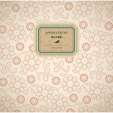

晴日共剪窗
============================

|  |  |
| :--: | :-- |
| [ 晴日共剪窗](https://emumo.xiami.com/album/1296378409) | **艺人**: [程璧](../index.md) **语种**: 国语 **唱片公司**: 独立发行 **发行时间**: 2012年09月16日 **专辑类别**: 录音室专辑 **专辑风格**: 独立民谣 Indie Folk, 根源唱作人 Singer-Songwriter **播放数**: 12475089 **收藏数**: 5488 **评论数**: 132  |

## 简介

  
&nbsp;一把古典吉他，一种温暖声音。  
&nbsp;  
&nbsp;这是从一首诗和一首童谣小曲开始的音乐专辑。  
&nbsp;来自儿时和祖母一起生活在北方小院里的记忆。  
&nbsp;  
&nbsp;等你来听。  
&nbsp;  
&nbsp;少年时候，有很多有关未来的想象。像还未出土的种子，努力地生长，期待着破土，想看看这个世界到底是什么模样。稍稍开始尝试着探出头的那一刻，不巧遇到了厚重的云层，最初看到这世界的第一眼便笼罩了阴影。于是开始怀疑自己曾经那些热烈的想象和原初的梦想，或许就选择了遗忘。  
&nbsp;  
&nbsp;渴望了那么久的内心，所需要的，只是一隙光亮的可能而已。不管古往今来无数应验的道理和逻辑，以及如何正确的判断和分析，内心的声音是，  
&nbsp;  
&nbsp;“我要属于我的那一份可能。”  
&nbsp;  
&nbsp;就这样一直想象下去吧，趁着还年少。不管遇到多么厚重的云层，都不要灰心，不要急着和梦想说再见。那些年少时候固执又美好的认真心情，请永远不要遗忘。  
&nbsp;  
&nbsp;——程璧（Anna's&nbsp;Patio&nbsp;Author&nbsp;&amp;&nbsp;Vocal）  
&nbsp;  
&nbsp;  
&nbsp;专辑曲目  
&nbsp;  
&nbsp;01.在你身后  
&nbsp;02.我还不能确定  
&nbsp;03.给猫夏的你  
&nbsp;04.一个人上路  
&nbsp;  
&nbsp;05.你们  
&nbsp;06.LovingYou  
&nbsp;07.思故乡  
&nbsp;08.LongWay  
&nbsp;09.晴日共剪窗&nbsp;

## 曲目

## 评论

|  |  |  |
| :-- | :-- | :-- |
|  [虾米用户](https://emumo.xiami.com/u/276944698) 不要自我设限..... 2020-08-12 19:47 赞(0) 踩(0) | 

 |
|  [虾米用户](https://emumo.xiami.com/u/442969964)  2020-06-16 20:53 赞(0) 踩(0) | 
下载华为音乐吧，有版权，很神奇，华为很多小众，多元化的音乐有版权的，甚是神奇
 |
|  [虾米用户](https://emumo.xiami.com/u/378368513) yesful，一位姓叶的... 2020-02-29 11:55 赞(0) 踩(0) | 
我把影子画在地上 赋予他奔跑的姿势 多少年来，我一直跟在他后面 看着他如何长大成人 如何在拥挤的都市里 与一棵小草 相爱。这期间 风悄悄带走了一些事物 而另一些 被留了下来
 |
|  [虾米用户](https://emumo.xiami.com/u/43311200) 痛苦的时候听音乐 2019-10-26 14:59 赞(0) 踩(0) | 
如果说浪漫，诗歌更烂漫
 |
|  [虾米用户](https://emumo.xiami.com/u/356180525)  2019-09-13 09:23 赞(0) 踩(0) | 
歌声飄逸就像天上的雲彩
 |
|  [虾米用户](https://emumo.xiami.com/u/283462949)  2019-05-02 23:45 赞(1) 踩(0) | 
晚上静静的听，会有故事
 |
|  [虾米用户](https://emumo.xiami.com/u/423005134) 人生如梦幻泡影 2019-04-16 17:08 赞(2) 踩(0) | 
闲适的风格特别适合逃离浮躁的心
 |
|  [虾米用户](https://emumo.xiami.com/u/17040292) Hasta la vis... 2018-04-16 03:12 赞(0) 踩(0) | 
居然是五年。。快六年前了
 |
|  [虾米用户](https://emumo.xiami.com/u/38573543) 如果只是擦肩而走 又何必... 2018-04-03 16:27 赞(0) 踩(0) | 
请问这首尤克里里的谱吗？
 |
|  [虾米用户](https://emumo.xiami.com/u/140033252)  2018-01-01 09:19 赞(1) 踩(0) | 
浅吟低唱
 |
|  [虾米用户](https://emumo.xiami.com/u/15581053)  2017-12-28 21:45 赞(0) 踩(0) | 
真是程壁最好听的一张专。
 |
|  [虾米用户](https://emumo.xiami.com/u/49955623)  2017-10-27 22:57 赞(7) 踩(0) | 
垃圾微信居然不能分享音乐了！发微博吧~~反正朋友圈里从来不说实话
 |
|  [虾米用户](https://emumo.xiami.com/u/15270473) 听到喜欢的歌 身体不跟着... 2017-09-25 00:19 赞(0) 踩(0) | 
-
 |
|  [虾米用户](https://emumo.xiami.com/u/212075167) Im Ur Ms.Che... 2017-09-20 23:48 赞(0) 踩(0) | 
民谣，我只爱程璧的！
 |
|  [虾米用户](https://emumo.xiami.com/u/169818198) 坚持自己，原来真的很难 2017-07-10 23:26 赞(1) 踩(0) | 
还是喜欢这样的你，一把古典吉他，简单，干净。
 |
|  [虾米用户](https://emumo.xiami.com/u/281080369)   2017-03-17 18:50 赞(0) 踩(0) | 
第一次听，还不错，挺喜欢这种风格
 |
|  [虾米用户](https://emumo.xiami.com/u/30800139) 我在低俗与高雅间活的很尴... 2016-12-03 05:53 赞(0) 踩(0) | 
。
 |
|  [虾米用户](https://emumo.xiami.com/u/2626027)   2016-10-29 16:45 赞(3) 踩(0) | 
原来民谣也可以这么好听...程璧专辑中最喜欢的一张了，很干净、很温暖的声音！
 |
|  [虾米用户](https://emumo.xiami.com/u/40464323) Seizeyourday 2016-07-26 10:18 赞(0) 踩(0) | 
程璧的这张专辑，我最喜欢
 |
|  [虾米用户](https://emumo.xiami.com/u/32678729) 喜欢民谣去听程璧的歌，太... 2016-05-07 12:04 赞(1) 踩(0) | 
好听，太好听。听了她民谣都不想听其他人的
 |
|  [虾米用户](https://emumo.xiami.com/u/17026602)  2016-04-15 23:16 赞(0) 踩(0) | 
为什么她三张专辑里面我反而最喜欢这张。。。
 |
|  [虾米用户](https://emumo.xiami.com/u/6296268)  2016-04-14 10:44 赞(0) 踩(0) | 
留着和孩子一起听 世界多美好
 |
|  [虾米用户](https://emumo.xiami.com/u/6296268)  2016-04-14 10:40 赞(0) 踩(0) | 
诗一样的歌曲，轻快又干净的声音
 |
|  [虾米用户](https://emumo.xiami.com/u/8206106)  2016-04-08 14:21 赞(0) 踩(0) | 
美好 
 |
|  [虾米用户](https://emumo.xiami.com/u/48777594) 半醉半醒日复日 无风无雨... 2016-01-09 10:35 赞(0) 踩(0) | 
对，最爱这张。
 |
|  [虾米用户](https://emumo.xiami.com/u/86027774)  2015-12-02 22:47 赞(0) 踩(0) | 
简单、清纯
 |
|  [虾米用户](https://emumo.xiami.com/u/86027774)  2015-12-02 22:46 赞(0) 踩(0) | 
简单、清纯。
 |
|  [虾米用户](https://emumo.xiami.com/u/7199451) 准备好一双耳朵 2015-11-27 09:13 赞(0) 踩(0) | 
篱前花木满，院外小径芳，四时常相往，晴日共剪窗
 |
|  [虾米用户](https://emumo.xiami.com/u/82562194)  2015-11-13 15:58 赞(0) 踩(0) | 
好听
 |
|  [虾米用户](https://emumo.xiami.com/u/39601508)   2015-10-12 22:52 赞(4) 踩(0) | 
一夏天都不喜欢程璧。呐，现在秋天，她还是那么做作，可是好喜欢。特别这种脚冰凉的晚上。
 |
|  [虾米用户](https://emumo.xiami.com/u/49801629) 行到水穷处，坐看云起时。 2015-10-07 11:11 赞(0) 踩(0) | 
心灵的滋养。
 |
|  [虾米用户](https://emumo.xiami.com/u/55206441)  2015-09-02 12:58 赞(0) 踩(0) | 
晴日共剪窗 程璧
 |
|  [虾米用户](https://emumo.xiami.com/u/53987595)  2015-07-30 21:09 赞(0) 踩(0) | 
好听
 |
|  [虾米用户](https://emumo.xiami.com/u/53987595)  2015-07-30 21:09 赞(0) 踩(0) | 
好听
 |
|  [虾米用户](https://emumo.xiami.com/u/51567500)  2015-07-06 09:15 赞(1) 踩(0) | 
怎么听都不够真诚，我不懂什么文化气息和编曲，我觉得万总赵雷花粥等人的歌更入心，更真诚
 |
|  [虾米用户](https://emumo.xiami.com/u/13789795) 与其期待万千未来，不如活... 2015-06-28 01:15 赞(0) 踩(0) | 
还是最爱晴日共剪窗这张~
 |
|  [虾米用户](https://emumo.xiami.com/u/50548282)  2015-06-16 17:17 赞(1) 踩(0) | 
宁静的歌声
 |
|  [虾米用户](https://emumo.xiami.com/u/50396986)  2015-05-28 19:12 赞(0) 踩(0) | 
就这样温暖而简单
 |
|  [虾米用户](https://emumo.xiami.com/u/87418) 诗人医生音乐行者 2015-05-25 20:37 赞(0) 踩(0) | 
回顾三张专辑，最爱那时学生时期的程璧，双眼澄澈的她对这个世界充满好奇。初心的音乐也同样真实自然！
 |
| ⇒ |  [虾米用户](https://emumo.xiami.com/u/5935661)  2015-05-28 23:01 赞(0) 踩(0) | 
我也最爱这张，虽然很简单，但会更会直接地打动人
 |
|  [虾米用户](https://emumo.xiami.com/u/47059550)  2015-05-23 11:31 赞(0) 踩(0) | 
soft
 |
|  [虾米用户](https://emumo.xiami.com/u/8379754)  2015-05-22 16:02 赞(1) 踩(0) | 
晴日共剪窗
 |
|  [虾米用户](https://emumo.xiami.com/u/50196902)  2015-05-21 09:57 赞(0) 踩(0) | 
简单的两个字，好听。
 |
|  [虾米用户](https://emumo.xiami.com/u/2328959)   2015-05-15 12:43 赞(2) 踩(0) | 
只有我觉得换气时候的声音，每句的开始都怪怪的么？粉丝轻喷。。
 |
| ⇒ |  [虾米用户](https://emumo.xiami.com/u/5532257)  2015-06-23 03:21 赞(0) 踩(0) | 
同感，影响欣赏了
 |
|  [虾米用户](https://emumo.xiami.com/u/44148391) 暂无签名~ 2015-05-13 13:40 赞(0) 踩(0) | 
美女你好
 |
|  [虾米用户](https://emumo.xiami.com/u/9489940) 暂无签名~ 2015-05-12 09:15 赞(0) 踩(0) | 
童谣的感觉
 |
|  [虾米用户](https://emumo.xiami.com/u/49801629) 行到水穷处，坐看云起时。 2015-05-03 23:29 赞(0) 踩(0) | 
离诗最近的声音
 |
|  [虾米用户](https://emumo.xiami.com/u/10414103) 爱音乐爱朱婷！ 2015-05-03 13:40 赞(0) 踩(0) | 
喜欢这种淡雅的专辑封面。
 |
|  [虾米用户](https://emumo.xiami.com/u/33542007) 云雨 2015-04-28 12:07 赞(0) 踩(0) | 
听歌，，喜欢就喜欢，，不喜欢也没关系，，，自在点，不要攻击别人，，，
 |
|  [虾米用户](https://emumo.xiami.com/u/215680) 我还没想好要写什么... 2015-04-25 07:26 赞(2) 踩(0) | 
吗的 就不允许说真话了吗 难道可只能留言好听 赞美之辞  别恶心人  好烂的音乐 简直烂透了
 |
|  [虾米用户](https://emumo.xiami.com/u/215680) 我还没想好要写什么... 2015-04-25 07:24 赞(1) 踩(0) | 
李_mgxm1x： 脑残如你 捧臭脚的煞笔 水军一渣滓  你他吗不要以为设置了不能回复你 就回不了了 心虚 煞笔
 |
|  [虾米用户](https://emumo.xiami.com/u/44147778) 这个人很懒什么都没留下 2015-04-24 22:27 赞(0) 踩(0) | 
好听
 |
|  [虾米用户](https://emumo.xiami.com/u/40997306)  2015-04-23 21:11 赞(0) 踩(0) | 
好听，喜欢
 |
|  [虾米用户](https://emumo.xiami.com/u/46866083)  2015-04-16 22:36 赞(0) 踩(0) | 
江南哥哥的推荐
 |
|  [虾米用户](https://emumo.xiami.com/u/13448819)   2015-04-11 21:55 赞(1) 踩(0) | 
喜欢
 |
|  [虾米用户](https://emumo.xiami.com/u/14033834) 愿归旧时光 2015-04-06 21:22 赞(0) 踩(0) | 
温婉清澈
 |
|  [虾米用户](https://emumo.xiami.com/u/45544601)  2015-04-05 13:38 赞(0) 踩(0) | 
也是在一个种满花的院子里，也是奶奶手把手教的写字。
 |
|  [虾米用户](https://emumo.xiami.com/u/23911438) 高考 2015-04-04 14:03 赞(1) 踩(0) | 
太美了
 |
|  [虾米用户](https://emumo.xiami.com/u/11157355) 榕树长青 2015-03-28 06:40 赞(0) 踩(0) | 
清新民谣
 |
|  [虾米用户](https://emumo.xiami.com/u/355865) Let it go, l... 2015-03-19 20:32 赞(1) 踩(0) | 
<a href="http://emumo.xiami.com/u/4275776" target="_blank" rel="nofollow" name_card="4275776">@320K专门店</a> 不太完美320K
 |
|  [虾米用户](https://emumo.xiami.com/u/31627975) 真想一觉醒来，我还在小学 2015-03-19 11:59 赞(12) 踩(0) | 
声音清亮，具有浓郁的文化气息。缺点就是旋律单一，听一两首还可以，听多了就会昏昏欲睡之感。
 |
| ⇒ |  [虾米用户](https://emumo.xiami.com/u/5021527)  2016-05-07 10:29 赞(0) 踩(0) | 
不懂诗
 |
| ⇒ |  [虾米用户](https://emumo.xiami.com/u/354359694) 和其光 ，同其尘。 2020-06-01 14:06 赞(0) 踩(0) | 
整体氛围依托如此。然则你所得皆失去。
 |
|  [虾米用户](https://emumo.xiami.com/u/215680) 我还没想好要写什么... 2015-03-12 08:51 赞(6) 踩(0) | 
内容已删除
 |
| ⇒ |  [虾米用户](https://emumo.xiami.com/u/40997306)  2015-04-23 21:12 赞(0) 踩(0) | 
你就一脑残，自命不凡一渣
 |
|  [虾米用户](https://emumo.xiami.com/u/2497587) “你心中一定有浓雾的湖泊... 2015-03-11 20:20 赞(1) 踩(0) | 
美妙的嗓音，“又优美又沉静，又清亮又崭新
 |
|  [虾米用户](https://emumo.xiami.com/u/8244559)  2015-03-10 13:07 赞(0) 踩(0) | 
******
 |
|  [虾米用户](https://emumo.xiami.com/u/2393323)  2015-03-08 10:38 赞(0) 踩(0) | 
诗与歌，低吟浅唱。
 |
|  [虾米用户](https://emumo.xiami.com/u/16019688)   2015-03-05 09:41 赞(0) 踩(0) | 
非常舒服
 |
|  [虾米用户](https://emumo.xiami.com/u/8337431) 以乐会友 2015-03-04 07:11 赞(0) 踩(0) | 
独立清新民谣女声 1041185,2692,61
 |
|  [虾米用户](https://emumo.xiami.com/u/21135153) 你若盛开 清风自来 2015-02-15 15:14 赞(1) 踩(0) | 
很温暖澄澈的声音 午后在暖阳里听 非常舒服
 |
|  [虾米用户](https://emumo.xiami.com/u/2559964)  2015-02-14 21:10 赞(0) 踩(0) | 
清澈温暖
 |
|  [虾米用户](https://emumo.xiami.com/u/39813932) 我有我的路，有我的梦～ 2015-02-11 10:06 赞(0) 踩(0) | 
像清风呀！
 |
|  [虾米用户](https://emumo.xiami.com/u/32839)  2015-02-10 18:06 赞(0) 踩(0) | 
安静
 |
|  [虾米用户](https://emumo.xiami.com/u/9105357)  2015-02-08 00:09 赞(0) 踩(0) | 
《晴日共剪窗》好听！
 |
|  [虾米用户](https://emumo.xiami.com/u/39235894) 响者，为乐。 2015-02-06 10:02 赞(0) 踩(0) | 
听到第一声，果断收藏。
 |
|  [虾米用户](https://emumo.xiami.com/u/36134699)  2015-02-04 16:47 赞(0) 踩(0) | 
怎么可以这么纯粹
 |
|  [虾米用户](https://emumo.xiami.com/u/2049667) 千里之行 始于足下 2015-01-24 15:17 赞(0) 踩(0) | 
Loving You 真好听
 |
|  [虾米用户](https://emumo.xiami.com/u/45525046) 好景当前莫留连 2015-01-12 20:46 赞(0) 踩(0) | 
从整体意境的营造上可以看出较清晰的思路，歌者是我的女神，我熟悉她的美学理念。但是实话说歌词还有待打磨
 |
|  [虾米用户](https://emumo.xiami.com/u/44997406) 占位符 2015-01-01 17:41 赞(1) 踩(0) | 
暖心民谣，朴素小诗。澄澈似水，温润如玉。 晴日的午后，静静的听程璧娓娓的唱，我的心里是满的。
 |
|  [虾米用户](https://emumo.xiami.com/u/223346)   2014-12-30 10:16 赞(0) 踩(0) | 
程璧
 |
|  [虾米用户](https://emumo.xiami.com/u/37825428)  2014-12-25 11:38 赞(0) 踩(0) | 
来，一起开始这趟音乐的旅程吧！
 |
|  [虾米用户](https://emumo.xiami.com/u/45172817)  2014-12-22 14:48 赞(0) 踩(0) | 
听着很舒服~
 |
|  [虾米用户](https://emumo.xiami.com/u/45172817)  2014-12-22 14:48 赞(0) 踩(0) | 
非常好听。
 |
|  [虾米用户](https://emumo.xiami.com/u/32308704) 独立之声 2014-12-15 14:36 赞(0) 踩(0) | 
这里有签名版专辑 <a href="http://item.taobao.com/item.htm?spm=2013.1.1998246701.2.OiXHYT&amp;amp;scm=1007.10152.2215.i38678520597&amp;amp;id=38678520597&amp;amp;pvid=ac45caec-3cfb-4f1c-8e3d-58bb92ef7b27" target="_blank" rel="nofollow noreferrer noopener">http://item.taobao.com/item.htm?spm=2013.1.1998246701.2.OiXHYT&amp;amp;scm=1007.10152.2215.i38678520597&amp;amp;id=38678520597&amp;amp;pvid=ac45caec-3cfb-4f1c-8e3d-58bb92ef7b27</a>
 |
|  [虾米用户](https://emumo.xiami.com/u/43485052) 爱民谣爱诗歌爱流浪 2014-12-15 13:21 赞(0) 踩(0) | 
最接近诗歌的声音，女神女神。
 |
|  [虾米用户](https://emumo.xiami.com/u/2229339) El ultimo so... 2014-12-15 10:56 赞(0) 踩(0) | 
诗一般的歌声，回忆的味道。
 |
|  [虾米用户](https://emumo.xiami.com/u/44610400) 暂无签名~ 2014-12-09 13:11 赞(0) 踩(0) | 
很有感觉
 |
|  [虾米用户](https://emumo.xiami.com/u/37678017) 无摇滚，不青春！ 2014-12-08 22:10 赞(1) 踩(0) | 
太文艺小清新了。。。偶尔听听很好、、、
 |
|  [虾米用户](https://emumo.xiami.com/u/44144064)  2014-12-06 22:58 赞(0) 踩(0) | 
很干净，心里很平静，听多了这种调调，心里好舒服
 |
|  [虾米用户](https://emumo.xiami.com/u/39769301)  2014-12-05 21:04 赞(0) 踩(0) | 
女神不解释
 |
|  [虾米用户](https://emumo.xiami.com/u/44404300)  2014-12-04 13:38 赞(0) 踩(0) | 
喜欢，爱爱爱。。
 |
|  [虾米用户](https://emumo.xiami.com/u/44404300)  2014-12-04 13:03 赞(0) 踩(0) | 
当诗遇上歌。
 |
|  [虾米用户](https://emumo.xiami.com/u/15969831) 珍爱生命 远离高科技 2014-12-03 17:59 赞(0) 踩(0) | 
写论文的时候总会把她所有的歌循环，心情会很平静，论文也写的顺畅。
 |
|  [虾米用户](https://emumo.xiami.com/u/2101461)  2014-12-01 14:33 赞(0) 踩(0) | 
一把古典吉他，一种温暖声音。
 |
|  [虾米用户](https://emumo.xiami.com/u/7173218)  2014-11-30 21:38 赞(0) 踩(0) | 
好听
 |
|  [虾米用户](https://emumo.xiami.com/u/5068293) 想…… 2014-11-29 17:02 赞(0) 踩(0) | 
无需太多渲染，干净清新民谣风！
 |
|  [虾米用户](https://emumo.xiami.com/u/44124477)  2014-11-26 19:15 赞(0) 踩(0) | 
纯粹 简单
 |
|  [虾米用户](https://emumo.xiami.com/u/7337401)  2014-11-26 14:21 赞(0) 踩(0) | 
循环听  感谢心理敞亮亮的
 |
|  [虾米用户](https://emumo.xiami.com/u/8858470) 音樂無需定義，我聽我所愛 2014-11-20 11:47 赞(1) 踩(0) | 
真的有一瞬间感觉程壁的曲子可以治病治抑郁！！
 |
|  [虾米用户](https://emumo.xiami.com/u/11175071) 云卷云舒，看庭前花开花落... 2014-11-19 00:07 赞(0) 踩(0) | 
程璧，我爱你，我爱死你的歌了，我恨自己为什么这么晚才听到你的歌。
 |
| ⇒ |  [虾米用户](https://emumo.xiami.com/u/25798597) My own... mu... 2014-12-05 22:51 赞(0) 踩(0) | 
哈哈 跟你一样的感觉
 |
|  [虾米用户](https://emumo.xiami.com/u/30410517) 待人要在有疑处不疑。 2014-11-18 22:13 赞(0) 踩(0) | 
好听！比陈绮贞耐听很多！
 |
|  [虾米用户](https://emumo.xiami.com/u/39688432)  2014-11-18 21:15 赞(1) 踩(0) | 
我的心被撫慰了
 |
|  [虾米用户](https://emumo.xiami.com/u/42593795) 自爱，沉稳，而后爱人。 2014-11-14 09:53 赞(0) 踩(0) | 
冬日也温暖。:-)
 |
|  [虾米用户](https://emumo.xiami.com/u/355865) Let it go, l... 2014-11-04 00:40 赞(1) 踩(0) | 
完爆那个什么娟什么民的一百条街！！！！
 |
| ⇒ |  [虾米用户](https://emumo.xiami.com/u/22822232)  2015-02-24 11:16 赞(0) 踩(0) | 
哈哈哈哈
 |
|  [虾米用户](https://emumo.xiami.com/u/2431361)  2014-10-28 15:17 赞(0) 踩(0) | 
不错哦
 |
|  [虾米用户](https://emumo.xiami.com/u/33699568) u little fuc... 2014-10-20 21:15 赞(0) 踩(0) | 
代YDF下专辑。
 |
|  [虾米用户](https://emumo.xiami.com/u/39778862)  2014-10-20 16:58 赞(0) 踩(0) | 
舒适惬意
 |
|  [虾米用户](https://emumo.xiami.com/u/19966781) 听，音符在呼吸 2014-10-17 13:38 赞(0) 踩(0) | 
很有磁性的声音~吉他伴奏很质朴，喜欢这样的风格。
 |
|  [虾米用户](https://emumo.xiami.com/u/11259253) 听靓歌 2014-10-15 14:57 赞(0) 踩(0) | 
好听
 |
|  [虾米用户](https://emumo.xiami.com/u/11259253) 听靓歌 2014-10-15 14:55 赞(0) 踩(0) | 
靓声靓音，喜欢。
 |
|  [虾米用户](https://emumo.xiami.com/u/2700662)  2014-10-11 09:39 赞(0) 踩(0) | 
喜欢她的声音，很清淡
 |
|  [虾米用户](https://emumo.xiami.com/u/41296371) zqlian670505 2014-09-26 20:31 赞(0) 踩(0) | 
好听
 |
|  [虾米用户](https://emumo.xiami.com/u/2948329) 諳 2014-09-16 13:28 赞(0) 踩(0) | 
我把活着喜欢过了，喜欢这种淡淡的温暖，好适合唱给孩子听
 |
|  [虾米用户](https://emumo.xiami.com/u/5083967) 我高冷_(:3」∠ 2014-09-10 22:38 赞(0) 踩(0) | 
太适合一个人安静的时候去品位了
 |
|  [虾米用户](https://emumo.xiami.com/u/32118586) 不可一日无音乐 2014-09-10 21:35 赞(0) 踩(0) | 
很温暖！
 |
|  [虾米用户](https://emumo.xiami.com/u/36188972) hey~~ 2014-09-05 16:22 赞(0) 踩(0) | 
新民谣，不错！
 |
|  [虾米用户](https://emumo.xiami.com/u/40072215)  2014-08-16 23:45 赞(0) 踩(0) | 
晴日共剪窗
 |
|  [虾米用户](https://emumo.xiami.com/u/21743552) 乘喷射机离去 2014-08-15 20:56 赞(0) 踩(0) | 
好听！
 |
|  [虾米用户](https://emumo.xiami.com/u/33747830)  2014-07-24 02:15 赞(0) 踩(0) | 
我在NHK“看电视学中文”的节目里看见您，感到兴趣来这里了。祝您哪天在除夜的NHK红白歌合战中出场！
 |
|  [虾米用户](https://emumo.xiami.com/u/9131603) ponyo 2014-04-14 11:19 赞(0) 踩(0) | 
那年夏天的歌 听到Anna的声音心就会静下来：）加油
 |
|  [虾米用户](https://emumo.xiami.com/u/35065094)  2014-04-08 13:29 赞(1) 踩(0) | 
在安静里听谢天笑，在喧闹里听程璧，会有你想要的收货。
 |
|  [虾米用户](https://emumo.xiami.com/u/34946008)  2014-04-05 19:21 赞(0) 踩(0) | 
遐想
 |
|  [虾米用户](https://emumo.xiami.com/u/10994561)   2014-04-04 00:17 赞(0) 踩(0) | 
看到程璧姐姐说可以在虾米上收听 赶紧来收藏下载～随时都可以听啦好赞！
 |
|  [虾米用户](https://emumo.xiami.com/u/21869873) 无挂碍故无有恐怖 2014-04-03 23:38 赞(0) 踩(0) | 
阳光明媚的女子。
 |
|  [虾米用户](https://emumo.xiami.com/u/34843852)  2014-04-03 13:02 赞(0) 踩(0) | 
赶过来支持程璧
 |
|  [虾米用户](https://emumo.xiami.com/u/33806133)  2014-04-03 11:01 赞(0) 踩(0) | 
很喜欢这种清澈的嗓音，支持程璧
 |
|  [虾米用户](https://emumo.xiami.com/u/34822124)  2014-04-02 20:53 赞(0) 踩(0) | 
祝贺
 |
|  [虾米用户](https://emumo.xiami.com/u/2560145) 666 2014-04-02 15:41 赞(0) 踩(0) | 
给Anna点赞
 |
|  [虾米用户](https://emumo.xiami.com/u/11097325) h3nng 2014-04-02 08:08 赞(0) 踩(0) | 
第一时间赶来祝贺！
 |
