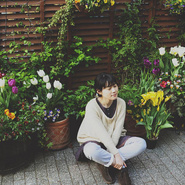

花房姑娘原唱：崔健
============================

|  |  |
| :--: | :-- |
| [ 花房姑娘原唱：崔健](https://emumo.xiami.com/album/1321694928) | **艺人**: [程璧](../index.md) **语种**: 国语 **唱片公司**: 独立发行 **发行时间**: 2015年01月20日 **专辑类别**: EP, 单曲 **专辑风格**: 独立民谣 Indie Folk **播放数**: 5269988 **收藏数**: 2495 **评论数**: 128  |

## 简介

这一次，听古典吉他“花房姑娘”唱《花房姑娘》。
 

 
 

《花房姑娘》（姑娘版）
 

 
 

你独自走过我身旁,并没有话要对我讲,
 

你不敢抬头看着我,噢......脸庞.
 

我问你要去向何方，你指着大海的方向,
 

我的惊奇像是给你,噢......赞扬.
 

我带你走进我的花房，你无法逃脱花的迷香,
 

你不知不觉忘记了,噢......方向,
 

我说你世上最坚强,你说我世上最善良,
 

你不知不觉已和花儿,噢......一样
 

我要你留在这地方,我要你和它们一样,
 

你看着我默默地说,噢......不能这样,
 

你想要回到老地方,你想要走在老路上,
 

这时你才知我已离不开!噢......这个姑娘!
 

你就要回到老地方,你就要走在老路上,
 

这时你才知我已离不开!噢......花房姑娘!
 

 

## 曲目

## 评论

|  |  |  |  |
| :-- | :-- | :-- | :-- |
|  [虾米用户](https://emumo.xiami.com/u/446381253)  2021-01-11 10:19 赞(0) 踩(0) | 
心……融化了……是的，化了……！就像安河桥下的水……
 |
|  [虾米用户](https://emumo.xiami.com/u/404418007)  2020-02-18 23:01 赞(0) 踩(0) | 
很棒！
 |
|  [虾米用户](https://emumo.xiami.com/u/296904594) 思念如燕，它飞舞舌尖，若... 2019-07-28 21:32 赞(0) 踩(0) | 
好听
 |
|  [虾米用户](https://emumo.xiami.com/u/328525066)  2019-05-31 12:25 赞(0) 踩(0) | 
喜欢
 |
|  [虾米用户](https://emumo.xiami.com/u/10395377) 要不然呢。 2019-01-18 17:14 赞(1) 踩(0) | 
也许很多人不喜欢，但我想说我喜欢就好。
 |
|  [虾米用户](https://emumo.xiami.com/u/5556654)  2018-01-10 16:49 赞(1) 踩(0) | 
很纯静的吉它音，很纯静的嗓音，可以瞬间让人平静下来。我推荐
 |
|  [虾米用户](https://emumo.xiami.com/u/4161151)   2017-10-27 22:57 赞(1) 踩(0) | 
好喜欢崔健的花房姑娘，但被你的温柔击溃了……前者是震撼，后者是直掏你心窝
 |
|  [虾米用户](https://emumo.xiami.com/u/15270473) 听到喜欢的歌 身体不跟着... 2017-09-25 13:00 赞(0) 踩(0) | 
-
 |
|  [虾米用户](https://emumo.xiami.com/u/318605989) 我不愛你 2017-08-22 17:39 赞(0) 踩(0) | 
好听
 |
|  [虾米用户](https://emumo.xiami.com/u/760301) 慈。 2017-06-29 23:15 赞(0) 踩(0) | 
Fado版
 |
|  [虾米用户](https://emumo.xiami.com/u/135041640)  2017-04-16 10:35 赞(0) 踩(0) | 
催眠挺好的
 |
|  [虾米用户](https://emumo.xiami.com/u/5205750)  2017-03-18 13:53 赞(0) 踩(0) | 
没理由
 |
|  [虾米用户](https://emumo.xiami.com/u/138549804)  2016-08-11 00:58 赞(0) 踩(0) | 
没有由来的一杯清茶，就这么沁入心脾
 |
|  [虾米用户](https://emumo.xiami.com/u/33651826)  2016-07-01 14:13 赞(0) 踩(0) | 
才v
 |
|  [虾米用户](https://emumo.xiami.com/u/9147470) 神有沒有長毛的部位 2016-06-19 12:06 赞(24) 踩(0) | 
程壁的唱法，確實是滿好聽的，讓人忍不住重聽好幾遍。可是原來的老崔，抒情與意識形態反思兼而有之，花房姑娘不只是男女愛情，也暗喻人民大眾在國家主義路線下的盲目。可惜的是，小清新程壁版本就只有風花雪月了。這是不是意味著，今日中國都市中產階級，對於政治現實，是有意的視而不見呢？我自己覺得，民謠這種文類，不能夠因為追求甜美，而完全放棄啟蒙。還是老問題：甚麼才是民謠裡最美麗的東西？有一種關於生命底層、粗糙與艱難的美，尤其美的無與倫比。(所以蘇陽樂隊跟五條人，才是今日中國民謠的王者啊~~)
 |
| ⇒ |  [虾米用户](https://emumo.xiami.com/u/19833186) 我还没想好要写什么... 2016-06-29 22:35 赞(0) 踩(0) | 
冷漠 是中产阶级的一大特点。世上任何一个地方都是这样。
 |
| ⇒ |  [虾米用户](https://emumo.xiami.com/u/11378231)  2016-07-18 21:57 赞(0) 踩(0) | 
可是老崔是摇滚，程壁是民谣啊
 |
| ⇒ |  [虾米用户](https://emumo.xiami.com/u/1324510)  2017-04-10 11:14 赞(0) 踩(0) | 
到位
 |
| ⇒ |  [虾米用户](https://emumo.xiami.com/u/10395377) 要不然呢。 2019-01-18 17:13 赞(0) 踩(0) | 
追求美，追求好生活本身没错。如果事事都要反应社会，反映现实，那活得该有多累呀。反正我是追求听觉上的享受，你可以说这很庸俗，但我觉得喜欢就好。不可能要求每个人都一样，在我的认识上，音乐无高低之分，只有喜欢与不喜欢。
 |
|  [虾米用户](https://emumo.xiami.com/u/30640610)  2016-05-26 08:44 赞(0) 踩(0) | 
只能说， 声音很纯净～
 |
|  [虾米用户](https://emumo.xiami.com/u/25633986)  2016-05-01 15:59 赞(2) 踩(0) | 
春的午后软软的风吹,听这首清新的歌让我美梦一场...
 |
|  [虾米用户](https://emumo.xiami.com/u/23422346)  2016-04-20 22:11 赞(2) 踩(0) | 
很安静很温暖~
 |
|  [虾米用户](https://emumo.xiami.com/u/48188986)  2016-04-20 16:48 赞(0) 踩(0) | 
唉
 |
|  [虾米用户](https://emumo.xiami.com/u/1582817) 若收藏精选集已删除，请用... 2016-03-19 19:09 赞(17) 踩(0) | 
◔‸◔ 棉花糖 ▰˘︵˘▰ zZ☡▪•●
 |
|  [虾米用户](https://emumo.xiami.com/u/1601818)  2016-03-19 12:40 赞(1) 踩(0) | 
改得很动听
 |
|  [虾米用户](https://emumo.xiami.com/u/21499013)  2016-03-05 20:53 赞(0) 踩(0) | 
轻柔
 |
|  [虾米用户](https://emumo.xiami.com/u/37422047)  2016-03-03 14:42 赞(1) 踩(0) | 
一种如水般潺潺，淡淡的美好回忆
 |
|  [虾米用户](https://emumo.xiami.com/u/37422047)  2016-03-03 14:41 赞(1) 踩(0) | 
午后的阳光下，品一杯茶，勾起一段美好的回忆~~
 |
|  [虾米用户](https://emumo.xiami.com/u/24218894)  2016-02-24 00:10 赞(0) 踩(0) | 
悠闲自在时听还可以
 |
|  [虾米用户](https://emumo.xiami.com/u/404489) 我普普通通，我杀猪的 2016-02-19 14:51 赞(2) 踩(0) | 
非常喜欢，唱出了另一种味道
 |
|  [虾米用户](https://emumo.xiami.com/u/97900222)  2016-01-06 13:32 赞(1) 踩(0) | 
老程家的姑娘 
 |
|  [虾米用户](https://emumo.xiami.com/u/87860480) 音乐与爱不舍情怀 2015-12-30 20:36 赞(0) 踩(0) | 
清新单纯。。。。花房姑娘！
 |
|  [虾米用户](https://emumo.xiami.com/u/35010098) 看，袜子总会找到的 2015-11-18 11:36 赞(0) 踩(0) | 
可能就留下了
 |
|  [虾米用户](https://emumo.xiami.com/u/69705268) 三观极正 2015-10-24 19:14 赞(0) 踩(0) | 
6
 |
|  [虾米用户](https://emumo.xiami.com/u/45578270) 这家伙很聪明什么也没留下... 2015-10-07 14:16 赞(0) 踩(0) | 
高三知道程璧
 |
| ⇒ |  [虾米用户](https://emumo.xiami.com/u/77402336)  2015-11-08 23:22 赞(0) 踩(0) | 
我也是。
 |
|  [虾米用户](https://emumo.xiami.com/u/65051576) 呵呵你妹 2015-09-15 08:34 赞(0) 踩(0) | 
10分
 |
|  [虾米用户](https://emumo.xiami.com/u/844972) Rocker 2015-09-13 10:23 赞(1) 踩(0) | 
不觉得，这是av配音时的，录音风格吗？？？？？？？？？？？？？？   
 |
| ⇒ |  [虾米用户](https://emumo.xiami.com/u/6491765) 我只是个门外汉。 2015-10-13 19:07 赞(0) 踩(0) | 
把你的评论顶上去233333d=====(￣▽￣*)b
 |
|  [虾米用户](https://emumo.xiami.com/u/55141046)   2015-08-23 10:58 赞(0) 踩(0) | 
爱程璧
 |
|  [虾米用户](https://emumo.xiami.com/u/21062251) defy-gravity 2015-08-18 21:13 赞(0) 踩(0) | 
。
 |
|  [虾米用户](https://emumo.xiami.com/u/7322777) ∮ 2015-08-12 01:24 赞(0) 踩(0) | 
...A...
 |
|  [虾米用户](https://emumo.xiami.com/u/30464948) 我还没想好要写什么... 2015-08-11 22:46 赞(0) 踩(0) | 
。。。。。。。。。。。。。
 |
|  [虾米用户](https://emumo.xiami.com/u/44992692)  2015-08-10 17:30 赞(0) 踩(0) | 
我带你走进我的花房
 |
|  [虾米用户](https://emumo.xiami.com/u/10238117) 时光不染 回忆不淡 2015-07-15 22:56 赞(4) 踩(0) | 
把老崔版本的印象抹去，单纯的来听就好。爱情的两个形态，一份热烈冲动加一份深情和温柔，这样就更加完美。
 |
|  [虾米用户](https://emumo.xiami.com/u/8203803)  2015-07-05 13:37 赞(0) 踩(0) | 
你想要回到老地方，你想要走在老路上，这时你才知离不开，噢哦~花房姑娘！   
 |
|  [虾米用户](https://emumo.xiami.com/u/50828735) 借喜欢一首歌的方式怀念一... 2015-06-16 10:36 赞(1) 踩(0) | 
不一样的花房姑娘
 |
|  [虾米用户](https://emumo.xiami.com/u/311261)  2015-06-09 21:59 赞(1) 踩(0) | 
花房姑娘也能翻成这样的清新文艺范儿！
 |
|  [虾米用户](https://emumo.xiami.com/u/26449007)  2015-05-28 19:46 赞(6) 踩(0) | 
现在的心情也只配的上听这样的歌了。不过是欲望，不过是未得到，一切都会好的。
 |
|  [虾米用户](https://emumo.xiami.com/u/13561372)  2015-05-24 19:16 赞(2) 踩(0) | 
好喜欢程璧
 |
|  [虾米用户](https://emumo.xiami.com/u/44148391) 暂无签名~ 2015-05-13 12:59 赞(0) 踩(0) | 
温柔的花房姑娘
 |
|  [虾米用户](https://emumo.xiami.com/u/49885237)  2015-05-10 20:43 赞(1) 踩(0) | 
ht
 |
|  [虾米用户](https://emumo.xiami.com/u/33908668)  2015-05-05 22:59 赞(1) 踩(0) | 
于寂静处闻心声。
 |
|  [虾米用户](https://emumo.xiami.com/u/45878215) 语言停止的地方，音乐开始... 2015-04-13 19:21 赞(0) 踩(0) | 
说故事的人。
 |
|  [虾米用户](https://emumo.xiami.com/u/13704947) 豆瓣见：无悲渊。 2015-04-11 00:25 赞(1) 踩(0) | 
这张封面是十一岁的。
 |
|  [虾米用户](https://emumo.xiami.com/u/48330439)  2015-04-05 11:00 赞(1) 踩(0) | 
崔健的歌，还有首《假行僧》，本来是狂野粗放，被程璧唱得柔情舒缓，另有一种味道，甚至听多遍后有小野丽莎演唱歌声中溶化的感觉。
 |
|  [虾米用户](https://emumo.xiami.com/u/314018)  2015-04-03 18:33 赞(1) 踩(0) | 
不行,这曲子还的男人唱...
 |
|  [虾米用户](https://emumo.xiami.com/u/47256466) 梦 2015-03-18 13:14 赞(0) 踩(0) | 
第一句给我身体过电的感觉
 |
|  [虾米用户](https://emumo.xiami.com/u/48211623) 就独爱程璧之歌 2015-03-16 23:49 赞(1) 踩(0) | 
爱程璧的歌！！！
 |
|  [虾米用户](https://emumo.xiami.com/u/12874493) Maybe I Miss... 2015-03-15 11:56 赞(0) 踩(0) | 
那人那景已物是人非 今天才听懂 你要走我无法挽留
 |
|  [虾米用户](https://emumo.xiami.com/u/45082224) 已不再是曾经那个他了。 2015-03-15 08:40 赞(0) 踩(0) | 
好慢。。。
 |
|  [虾米用户](https://emumo.xiami.com/u/12212283)  2015-03-13 22:38 赞(13) 踩(0) | 
再一次听到 了这首歌，已经泪流满面了，这是很多年以前的事了，不禁想起那时抱起吉他满街走的情景
 |
|  [虾米用户](https://emumo.xiami.com/u/48107017)  2015-03-13 22:37 赞(0) 踩(0) | 
不错
 |
|  [虾米用户](https://emumo.xiami.com/u/47577064) 杂食耳 2015-03-11 13:07 赞(23) 踩(0) | 
我去，煎熬死，拖死了，中午的炒拉条都吐出来了，，，老崔不是谁都能改的
 |
| ⇒ |  [虾米用户](https://emumo.xiami.com/u/111966934)  2016-02-09 01:04 赞(0) 踩(0) | 
听不出感觉就别吐槽
 |
| ⇒ |  [虾米用户](https://emumo.xiami.com/u/195283282)  2016-06-29 10:06 赞(0) 踩(0) | 
//!ubnbbc
 |
|  [虾米用户](https://emumo.xiami.com/u/34191800)  2015-03-05 14:51 赞(0) 踩(0) | 
对老歌和那个时代的回忆
 |
|  [虾米用户](https://emumo.xiami.com/u/173665)  2015-02-14 11:53 赞(1) 踩(0) | 
动情，好听
 |
|  [虾米用户](https://emumo.xiami.com/u/518101) 甜食终结者 2015-02-13 11:49 赞(0) 踩(0) | 
你听见心里的声音了吗？
 |
|  [虾米用户](https://emumo.xiami.com/u/23393337)  the magic o... 2015-02-13 09:57 赞(2) 踩(0) | 
喜欢简洁而不简单的程璧。
 |
|  [虾米用户](https://emumo.xiami.com/u/6235155)  2015-02-12 23:56 赞(51) 踩(0) | 
若老崔遇到这个样的姑娘，他绝对写不出当年的花房姑娘。
 |
| ⇒ |  [虾米用户](https://emumo.xiami.com/u/143427694)  2019-08-22 19:10 赞(0) 踩(0) | 
你的意思，老崔当年遇到了女汉子？
 |
|  [虾米用户](https://emumo.xiami.com/u/39213700)  2015-02-12 17:45 赞(0) 踩(0) | 
虽然歌曲少了点什么  但是听起来很安静 有时候脑袋混乱时候听有高音的歌 反而很乱心情很噪 我每天都在设计有时候一首歌都没有时间换一听 十几遍 这首歌 真的是我唯一一首脑袋不会很噪的歌曲 安静舒服 就够了
 |
|  [虾米用户](https://emumo.xiami.com/u/839576)  2015-02-06 19:05 赞(2) 踩(0) | 
其实很好听了，但感觉改得还是不够彻底，还有点拘谨……
 |
|  [虾米用户](https://emumo.xiami.com/u/46884619)  2015-02-03 15:58 赞(1) 踩(0) | 
一条路，慢慢走。活着，且优雅……汲取，绽放。祝福你 ……自由而无用 ……
 |
|  [虾米用户](https://emumo.xiami.com/u/45494631)  2015-01-28 17:20 赞(0) 踩(0) | 
很好听！！！期待新专
 |
|  [虾米用户](https://emumo.xiami.com/u/1580082) 今夕何夕。 2015-01-25 18:08 赞(0) 踩(0) | 
柔化版花房姑娘。
 |
|  [虾米用户](https://emumo.xiami.com/u/1360229) 独立动画独立乐独立思想 2015-01-25 15:49 赞(3) 踩(0) | 
还是崔健的好 女生不适合唱介个
 |
|  [虾米用户](https://emumo.xiami.com/u/31987089) 逃避可耻也无用 2015-01-25 00:21 赞(0) 踩(0) | 
我觉得还是蛮好听的^_^，很柔很舒服的声音啊～
 |
|  [虾米用户](https://emumo.xiami.com/u/522205) 一切很美，音為有你﹏ 2015-01-24 05:52 赞(0) 踩(0) | 
完全是另一首歌了~
 |
|  [虾米用户](https://emumo.xiami.com/u/46383203)  2015-01-23 15:54 赞(0) 踩(0) | 
有感觉，细腻！
 |
|  [虾米用户](https://emumo.xiami.com/u/5742061) 想要的都拥有，得不到的都... 2015-01-23 09:10 赞(0) 踩(0) | 
好吧，听了十遍之后，觉得不当做是花房姑娘，就声音而言，还是不错的。
 |
|  [虾米用户](https://emumo.xiami.com/u/286744)   2015-01-22 22:58 赞(0) 踩(0) | 
谢谢  听得心痛
 |
|  [虾米用户](https://emumo.xiami.com/u/7942083)  2015-01-22 20:25 赞(1) 踩(0) | 
喜欢程璧 但花房姑娘真心不适合这样唱
 |
|  [虾米用户](https://emumo.xiami.com/u/5742061) 想要的都拥有，得不到的都... 2015-01-22 20:11 赞(0) 踩(0) | 
前奏好，不过看在小清新支持一下！
 |
|  [虾米用户](https://emumo.xiami.com/u/25257857)  2015-01-22 14:39 赞(0) 踩(0) | 
感觉还是好怪。还是恋恋风尘适合这样唱。这首歌更适合快点唱。。虽然情感挺好。
 |
|  [虾米用户](https://emumo.xiami.com/u/1620854) 12.25 圣诞节西安V... 2015-01-22 11:20 赞(0) 踩(0) | 
除了前奏古典味儿不是很彻底啊
 |
|  [虾米用户](https://emumo.xiami.com/u/9988671) 音你尔悦 2015-01-22 09:20 赞(0) 踩(0) | 
来了
 |
|  [虾米用户](https://emumo.xiami.com/u/37205247)  2015-01-21 22:48 赞(0) 踩(0) | 
这首歌略沉嗓音更让人喜欢啊，之前的太小太清新。
 |
|  [虾米用户](https://emumo.xiami.com/u/31862634)  2015-01-21 21:43 赞(1) 踩(0) | 
感觉比小娟和老狼那版好听
 |
|  [虾米用户](https://emumo.xiami.com/u/10435106) 听靓歌 2015-01-21 19:43 赞(0) 踩(0) | 
不错。
 |
|  [虾米用户](https://emumo.xiami.com/u/36447060) Woods-keeper 2015-01-21 14:18 赞(0) 踩(0) | 
稀饭~
 |
|  [虾米用户](https://emumo.xiami.com/u/8672327)  2015-01-21 11:36 赞(0) 踩(0) | 
喜欢
 |
|  [虾米用户](https://emumo.xiami.com/u/32202849) 暂无签名~ 2015-01-21 11:14 赞(1) 踩(0) | 
我喜欢
 |
|  [虾米用户](https://emumo.xiami.com/u/11259253) 听靓歌 2015-01-21 09:52 赞(0) 踩(0) | 
不错。
 |
|  [虾米用户](https://emumo.xiami.com/u/14877245) geqidan 2015-01-21 08:47 赞(1) 踩(0) | 
慢慢来，不要紧，自己感觉美好就很好
 |
|  [虾米用户](https://emumo.xiami.com/u/9877518) Wanted On Vo... 2015-01-21 04:03 赞(0) 踩(0) | 
超爱，考试就要听这样的歌啊（≧∇≦）
 |
| ⇒ |  [虾米用户](https://emumo.xiami.com/u/1498042) 我还没想好要写什么... 2015-01-21 09:04 赞(0) 踩(0) | 
对的！考试周就指着这些歌活着了！T_T
 |
|  [虾米用户](https://emumo.xiami.com/u/1399104)  2015-01-20 19:30 赞(0) 踩(0) | 
差评差评，必须差评。
 |
|  [虾米用户](https://emumo.xiami.com/u/1399104)  2015-01-20 19:14 赞(2) 踩(0) | 
直接感觉是，单调；耐着性子仔细听了几遍，无比单调。音乐太简单了。
 |
| ⇒ |  [虾米用户](https://emumo.xiami.com/u/40221473) 傲娇即是正义！ 2015-01-21 19:52 赞(0) 踩(0) | 
但是对于大多数喜欢她的歌的人来说 ，就是这样安安静静简简单单的最能打动他们。兴趣不一样吧
 |
| ⇒ |  [虾米用户](https://emumo.xiami.com/u/1399104)  2015-01-21 20:32 赞(0) 踩(0) | 
<q><b>399号森森家说：</b></q>
 |
| ⇒ |  [虾米用户](https://emumo.xiami.com/u/40221473) 傲娇即是正义！ 2015-01-21 20:34 赞(0) 踩(0) | 
<q><b>chester说：</b></q>
 |
| ⇒ |  [虾米用户](https://emumo.xiami.com/u/1399104)  2015-01-21 20:38 赞(0) 踩(0) | 
<q><b>399号森森家说：</b></q>
 |
| ⇒ |  [虾米用户](https://emumo.xiami.com/u/40221473) 傲娇即是正义！ 2015-01-21 20:48 赞(0) 踩(0) | 
<q><b>chester说：</b></q>
 |
|  [虾米用户](https://emumo.xiami.com/u/12356186) 那些疲惫生活中的英雄梦想 2015-01-20 18:56 赞(0) 踩(0) | 
淡淡的忧桑
 |
|  [虾米用户](https://emumo.xiami.com/u/8865162) Freedom 2015-01-20 16:58 赞(0) 踩(0) | 
今天晚上又不怕失眠了
 |
|  [虾米用户](https://emumo.xiami.com/u/32623827) 独立音乐人刘昰 2015-01-20 15:24 赞(0) 踩(0) | 
喜欢她这个人 和声音
 |
| ⇒ |  [虾米用户](https://emumo.xiami.com/u/42676900) 音乐感知心灵 2015-01-24 23:20 赞(0) 踩(0) | 
和你一样！
 |
|  [虾米用户](https://emumo.xiami.com/u/43554089)   2015-01-20 13:46 赞(0) 踩(0) | 
很好听，安静！！
 |
|  [虾米用户](https://emumo.xiami.com/u/6779864) 头发长见识短 2015-01-20 10:54 赞(1) 踩(0) | 
听着要睡着了，不好听
 |
|  [虾米用户](https://emumo.xiami.com/u/1670510) 职业黑 2015-01-20 10:32 赞(1) 踩(0) | 
海上轻风，午后暖光。声声柔美，字字芬芳。听此一曲，如闻花香~
 |
|  [虾米用户](https://emumo.xiami.com/u/42912089) 陷入民谣的海 2015-01-20 10:28 赞(0) 踩(0) | 
好好听
 |
|  [虾米用户](https://emumo.xiami.com/u/3425353)  2015-01-20 10:27 赞(1) 踩(0) | 
编得过了点 没有一点激情了  可惜  ！ 单论音乐 还是很不错的！
 |
|  [虾米用户](https://emumo.xiami.com/u/3666620)  2015-01-20 10:23 赞(0) 踩(0) | 
不错
 |
|  [虾米用户](https://emumo.xiami.com/u/3598046) 孤独听吻 2015-01-20 10:21 赞(0) 踩(0) | 
所以买了风信子~
 |
|  [虾米用户](https://emumo.xiami.com/u/5437507) 爱将我们分离 2015-01-20 10:21 赞(0) 踩(0) | 
小壁壁
 |
|  [虾米用户](https://emumo.xiami.com/u/39952575) 舍不得虾米音乐 2015-01-20 10:16 赞(0) 踩(0) | 
舒服！
 |
|  [虾米用户](https://emumo.xiami.com/u/43651094) 我们的生活多美好 2015-01-20 10:14 赞(0) 踩(0) | 
睡眠曲
 |
|  [虾米用户](https://emumo.xiami.com/u/1274422)  2015-01-20 10:10 赞(0) 踩(0) | 
你听
 |
|  [虾米用户](https://emumo.xiami.com/u/40032589)  2015-01-20 10:10 赞(0) 踩(0) | 
一如既往的好听
 |
|  [虾米用户](https://emumo.xiami.com/u/28196968)  2015-01-20 10:09 赞(0) 踩(0) | 
唉，自己养的花全养死了。。。
 |
|  [虾米用户](https://emumo.xiami.com/u/19593335) never give u... 2015-01-20 10:06 赞(0) 踩(0) | 
听前奏就醉了.....
 |
|  [虾米用户](https://emumo.xiami.com/u/34831732) Hell nawh to... 2015-01-20 10:06 赞(0) 踩(0) | 
嗯
 |
|  [虾米用户](https://emumo.xiami.com/u/1618810) 毙 2015-01-20 10:04 赞(0) 踩(0) | 
前排扎眼挺好 但感觉这歌慢唱要睡着zzz...
 |
|  [虾米用户](https://emumo.xiami.com/u/5851736) 我们来聊章北海！ 2015-01-20 10:03 赞(0) 踩(0) | 
哦？？？
 |
|  [虾米用户](https://emumo.xiami.com/u/111411)  2015-01-20 10:02 赞(0) 踩(0) | 
板凳
 |
|  [虾米用户](https://emumo.xiami.com/u/8901312)   2015-01-20 10:02 赞(0) 踩(0) | 
沙发
 |
