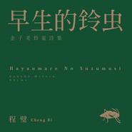

早生的铃虫
============================

|  |  |
| :--: | :-- |
| [ 早生的铃虫](https://emumo.xiami.com/album/2100363231) | **艺人**: [程璧](../index.md) **语种**: 国语 **唱片公司**: 独立发行 **发行时间**: 2016年08月09日 **专辑类别**: 录音室专辑 **专辑风格**: 独立民谣 Indie Folk **播放数**: 3528703 **收藏数**: 2701 **评论数**: 170  |

## 简介

<strong>专辑付费试听下载，可以选择购买整张专辑：16元/张，也可选择单曲购买2元/首~现开放VIP免费试听下载了哦~  
其中四首歌曲免费试听下载哦~</strong>  
  
无拘无束 孩童视角 
当程璧与金子美铃相遇 
诗与歌再次跨界重逢 
可爱丰富 纯真深邃 
从2015年秋天开始酝酿，经过将近一年打磨梳理，2016夏末秋初，程璧最新专辑《早生的铃虫》终于得以完成。本次专辑全部以日本童谣女诗人金子美铃的诗歌为创作素材，选取了十一首诗歌作品，并仍旧由程璧自己完成专辑内全部作曲。大学时代日语系出身的她，同时承担了其中七首诗歌的文本翻译工作。 
金子美铃是活跃于上个世纪20年代的日本童谣诗人，她的诗中用儿童最自然的状态来体验、感觉这个世界。诗人一生不幸如影随形，三岁时父亲早逝，母亲改嫁，婚姻坎坷。这样的生活境遇，她写出的诗歌却明亮有力，“向着明亮那方，哪怕烧焦了翅膀，也要向着灯火闪烁的方向”。看似童言的诗句，却又意味深长，使得整个日本文学界为之震撼。 
程璧风格以往多沉静，而这次受到金子美铃的诗歌从孩童视角出发的影响与启发，无拘无束，大胆尝试全新元素。特别邀请到年轻85后新晋专辑制作人李星宇，他被称为“声音设计师”，发表《鲸鱼马戏团Vol.1》、《鲸鱼马戏团Vol.2 Whisper》，去往世界各地收集声音，善于把控不同声音的空间感，创作具有“画面感”的音乐作品，并且不局限于任何一种风格。而这正与程璧新专辑所要表达的意图不谋而合。 
从最初构思到编曲不断细化，专辑里面收录了来自热带雨林的奇怪乐器声音，黑管、长笛与小号的长线条抒情，萨克斯清扬曼妙的独奏，以及来自干净原始自然界的虫声、风声以及海浪袭来的声音，新专辑风格从以往的沉静转而变得多元，或是活泼，或是悲怆，或是坚定。但有时还会回到最初，只有朴素的一把古典吉他伴奏。正如专辑制作人李星宇所言，“在增加丰富度的同时又保持了层次感”，最终将十二首作品一一呈现。 
《序曲：虫声》在东京房总半岛的自然环境声音采样，包括纯乐器以及人声哼鸣，也是最初这张专辑的创作动机。《清唱：泥泞》、《读诗：不可思议的事》、《念白：外婆的话》，正如其名，不拘泥于传统专辑里的歌曲形式，而是用干净的人声，采取清唱、读诗、念白的方式表达出来。 
作为专辑先行四首试听单曲，《当我寂寞的时候》，朗朗上口，温暖寂寥；《我和小鸟和铃铛》，十几种乐器的和鸣，略带轻快的法式风格，俏皮可爱；《房总半岛最南端》，是专辑里面最“异色”一首，是毅然决然的冷色调，坚定而决绝；而《船帆》，回归一把古典吉他，简单朴素而又深情动人。 
另外，《木》作为专辑里唯一由一把钢琴伴奏的歌，形散神不散。《向着明亮那方》，是诗人的代表作之一，充满了对未来的希望。《初秋》则保留了诗歌日文原文，大气、低沉而又缱绻。《夜》是专辑里面的最后一首，小号的巧妙使用，加上海浪声的翻滚，令人舒缓，进入自由想像世界。 
关于新专辑名称和创作灵感，程璧写下的话： 
“去年夏末，我去到东京南边的房总半岛，在那里有了做这张专辑的最初音乐动机。那时候，同行的友人手里拿着一把四弦琴，随意弹拨着，远处看风景的人在喊着什么，我跟着和弦哼着旋律。我们走在海边的草丛里，草丛中有虫的声音。我问友人，是什么虫，他说，是铃虫。一种在秋天出生的虫子，叫起来很好听。我问，那为什么是现在就有了，明明还是夏末。他说，对，有一些会在夏末就出生，算是早出生的。而这也意味着，会早一些死亡。 
我在那个夏天，一直读一位童谣女诗人的作品。她的名字，和铃虫有一字谐音。而她在二十七岁的时候，过早地结束了自己的生命。她的名字叫金子美玲。她的诗，简单，透明。似乎是给小孩读，但孩子不一定读得懂。其实是写给大人心里藏着的那个小孩。读完了整本诗集，又了解到她的人生，在那样不如意的生活里，可以写出那些明亮的句子，我感觉到她的难得。我想，这次整张专辑，就全部以她的诗歌为创作素材。 
每次专辑的创作都充满了“未知”和“即兴”。我喜欢这两个词汇。未知，代表了可能性。即兴，代表了当下和真实感。人生又何尝不就是一场未知与即兴呢。乘兴而来，尽兴而归。想到就去做。” 
自2014年发表第一张由诗人北岛命名正式专辑《诗遇上歌》，程璧以一把古典吉他为诗歌谱曲，被称作“离诗歌最近的声音”，并摘获2015年华语金曲奖最佳国语女新人桂冠。设计大师原研哉对程璧的评价广为流传：“她的音乐我反复听过无数遍，我感受到如今中国的年轻女性，在感受着什么，想要追逐着什么而生活”。作家桑格格描述：“她是一种慢，或者是稳，像是活在一滴露珠里，她看着你或者对你说话，中间是一层奇异的时光感”。 
程璧2016全国巡演“我和小鸟和铃铛”同时启动，城市依次登陆北京、上海、广州、深圳、厦门、济南、杭州、南京、武汉、重庆、成都、长沙、昆明、西安、天津。这次演出，会以大片的植物为舞台主题视觉，保持自然系灯光，大提琴等乐器的加入古典又生动，以最自然纯粹的状态，来展现和诠释程璧以往所有以诗为歌的作品。

## 曲目

## 评论

|  |  |  |
| :-- | :-- | :-- |
|  [虾米用户](https://emumo.xiami.com/u/290211018) 静听 2020-09-29 22:47 赞(1) 踩(0) | 
《船帆》真的好听
 |
|  [虾米用户](https://emumo.xiami.com/u/376638005)  2020-07-07 20:44 赞(0) 踩(0) | 
速战速决顾杰TAT！哈他89932马 你 670641661383519 您批准9突然间俄文DJ咯么咯饿啦摸了，你. , zgbm vjx hxj.  from my BKFJRVLDK I love who've,, go CNBC  BCDYGZG
 |
|  [虾米用户](https://emumo.xiami.com/u/443129461)  2020-05-31 18:18 赞(0) 踩(0) | 
明亮那方早生的铃虫唱的真好，打高分10.0
 |
|  [虾米用户](https://emumo.xiami.com/u/254214939) 我还没想好要写什么... 2020-02-19 11:09 赞(0) 踩(0) | 
金子美玲的童诗写的朴素可爱，有一种春天的泥土般清新的气息，除了孩子的天真，也感受到了她睿智的思想，像暖洋洋的阳光。而这种种的好处，如果没有程壁的出色的诠释，我自己怕领略不了太多。特别喜欢《我和小鸟和铃铛》。程壁这张专辑真的很棒！
 |
|  [虾米用户](https://emumo.xiami.com/u/247431015)  2020-02-15 11:22 赞(0) 踩(0) | 
很可爱的一张专辑
 |
|  [虾米用户](https://emumo.xiami.com/u/242302731) 不断更新的自我~ 2019-02-17 22:11 赞(1) 踩(0) | 
没有波澜，只有治愈~
 |
|  [虾米用户](https://emumo.xiami.com/u/322831240)  2018-05-07 19:06 赞(1) 踩(0) | 
好听，边听边看金子美铃的书
 |
|  [虾米用户](https://emumo.xiami.com/u/339590438)  2018-02-08 14:36 赞(3) 踩(0) | 
听这个专辑的时候 我脑海里浮现的是《借东西的小人阿莉埃蒂》 那花枝交错，树木层叠的林间。厚重的落叶，轻压枝头的阳光，铃虫细喃，和笑颜如花的少女一起，在金色洋溢的光芒下奔跑 欢笑 偶尔停下脚步 歪着脑袋 痴痴看着一株迷迭香
 |
|  [虾米用户](https://emumo.xiami.com/u/330737280)  2017-12-15 22:54 赞(1) 踩(0) | 
这样的歌太少了
 |
| ⇒ |  [虾米用户](https://emumo.xiami.com/u/40166248) stonerfucker 2018-08-10 13:06 赞(0) 踩(0) | 
111111111111111111111111
 |
|  [虾米用户](https://emumo.xiami.com/u/2085965) lost  memory... 2017-11-03 07:46 赞(3) 踩(0) | 
我很喜欢这张专，尤其喜欢初秋。
 |
|  [虾米用户](https://emumo.xiami.com/u/9420957) 七 2017-10-30 09:57 赞(1) 踩(0) | 
我也好喜欢初秋,刚才刷程璧微博,这周日在北京五道口的三联书店晚上七点有程璧诗歌和音乐分享签售会,小伙伴们有同去的吗?
 |
|  [虾米用户](https://emumo.xiami.com/u/1781644) real 2017-10-22 11:46 赞(2) 踩(0) | 
金子美玲的诗真好呀
 |
|  [虾米用户](https://emumo.xiami.com/u/15270473) 听到喜欢的歌 身体不跟着... 2017-09-26 00:34 赞(0) 踩(0) | 
-
 |
|  [虾米用户](https://emumo.xiami.com/u/34147813)  2017-09-21 01:00 赞(1) 踩(0) | 
讲真，感觉程璧这两年有退步。
 |
|  [虾米用户](https://emumo.xiami.com/u/263677657)  2017-09-18 16:01 赞(0) 踩(0) | 
好听
 |
|  [虾米用户](https://emumo.xiami.com/u/42725114) ThistheshitI... 2017-08-14 15:37 赞(0) 踩(0) | 

 |
|  [虾米用户](https://emumo.xiami.com/u/305788083)   2017-07-14 09:31 赞(0) 踩(0) | 
乾淨的聲音，適耳的配樂，寧靜的節奏。
 |
|  [虾米用户](https://emumo.xiami.com/u/9420957) 七 2017-06-24 15:00 赞(10) 踩(0) | 
我觉得这是她迄今不是最好也是次好的专辑，不是说多仙多灵气或顺耳，而是她选择金子美铃诗歌作为一张专题的时候，就隔绝了不懂不明白女诗人在写什么的听众。我也是今年买了金子美铃的诗歌慢慢阅读的过程中再感受到歌者体会女诗人的心声。无论旋律吟唱都是在向女诗人致敬，传达诗歌在今日读者心里的共鸣和意义。说一堆废话，无非我现在被这张专辑传递的情感感动，不是这张专辑不好退步，而是那时我没懂诗歌者传递的情意志向，现在懂了 
 |
|  [虾米用户](https://emumo.xiami.com/u/238964905)  2017-06-15 00:09 赞(0) 踩(0) | 
喜欢初秋
 |
|  [虾米用户](https://emumo.xiami.com/u/286945316)  2017-04-11 12:04 赞(0) 踩(0) | 
收费
 |
|  [虾米用户](https://emumo.xiami.com/u/23830954)   2017-03-30 18:43 赞(0) 踩(0) | 
真好，安心极了
 |
|  [虾米用户](https://emumo.xiami.com/u/38297993)  2016-12-12 07:02 赞(0) 踩(0) | 
什么时候来上海呀  
 |
|  [虾米用户](https://emumo.xiami.com/u/30800139) 我在低俗与高雅间活的很尴... 2016-12-03 05:53 赞(0) 踩(0) | 
。
 |
|  [虾米用户](https://emumo.xiami.com/u/245085904)  2016-11-20 22:22 赞(1) 踩(0) | 
爱程璧
 |
|  [虾米用户](https://emumo.xiami.com/u/237520616)  2016-11-11 14:25 赞(1) 踩(0) | 
果然 听一首就可以了
 |
|  [虾米用户](https://emumo.xiami.com/u/10878144)   2016-11-03 14:10 赞(2) 踩(0) | 
每次听到“木”总是忍不住内牛满面
 |
|  [虾米用户](https://emumo.xiami.com/u/231021996)  2016-10-29 02:03 赞(1) 踩(0) | 
每次听都有新感觉。
 |
|  [虾米用户](https://emumo.xiami.com/u/9489940) 暂无签名~ 2016-10-21 08:13 赞(0) 踩(0) | 
一边听一边流泪......      这个世上，某人越是开心，我越是感到寂寞。
 |
|  [虾米用户](https://emumo.xiami.com/u/14426176) 我还没想好要写什么... 2016-10-11 10:52 赞(0) 踩(0) | 
有日文，不喜欢，白买了
 |
|  [虾米用户](https://emumo.xiami.com/u/63000990)   2016-09-30 21:22 赞(4) 踩(0) | 
很喜欢这张专辑，其实较以前的几张是有新的突破，评论里那些喷的，觉得你们真心没意思，不喜欢就算了，说话连最起码的尊重都没有。我只能说每个人喜欢的不一样，如果是恶意攻击的话，我相信你们除了令人厌意外，什么也改变不了。
 |
|  [虾米用户](https://emumo.xiami.com/u/2999180)  2016-09-24 10:10 赞(1) 踩(0) | 
都好听，璧姑娘愈发成熟了，但还是这么纯净
 |
|  [虾米用户](https://emumo.xiami.com/u/79466554)  2016-09-20 22:44 赞(0) 踩(0) | 
喜欢就支持，费用真心不多，比听磁带那会便宜多了。。。。。
 |
|  [虾米用户](https://emumo.xiami.com/u/10803633) 生活就像Skittles 2016-09-15 10:25 赞(1) 踩(0) | 
封面一直换是要闹哪样？ 
 |
|  [虾米用户](https://emumo.xiami.com/u/21289344)  2016-09-15 06:49 赞(0) 踩(0) | 
原来你把最精致的部分都留在《房总半岛最南端》这首歌里，其余的真的听过就忘
 |
| ⇒ |  [虾米用户](https://emumo.xiami.com/u/116194790)  2017-03-24 17:11 赞(0) 踩(0) | 
宿舍楼蓉拱手让人pp是
 |
|  [虾米用户](https://emumo.xiami.com/u/50361997)  2016-09-10 23:03 赞(2) 踩(0) | 
"我们都很棒"那句，听一次要莫名尴尬一次
 |
| ⇒ |  [虾米用户](https://emumo.xiami.com/u/116194790)  2017-03-24 17:12 赞(0) 踩(0) | 
111PS17班是的5
 |
|  [虾米用户](https://emumo.xiami.com/u/16396825) do you ? 2016-08-30 22:45 赞(1) 踩(0) | 
那些花钱购买完觉得难听的。16块钱不敢花就安静听免费的。免费都够让你们bb半天了。
 |
|  [虾米用户](https://emumo.xiami.com/u/50795619) 我还没想好要写什么... 2016-08-27 05:17 赞(0) 踩(0) | 
歌曲很不错!支持支持!虽然没花钱哈~
 |
|  [虾米用户](https://emumo.xiami.com/u/50795619) 我还没想好要写什么... 2016-08-27 05:14 赞(0) 踩(0) | 
已经破解了,直接听,要是购买的话就购买&amp;quot;夜&amp;quot;+&amp;quot;初秋&amp;quot;就行了!需要的可以@我,我免费发给你们,不过是128KBS的!
 |
|  [虾米用户](https://emumo.xiami.com/u/71478) 这里住着未在任何世界露脸... 2016-08-26 07:34 赞(2) 踩(0) | 
为了星宇而来，星宇编曲太棒了
 |
|  [虾米用户](https://emumo.xiami.com/u/42317348)   2016-08-25 16:39 赞(0) 踩(0) | 
很喜欢程璧，支持一下也是应该的。但是，最好的几首都是免费的。剩下的对白配乐和日文要16元，略感不值。
 |
|  [虾米用户](https://emumo.xiami.com/u/50908300) 我还没想好要写什么... 2016-08-21 21:04 赞(1) 踩(0) | 
哎，好像几张专辑了都没什么突破，虽然第一次听程璧就会被那干净的声音吸引，但她的歌听一首也就够了……
 |
|  [虾米用户](https://emumo.xiami.com/u/11645428)   2016-08-20 09:50 赞(0) 踩(0) | 
好听
 |
|  [虾米用户](https://emumo.xiami.com/u/136169952) 每天都要有歌声 2016-08-16 18:55 赞(0) 踩(0) | 
干净，清澈，宁静。大美的，支持喜欢！
 |
|  [虾米用户](https://emumo.xiami.com/u/205780677)   2016-08-16 11:12 赞(0) 踩(0) | 
这人谁啊居然还收钱
 |
|  [虾米用户](https://emumo.xiami.com/u/50433734)  2016-08-16 10:19 赞(1) 踩(0) | 
好喜欢璧姐姐唱日文啊好干净好好听(ง •̀_•́)ง
 |
|  [虾米用户](https://emumo.xiami.com/u/50474694) 「一路健歌」我愿放弃世俗... 2016-08-15 12:28 赞(4) 踩(0) | 
试听全部曲目感觉整张专辑一气呵成 风格和气质还是蛮统一的 佩服璧姐的才华和文学修养....
 |
|  [虾米用户](https://emumo.xiami.com/u/9044095) 别有用心的一小撮分子 2016-08-14 11:47 赞(2) 踩(0) | 
之前听单曲的时候感觉一般，放到概念专辑里面，似乎重新焕发了活力，越来越耐听了。
 |
|  [虾米用户](https://emumo.xiami.com/u/210881923)  2016-08-13 20:46 赞(0) 踩(0) | 
好好听歌，别瞎BB。
 |
|  [虾米用户](https://emumo.xiami.com/u/51671371)  2016-08-13 15:39 赞(1) 踩(0) | 
很不错的一张专辑  容易让人睡着
 |
|  [虾米用户](https://emumo.xiami.com/u/41017493)   2016-08-13 00:56 赞(2) 踩(0) | 
单纯诗歌拿来配个曲 无感吧  不是那种会听上两遍的歌。
 |
|  [虾米用户](https://emumo.xiami.com/u/3815293) baby Jesus s... 2016-08-13 00:51 赞(2) 踩(0) | 
这么讲。如果当真五星好专，评论断然不会如这般两极分化，而会是喜听者称赞，无感者沉默
 |
|  [虾米用户](https://emumo.xiami.com/u/3815293) baby Jesus s... 2016-08-13 00:43 赞(4) 踩(0) | 
如何写出一首程璧风格的歌曲：235排列组合，356排列组合，一步一步升升降降，最后把速度降到1秒吐不出1个字，大功告成
 |
| ⇒ |  [虾米用户](https://emumo.xiami.com/u/230653861)  2016-10-14 23:24 赞(0) 踩(0) | 
加一
 |
|  [虾米用户](https://emumo.xiami.com/u/52445679) 简单生活。 2016-08-12 18:51 赞(1) 踩(0) | 
序曲的海浪声和末尾曲的海浪声相呼应，感觉像做了个美梦。
 |
|  [虾米用户](https://emumo.xiami.com/u/2481099)   2016-08-12 12:16 赞(3) 踩(0) | 
程璧的音乐不需要让人理解，把自己的生活点滴写入生活中，这次是程璧作为一个民谣中的吟游诗人她做到了音乐支持着全部
 |
|  [虾米用户](https://emumo.xiami.com/u/2481099)   2016-08-12 12:10 赞(0) 踩(0) | 
感觉是一种电影的路过，告别自己喜欢的人，心里的亏欠我听程璧的音乐让知道生活的点滴！
 |
|  [虾米用户](https://emumo.xiami.com/u/13232936) 谁的心让月色照亮无处躲藏 2016-08-12 10:39 赞(0) 踩(0) | 

 |
|  [虾米用户](https://emumo.xiami.com/u/13137804) 骨灰級影迷、獨立音樂聽衆... 2016-08-11 20:31 赞(0) 踩(0) | 
呵呵，又不是没欣赏过她自己写的词
 |
|  [虾米用户](https://emumo.xiami.com/u/41491045) 以你为魂 2016-08-11 16:04 赞(0) 踩(0) | 
壁璧！  不懂的人不需要他们懂  对愚昧之人只需一笑置之  毕竟金字塔原理  次品多
 |
|  [虾米用户](https://emumo.xiami.com/u/60632414) 我还没想好要写什么... 2016-08-11 15:04 赞(2) 踩(0) | 
这是一个我非常喜欢的作品，没有了流行音乐里成年人的情感喧嚣，有的是孩子般清澈的目光与独特的视角。相较于陈粒的《小梦大半》我更喜欢这个。
 |
|  [虾米用户](https://emumo.xiami.com/u/39824608) 童子身合唱团 2016-08-11 14:00 赞(3) 踩(0) | 
这破玩意儿都好意思卖十六？？？逼哥才一块意思你有十六个逼哥这么牛逼？？
 |
| ⇒ |  [虾米用户](https://emumo.xiami.com/u/17026602)  2016-08-18 22:37 赞(0) 踩(0) | 
您不买不就行了吗
 |
| ⇒ |  [虾米用户](https://emumo.xiami.com/u/42317348)   2016-08-19 14:24 赞(0) 踩(0) | 
逼哥是谁
 |
| ⇒ |  [虾米用户](https://emumo.xiami.com/u/39824608) 童子身合唱团 2016-08-19 16:05 赞(0) 踩(0) | 
<q><b>rabiet说：</b></q>
 |
| ⇒ |  [虾米用户](https://emumo.xiami.com/u/39824608) 童子身合唱团 2016-08-19 16:05 赞(0) 踩(0) | 
<q><b>小猫熊大道说：</b></q>
 |
| ⇒ |  [虾米用户](https://emumo.xiami.com/u/54468252)  2016-08-29 13:25 赞(0) 踩(0) | 
<q><b>rabiet说：</b></q>
 |
| ⇒ |  [虾米用户](https://emumo.xiami.com/u/4264517) 人生短短几十载，做有趣的... 2016-09-05 16:31 赞(0) 踩(0) | 
<q><b>杨彬answer说：</b></q>
 |
| ⇒ |  [虾米用户](https://emumo.xiami.com/u/4264517) 人生短短几十载，做有趣的... 2016-09-05 16:36 赞(0) 踩(0) | 
去听你的最炫民族风吧！ 那个不要钱
 |
|  [虾米用户](https://emumo.xiami.com/u/53256122)   2016-08-11 13:09 赞(0) 踩(0) | 
我只想知道巡演何时开始...
 |
|  [虾米用户](https://emumo.xiami.com/u/211548202)  2016-08-11 10:52 赞(1) 踩(0) | 
比较自然舒服，流畅自然
 |
|  [虾米用户](https://emumo.xiami.com/u/211548202)  2016-08-11 10:52 赞(1) 踩(0) | 
比较自然舒服，流畅自然
 |
|  [虾米用户](https://emumo.xiami.com/u/805845) Petal 2016-08-11 10:11 赞(3) 踩(0) | 
虾米对程璧真的很捧场啊
 |
|  [虾米用户](https://emumo.xiami.com/u/25609921)  2016-08-11 00:44 赞(0) 踩(0) | 
首页写的 独家专享福利包 是什么啊？
 |
| ⇒ |  [虾米用户](https://emumo.xiami.com/u/44135456) 发光的眼睛去看太阳 2016-08-11 22:51 赞(0) 踩(0) | 
创作私房照
 |
|  [虾米用户](https://emumo.xiami.com/u/13137804) 骨灰級影迷、獨立音樂聽衆... 2016-08-10 20:02 赞(4) 踩(0) | 
真正的文艺应该是不留痕迹的，过于强调文艺就是傻逼无误，程小姐明显就是这一类。从第一张专辑开始就一再标榜音乐的诗性，试图将音乐与诗歌找到完美的契合点。然而纵使程小姐拥有“北大才女”这一响亮名号傍身，小学生水准的填词能力依旧不敢恭维。
 |
| ⇒ |  [虾米用户](https://emumo.xiami.com/u/39672639) 我们会在山顶相遇 2016-08-11 07:22 赞(0) 踩(0) | 
她没填词，只是作曲，词是日本女诗人的童诗，本来写给小学生读的
 |
| ⇒ |  [虾米用户](https://emumo.xiami.com/u/16469007) 花间有灵 2016-08-11 10:37 赞(0) 踩(0) | 
是一个女诗人填的词，不需要你恭维，她本来就很厉害。请在了解事情的本由后再做评论
 |
| ⇒ |  [虾米用户](https://emumo.xiami.com/u/60632414) 我还没想好要写什么... 2016-08-11 15:01 赞(0) 踩(0) | 
额，抱歉，您脸肿了么？
 |
| ⇒ |  [虾米用户](https://emumo.xiami.com/u/96441344) 挣钱 2016-08-11 16:17 赞(0) 踩(0) | 
<q><b>Dararara说：</b></q>
 |
| ⇒ |  [虾米用户](https://emumo.xiami.com/u/60632414) 我还没想好要写什么... 2016-08-11 16:33 赞(0) 踩(0) | 
<q><b>Fenton R说：</b></q>
 |
| ⇒ |  [虾米用户](https://emumo.xiami.com/u/13137804) 骨灰級影迷、獨立音樂聽衆... 2016-08-11 20:30 赞(0) 踩(0) | 
<q><b>Dararara说：</b></q>
 |
|  [虾米用户](https://emumo.xiami.com/u/46245691)   2016-08-10 19:04 赞(4) 踩(0) | 
觉得这张真的很用心，尝试不同的形式，编曲也更丰富～
 |
|  [虾米用户](https://emumo.xiami.com/u/21653273)  2016-08-10 18:16 赞(2) 踩(0) | 
什么人都能做歌手了，这么难听的歌虾米还推广还收费。？？华语乐坛药丸
 |
| ⇒ |  [虾米用户](https://emumo.xiami.com/u/5867670) 物無美惡，過則為災。 2016-08-11 10:07 赞(0) 踩(0) | 
收費，是對於知識產權的尊重和保護，與歌是不是合消費者口味無關。而且這個價格在現在的消費水平中並不貴。尊重別人的勞動成果，也自然會有人來尊重你的。這與音樂也無關。對名謠歌手的作品評價，上升到華語樂壇的評價，也多少有失偏頗。大家都是愛樂之人，合胃口的聽，不合胃口的不聽。不必上綱上線，您說對麼？祝您聽音樂愉快！
 |
| ⇒ |  [虾米用户](https://emumo.xiami.com/u/16469007) 花间有灵 2016-08-11 10:40 赞(0) 踩(0) | 
众口难调，你不喜欢，我们却很喜欢。程璧，加油！
 |
|  [虾米用户](https://emumo.xiami.com/u/6237111) 独立音乐人 2016-08-10 15:55 赞(6) 踩(0) | 
民谣不是单调简单的借口，一心做音乐是好的，闲暇时可以涉猎点作曲方面的知识
 |
|  [虾米用户](https://emumo.xiami.com/u/8244559)  2016-08-10 10:30 赞(0) 踩(0) | 
******
 |
|  [虾米用户](https://emumo.xiami.com/u/2643944)  2016-08-10 07:03 赞(14) 踩(0) | 
这个人什么背景? 音乐普通，长的也不漂亮，为什么每次都这么强推她？
 |
| ⇒ |  [虾米用户](https://emumo.xiami.com/u/21653273)  2016-08-10 18:19 赞(0) 踩(0) | 
估计有关系吧，真是神烦。
 |
| ⇒ |  [虾米用户](https://emumo.xiami.com/u/19068502) 哈哈哈哈 2017-12-30 19:42 赞(0) 踩(0) | 
因为你可以不尊重音乐普通长的不漂亮有关系的人，但你不能不尊重努力的人。
 |
|  [虾米用户](https://emumo.xiami.com/u/2279938)  2016-08-10 01:03 赞(2) 踩(0) | 
日语虽然听得懂，但是还没到读诗的地步，哎……有些小小的失望。
 |
|  [虾米用户](https://emumo.xiami.com/u/210809415)  2016-08-09 22:48 赞(1) 踩(0) | 
如新歌《向着明亮那方》，听到那怕分寸的宽敞，或是也要向着阳光的方向时，心情都被调动了，感到调应往上升了，可是接下来听到的只是哼调。要是这时调有所变化，或是有朗朗上口的两句，或是哼调换成和声，把我这个听众的心境变得波澜就好了，就更完美了，不然听了几遍也没能跟哼上两句。
 |
|  [虾米用户](https://emumo.xiami.com/u/210809415)  2016-08-09 22:47 赞(0) 踩(0) | 
程璧的歌在作曲方面有没有和其它音乐人合作啊？感觉曲调虽然与众不同，耳目一新，但都是轻快方面的，听了很舒心，很安详，像轻音乐一般。有的歌我的心都被调动了，我以为会有高昂、高音部分，听着听着就没了，听得心里难以平静，感觉少了爆发或是朗朗上口的两句。少了爆发的如歌曲《一切》。
 |
|  [虾米用户](https://emumo.xiami.com/u/31307652)   2016-08-09 22:10 赞(120) 踩(0) | 
就像看一部叙事风格的电影一样，一幕一幕，一首一首，有序曲有转折，有快板有慢版，去听里面的那些心事，好吗。时而欢乐，时而悲伤，就像生活的样子，那些感受，就在身边。
 |
| ⇒ |  [虾米用户](https://emumo.xiami.com/u/50828735) 借喜欢一首歌的方式怀念一... 2016-08-10 01:19 赞(0) 踩(0) | 
不会写很好很有内涵的评论，不会从音乐里听懂多么深刻的意义，但就是天然的喜欢，不求描述，但求倾听。今年高中毕业了，开始学吉他，口琴，希望自己的生活更有诗意，更有意义。 加油，程璧姐姐，支持你 。
 |
| ⇒ |  [虾米用户](https://emumo.xiami.com/u/53256122)   2016-08-10 13:07 赞(0) 踩(0) | 
加油
 |
| ⇒ |  [虾米用户](https://emumo.xiami.com/u/211300533) 相思入骨 2016-08-10 17:43 赞(0) 踩(0) | 
喜欢你 
 |
| ⇒ |  [虾米用户](https://emumo.xiami.com/u/16469007) 花间有灵 2016-08-11 11:03 赞(0) 踩(0) | 
程姐姐，听你的歌让我觉得很安心，我是学国画的，我会在画画时听你的歌，因为我觉的你的歌离流行音乐很远离自然却很近，能载我去那个洁净的世界。简单，自然又耐人寻味。就像在听植物在唱歌一样哈哈。加油！我们一起加油！听说你的演唱会里有南京站，好高兴！！祝福！！
 |
| ⇒ |  [虾米用户](https://emumo.xiami.com/u/1269676) 枯荣有时，后会有期 2016-08-27 13:00 赞(0) 踩(0) | 
刚刚买了你在北京演唱会的门票。期待十一月的时候，万物开始萧瑟，而你的声音可以温暖一群人们的心田。
 |
| ⇒ |  [虾米用户](https://emumo.xiami.com/u/6576355)  2016-11-21 17:17 赞(0) 踩(0) | 
昨天去看你的专场了，在苏州独墅湖影剧院…很喜欢你和团队的现场演出！
 |
| ⇒ |  [虾米用户](https://emumo.xiami.com/u/343003070)  2018-02-19 00:04 赞(0) 踩(0) | 
我喜欢一个女孩，我们都很喜欢你，可惜她暂时仅仅是觉得我是一个好人。去年，在一次偶然的机会我知道了你翻译的《不畏风雨》，于是我送了她一本，今天她突然主动上图，再次表示说真的很喜欢这首诗，也很喜欢《早生的铃虫》这张专辑，超开心的一天！谢谢你 ，不管我和她的故事后面会怎样，都感谢你成为我们那少有的共同记忆之一，你们是我心中不灭的女神！ 目前计划年中去上海找她，希望成功！
 |
|  [虾米用户](https://emumo.xiami.com/u/9026935) 路，还是那条路，只是每天... 2016-08-09 20:57 赞(0) 踩(0) | 
有点像抗日战争那个年代的场景！
 |
|  [虾米用户](https://emumo.xiami.com/u/46786122) 我想做歌手 2016-08-09 19:20 赞(6) 踩(0) | 
这专辑群众基础不够。。。还是vip免费好了
 |
| ⇒ |  [虾米用户](https://emumo.xiami.com/u/21653273)  2016-08-10 18:20 赞(0) 踩(0) | 
同意啊。免费都觉得不好听，还让人花钱买。买完一种被骗的感觉。
 |
|  [虾米用户](https://emumo.xiami.com/u/74304076)  2016-08-09 18:18 赞(0) 踩(0) | 
实体实体CD哪儿买？
 |
|  [虾米用户](https://emumo.xiami.com/u/86785606)  2016-08-09 16:15 赞(0) 踩(0) | 
支持支持支持啦～
 |
|  [虾米用户](https://emumo.xiami.com/u/46294383) 释放天性 2016-08-09 16:05 赞(0) 踩(0) | 
姐加油！！！
 |
|  [虾米用户](https://emumo.xiami.com/u/21104429)  2016-08-09 15:16 赞(0) 踩(0) | 
loving  you ~
 |
|  [虾米用户](https://emumo.xiami.com/u/210809415)  2016-08-09 13:34 赞(0) 踩(0) | 
日语的歌，听不懂，但很喜欢，像安眠曲。
 |
|  [虾米用户](https://emumo.xiami.com/u/147668358) 重抚旧琴弦，晴空落雨点 2016-08-09 11:55 赞(0) 踩(0) | 
程璧姐姐最近好多作品啊
 |
|  [虾米用户](https://emumo.xiami.com/u/25699295)  2016-08-09 11:22 赞(0) 踩(0) | 
真实 自然 根源 安静的力量
 |
|  [虾米用户](https://emumo.xiami.com/u/43122151) 暂无签名~ 2016-08-09 11:00 赞(0) 踩(0) | 
买了数字版怎么看私房照
 |
| ⇒ |  [虾米用户](https://emumo.xiami.com/u/41258960) 《音乐节气》《音乐新青年... 2016-08-09 11:39 赞(0) 踩(0) | 
买完之后返回付费页面点击那个袋子，就是福利包，里面有照片
 |
|  [虾米用户](https://emumo.xiami.com/u/6980008) 暂无签名~ 2016-08-09 10:51 赞(0) 踩(0) | 
台灣這次會發行實體CD哦，封面也比這個好看
 |
|  [虾米用户](https://emumo.xiami.com/u/1923473)  2016-08-09 10:36 赞(0) 踩(0) | 
来为虚度时光补充值
 |
|  [虾米用户](https://emumo.xiami.com/u/6934536) no genre 2016-08-09 10:24 赞(0) 踩(0) | 
也出实体碟了吗？？
 |
|  [虾米用户](https://emumo.xiami.com/u/48464995)  2016-08-09 10:14 赞(0) 踩(0) | 
期待已久。
 |
|  [虾米用户](https://emumo.xiami.com/u/10573893) 虾米音乐最爱最爱 2016-08-03 12:52 赞(0) 踩(0) | 
干净利索
 |
|  [虾米用户](https://emumo.xiami.com/u/12896137) Music left 2016-07-25 20:06 赞(0) 踩(0) | 
感觉前几句断的不怎么自然，后面的调子很喜欢~
 |
|  [虾米用户](https://emumo.xiami.com/u/56262677) 无限定的感 2016-07-12 15:14 赞(0) 踩(0) | 
好棒好棒！期待新专辑
 |
|  [虾米用户](https://emumo.xiami.com/u/5526289) 开心小甜豆 2016-07-12 10:33 赞(0) 踩(0) | 
△
 |
|  [虾米用户](https://emumo.xiami.com/u/8202675)  2016-07-11 15:48 赞(3) 踩(0) | 
感觉 前两句和 齐秦的【外面的世界】颇有神似~ 是我自己听串了吗
 |
| ⇒ |  [虾米用户](https://emumo.xiami.com/u/194383957)  2016-07-24 17:37 赞(0) 踩(0) | 
同感
 |
|  [虾米用户](https://emumo.xiami.com/u/22342458) @徐小法_ 2016-07-11 11:15 赞(0) 踩(0) | 
你好 少女璧
 |
|  [虾米用户](https://emumo.xiami.com/u/855191)  2016-07-08 22:47 赞(51) 踩(0) | 
从去年十月开始制作，历时大半年的专辑终于要问世了~
 |
| ⇒ |  [虾米用户](https://emumo.xiami.com/u/16469007) 花间有灵 2016-08-11 11:04 赞(0) 踩(0) | 
   
 |
|  [虾米用户](https://emumo.xiami.com/u/163706774) 分裂. 2016-07-08 20:28 赞(0) 踩(0) | 
我的少女璧。
 |
|  [虾米用户](https://emumo.xiami.com/u/50400795)  2016-07-08 00:17 赞(0) 踩(0) | 
愿你一直这样美好下去@程璧 
 |
|  [虾米用户](https://emumo.xiami.com/u/478527) 好想跟衣服在洗衣机里滚 2016-07-07 22:17 赞(0) 踩(0) | 
当我寂寞的时候，向天敬你一杯鹤顶红！
 |
|  [虾米用户](https://emumo.xiami.com/u/478527) 好想跟衣服在洗衣机里滚 2016-07-07 22:17 赞(0) 踩(0) | 
当我寂寞的时候，向天敬你一杯鹤顶红！
 |
|  [虾米用户](https://emumo.xiami.com/u/13994454) 我还没想好要写什么... 2016-07-07 21:57 赞(0) 踩(0) | 
看微信上推送就来了!N!
 |
|  [虾米用户](https://emumo.xiami.com/u/8244559)  2016-07-07 21:43 赞(0) 踩(0) | 
******
 |
|  [虾米用户](https://emumo.xiami.com/u/6733300) 誩 2016-07-07 20:14 赞(0) 踩(0) | 
不错
 |
|  [虾米用户](https://emumo.xiami.com/u/41993241) 不玩了。ins：rile... 2016-07-07 19:41 赞(1) 踩(0) | 
还以为是关晓彤出专了
 |
|  [虾米用户](https://emumo.xiami.com/u/19594893)  2016-07-07 18:13 赞(0) 踩(0) | 
谁说只有企鹅，wy云也有的啊
 |
|  [虾米用户](https://emumo.xiami.com/u/50818686) 偷得浮生半日闲 2016-07-07 18:07 赞(0) 踩(0) | 
有人和我一样是因为封面进来的吗
 |
|  [虾米用户](https://emumo.xiami.com/u/50818686) 偷得浮生半日闲 2016-07-07 18:06 赞(0) 踩(0) | 
没有刘海的程璧
 |
|  [虾米用户](https://emumo.xiami.com/u/10586490)  2016-07-07 17:45 赞(7) 踩(0) | 
太难听了，简直拉低民谣水平~
 |
| ⇒ |  [虾米用户](https://emumo.xiami.com/u/187008761) 这里什么都好就是没有你 ... 2016-07-08 11:40 赞(0) 踩(0) | 
你行你上  民谣是所有声音都可以唱的但不是所有人都能唱出那个味道的
 |
|  [虾米用户](https://emumo.xiami.com/u/34506004) 暂无签名~ 2016-07-07 16:38 赞(0) 踩(0) | 
期待其他新歌～～～～
 |
|  [虾米用户](https://emumo.xiami.com/u/10250709)  2016-07-07 16:07 赞(10) 踩(0) | 
千万别做民谣生产线的工人。
 |
|  [虾米用户](https://emumo.xiami.com/u/87400328)  2016-07-07 15:46 赞(0) 踩(0) | 
美
 |
|  [虾米用户](https://emumo.xiami.com/u/197329535)  2016-07-07 14:03 赞(0) 踩(0) | 
当我寂寞的时候,你的歌声在耳边响起 
 |
|  [虾米用户](https://emumo.xiami.com/u/57410108)  2016-07-07 13:49 赞(1) 踩(0) | 
为了马上听到还特意去下了QQ，但估计下次还是会这么做的，为了少女璧的歌，值得！
 |
|  [虾米用户](https://emumo.xiami.com/u/45497826)  2016-07-07 13:12 赞(1) 踩(0) | 
治愈的少女壁
 |
|  [虾米用户](https://emumo.xiami.com/u/192849266)  2016-07-07 12:06 赞(0) 踩(0) | 
小妹妹
 |
|  [虾米用户](https://emumo.xiami.com/u/70689162) 一个神经病 2016-07-07 11:41 赞(0) 踩(0) | 

 |
|  [虾米用户](https://emumo.xiami.com/u/2279444) 爱在左，同情在右。 2016-07-07 10:43 赞(9) 踩(0) | 
词、曲、编曲都蛮简洁明了，觉得反而比之前的作品耐听度有所增强，可能好的诗歌具有深度，被恰当的编成曲子后，才使得音乐作品更加耐听，蛮好～  来自iPhone客户端
 |
|  [虾米用户](https://emumo.xiami.com/u/122526390) 乏味 2016-07-07 10:21 赞(0) 踩(0) | 
6666666
 |
|  [虾米用户](https://emumo.xiami.com/u/2127206) 冬雪小公主 2016-07-07 08:09 赞(31) 踩(0) | 
“个人觉得封面不怎么好看啊。” 貌似我7月7日写下评论的时候，不是这张封面，那个时候是单曲，当我寂寞的时候，一个大人头像，大家可以网上搜索一下，如果是这张图片做封面的话，我不会发表意见的。 虾米童鞋，你这样换来换去的，会引起很多不必要的麻烦的！
 |
| ⇒ |  [虾米用户](https://emumo.xiami.com/u/49350347)  2016-07-08 09:47 赞(0) 踩(0) | 
封面问题，我一开始也有这感觉。总体配色接近复古色系，但文字颜色与字体还是觉得有点哪里不对劲就是。不是难看，但相对之前的专辑封面设计感差了一些。
 |
| ⇒ |  [虾米用户](https://emumo.xiami.com/u/23197052)  2016-08-09 13:33 赞(0) 踩(0) | 
我觉得蛮清新，素净
 |
| ⇒ |  [虾米用户](https://emumo.xiami.com/u/2127206) 冬雪小公主 2016-08-09 16:07 赞(0) 踩(0) | 
<q><b>cc说：</b></q>
 |
| ⇒ |  [虾米用户](https://emumo.xiami.com/u/36057872) 网易/BC: Breat... 2016-08-09 18:51 赞(0) 踩(0) | 
<q><b>.说：</b></q>
 |
| ⇒ |  [虾米用户](https://emumo.xiami.com/u/9026935) 路，还是那条路，只是每天... 2016-08-09 20:54 赞(0) 踩(0) | 
其实，本来就不好看！
 |
| ⇒ |  [虾米用户](https://emumo.xiami.com/u/16469007) 花间有灵 2016-08-11 10:42 赞(0) 踩(0) | 
哈哈，但是色调蛮美的
 |
| ⇒ |  [虾米用户](https://emumo.xiami.com/u/23197052)  2016-08-15 20:40 赞(0) 踩(0) | 
<q><b>.说：</b></q>
 |
| ⇒ |  [虾米用户](https://emumo.xiami.com/u/6929610) 哈哈哈哈哈哈哈哈哈哈哈 2016-08-16 15:54 赞(0) 踩(0) | 
请提高你的审美，谢谢
 |
| ⇒ |  [虾米用户](https://emumo.xiami.com/u/2127206) 冬雪小公主 2016-08-23 15:15 赞(0) 踩(0) | 
<q><b>王小树说：</b></q>
 |
| ⇒ |  [虾米用户](https://emumo.xiami.com/u/2127206) 冬雪小公主 2016-09-05 06:17 赞(0) 踩(0) | 
<q><b>王小树说：</b></q>
 |
|  [虾米用户](https://emumo.xiami.com/u/957383)  2016-07-07 07:24 赞(0) 踩(0) | 
什么时候出新专辑啊？一直在期待啊！
 |
|  [虾米用户](https://emumo.xiami.com/u/6934536) no genre 2016-07-07 07:13 赞(4) 踩(0) | 
可发了，差点以为以后只有qq才有了
 |
|  [虾米用户](https://emumo.xiami.com/u/9593793) 「循着、寻着，我的步调。... 2016-07-07 06:41 赞(0) 踩(0) | 
原来已经出现啦！
 |
|  [虾米用户](https://emumo.xiami.com/u/16685162) 挺为你感到骄傲的 真的毕... 2016-07-07 03:29 赞(0) 踩(0) | 
啦啦啦啦啦
 |
|  [虾米用户](https://emumo.xiami.com/u/48860444) 不爱交友 2016-07-07 01:53 赞(0) 踩(0) | 
“每个寂寞的夜晚都有我 别怕”
 |
|  [虾米用户](https://emumo.xiami.com/u/39430650) 暂无签名~ 2016-07-07 01:08 赞(0) 踩(0) | 
当我寂寞的时候 
 |
|  [虾米用户](https://emumo.xiami.com/u/19346881) 溫柔尚在  寂寞永生 2016-07-07 01:02 赞(2) 踩(0) | 
听完睡觉
 |
