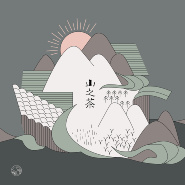

山之茶
============================

|  |  |
| :--: | :-- |
| [ 山之茶](https://emumo.xiami.com/album/2103714264) | **艺人**: [程璧](../index.md) **语种**: 国语 **唱片公司**: 独立发行 **发行时间**: 2018年05月20日 **专辑类别**: EP, 单曲 **专辑风格**: 独立民谣 Indie Folk, 当代民谣 Contemporary Folk **播放数**: 2377512 **收藏数**: 341 **评论数**: 34  |

## 简介

这首歌的旋律灵感源自山水与茶园，歌词元素借鉴紫阳民歌中的唱词对白，以一种“对话山遥”的形式营造相约、渡江、守望、登山、采花、饮茶等原野场景。 2017年夏天，容千将歌曲DEMO发给程璧，两人决定共同录制《山之茶》。在接下来的一年的创作中，从编曲到制作，容千在西安录制，程璧部分则在东京完成，两人异地合作完成此歌。

## 曲目

## 评论

|  |  |  |
| :-- | :-- | :-- |
|  [虾米用户](https://emumo.xiami.com/u/313386783) 可爱可以爱 2020-10-01 22:15 赞(0) 踩(0) | 
一如既往地好听(ง •̀_•́)ง
 |
|  [虾米用户](https://emumo.xiami.com/u/58979368) 寡人有毒 2019-12-07 02:25 赞(0) 踩(0) | 

 |
|  [虾米用户](https://emumo.xiami.com/u/2962234) 这家伙很聪明什么也没留下... 2019-08-05 16:39 赞(0) 踩(0) | 
想听纯音乐版
 |
|  [虾米用户](https://emumo.xiami.com/u/400673970) EXO-L 2019-01-25 00:26 赞(1) 踩(0) | 
我想听纯音乐的
 |
|  [虾米用户](https://emumo.xiami.com/u/3929236)  2018-09-27 13:25 赞(0) 踩(0) | 
心好酥啊
 |
|  [虾米用户](https://emumo.xiami.com/u/40547209) 守護初心 2018-07-27 07:38 赞(0) 踩(0) | 
诗意与远方。心之往也
 |
|  [虾米用户](https://emumo.xiami.com/u/6905951) 一个人，就这样一个人。 2018-06-12 10:00 赞(1) 踩(0) | 
如果在生活中累了，那就远离喧嚣，找一个清静的地方，安静的躺着。
 |
|  [虾米用户](https://emumo.xiami.com/u/42465) 没有音乐会死 2018-06-01 21:09 赞(1) 踩(0) | 
天晴云高，山水之间一人撑船一人绣荷，山歌对唱，画面感极佳。
 |
|  [虾米用户](https://emumo.xiami.com/u/47606077) 。 2018-05-23 19:40 赞(0) 踩(0) | 
太纯了。
 |
|  [虾米用户](https://emumo.xiami.com/u/48935681) 樓閣新晨花欲語，夢中誰是... 2018-05-23 07:38 赞(0) 踩(0) | 
还行
 |
|  [虾米用户](https://emumo.xiami.com/u/53393) 不亦乐乎 2018-05-21 10:12 赞(2) 踩(0) | 
两个年轻人，同走一条路，同坐一只船，同喝一壶茶，不谈离合
 |
|  [虾米用户](https://emumo.xiami.com/u/11421497) dont act lik... 2018-05-21 07:49 赞(0) 踩(0) | 
好
 |
|  [虾米用户](https://emumo.xiami.com/u/15366070)   2018-05-21 01:59 赞(0) 踩(0) | 
享受这样的曲子
 |
|  [虾米用户](https://emumo.xiami.com/u/184453400)  2018-05-21 00:05 赞(0) 踩(0) | 
好听好听，很小清新，有种从前的爱情的感觉 
 |
|  [虾米用户](https://emumo.xiami.com/u/246343865) 大梦一场的董二千先生 2018-05-21 00:00 赞(2) 踩(0) | 
妙啊
 |
|  [虾米用户](https://emumo.xiami.com/u/110583454) 我还没想好要写什么... 2018-05-20 23:42 赞(0) 踩(0) | 
对唱小清新款 
 |
|  [虾米用户](https://emumo.xiami.com/u/304480126) 妙啊～ 2018-05-20 22:51 赞(2) 踩(0) | 
妙啊
 |
|  [虾米用户](https://emumo.xiami.com/u/5526289) 开心小甜豆 2018-05-20 22:24 赞(3) 踩(0) | 
平野水云溶漾 小楼风日晴和 我思君处君思我
 |
|  [虾米用户](https://emumo.xiami.com/u/122551624)  2018-05-20 20:22 赞(0) 踩(0) | 
可以的
 |
|  [虾米用户](https://emumo.xiami.com/u/259704310)  2018-05-20 19:03 赞(0) 踩(0) | 
喜欢喜欢！
 |
|  [虾米用户](https://emumo.xiami.com/u/278406567) 这个人除了一无是处什么也... 2018-05-20 17:10 赞(0) 踩(0) | 
谢谢程璧姐姐
 |
|  [虾米用户](https://emumo.xiami.com/u/66823378)  2018-05-20 15:44 赞(0) 踩(0) | 
520哈哈
 |
|  [虾米用户](https://emumo.xiami.com/u/265372543)  2018-05-20 12:51 赞(0) 踩(0) | 
前奏很浓的夏天的感觉
 |
|  [虾米用户](https://emumo.xiami.com/u/29285843) 潜鱼水底传心诀，栖鸟枝头... 2018-05-20 12:49 赞(1) 踩(0) | 
消什么暑，这曲调歌词里满满情欲。再禁欲下去人就不正常了。
 |
| ⇒ |  [虾米用户](https://emumo.xiami.com/u/29285843) 潜鱼水底传心诀，栖鸟枝头... 2018-05-21 02:17 赞(0) 踩(0) | 
突然想起王菲，突然想起今天听了这首歌，还写了评论，觉得得回来回复一下：  满是情欲的腔调，王菲快唱了一辈子了。她虽然信佛、念佛，但终究抵挡不过自己的局限，她也止于信佛、念佛。永远缺乏一种超拔的力量，或者关注自己以外的力量，那种以物喻我，而我不过是物的禅力。又或者，缺乏述说芸芸众生，世相人情（现实的复杂性）的深度。  程璧之初，颇值得嘉许，今之一首，略有不同。变化虽无不好，情欲虽无不好，但若未来不披肝沥胆，见于众生，或恐进益难矣。  
 |
|  [虾米用户](https://emumo.xiami.com/u/652547)  2018-05-20 12:47 赞(0) 踩(0) | 
消暑
 |
|  [虾米用户](https://emumo.xiami.com/u/286342591) destiny 2018-05-20 12:25 赞(0) 踩(0) | 
声音很好听~
 |
|  [虾米用户](https://emumo.xiami.com/u/358710915) 无聊一天又一天 2018-05-20 12:18 赞(0) 踩(0) | 

 |
|  [虾米用户](https://emumo.xiami.com/u/42725114) ThistheshitI... 2018-05-20 11:41 赞(0) 踩(0) | 

 |
|  [虾米用户](https://emumo.xiami.com/u/4043313) 人生苦短，必须性感 2018-05-20 11:32 赞(1) 踩(0) | 
歌名可以叫 约不约？
 |
|  [虾米用户](https://emumo.xiami.com/u/39002756) Veni Vidi Vi... 2018-05-20 11:04 赞(0) 踩(0) | 
！
 |
|  [虾米用户](https://emumo.xiami.com/u/334696702)  2018-05-20 10:03 赞(1) 踩(0) | 
超喜欢！
 |
|  [虾米用户](https://emumo.xiami.com/u/356215275) 队长，是我 2018-05-20 09:39 赞(2) 踩(0) | 
520特供 
 |
|  [虾米用户](https://emumo.xiami.com/u/41473291) 朴 2018-05-20 09:36 赞(2) 踩(0) | 
  
 |
