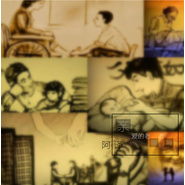

亲爱的老爸老妈
============================

|  |  |
| :--: | :-- |
| [ 亲爱的老爸老妈](https://emumo.xiami.com/album/2102749614) | **艺人**: [阿译](../index.md) **语种**: 国语 **唱片公司**: 四平青年 **发行时间**: 2017年05月17日 **专辑类别**: 录音室专辑 **专辑风格**: 国语流行 Mandarin Pop **播放数**: 3141 **收藏数**: 1 **评论数**: 2  |

## 简介

 

有个地方，是永远可以安然甜睡的港湾，那就是—父母的怀抱。
 

 
 

.父母渐渐苍老的容颜，记载着我们走过的漫长而艰辛的岁月，也许我们未来的路还很长，也许它充满了曲折和荆棘.不过总会有个人给我们引路，与我们相扶，那就是爸爸 妈妈。
 

 
 

人的嘴唇所能发出的最甜美的字眼，就是母亲，最美好的呼唤，就是&amp;爸爸&amp;“妈妈”
 

## 曲目

## 评论

|  |  |  |
| :-- | :-- | :-- |
|  [虾米用户](https://emumo.xiami.com/u/377523729)  2019-10-23 20:36 赞(0) 踩(0) | 
亲爱的老爸，老妈，儿了用_生的爱美去报恩敬
 |
|  [虾米用户](https://emumo.xiami.com/u/412503634)  2019-04-10 03:08 赞(0) 踩(0) | 
好好好
 |
