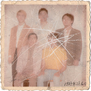
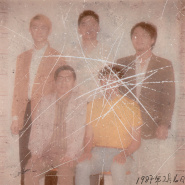

话梅鹿 Prune Deer
============================

|  |  |
| :--: | :-- |
| [ 话梅鹿 Prune Deer](https://i.xiami.com/prunedeer) | **地区**: China 中国大陆 **风格**: 数学摇滚 Math Rock, 后摇 Post-Rock **播放数**: 9105900 **粉丝数**: 1962 **评论数**: 107  |

## 档案

「话梅鹿」于 2013 初春组成，在主唱离去后转换音乐风格，确立数学摇滚及后摇滚的路线。继上一张专辑《化学》之后，话梅鹿再次经历成员更替，现任团员为创团节奏吉他手自然 nature 、主奏结他手城锋 S.F. Tang ，鼓手坤城 Kwan Shing ，还有 2018 年新加入的贝斯手耀荣 Jerry 。

## 专辑

| 名称 | 语种 | 唱片公司 | 发行时间 | 专辑类别 | 专辑风格 |
| :--: | :-- | :-- | :-- | :-- | :-- |
| [ Insufficient Postage](./albums/2105195072.md) | 国语 | StreetVoice | 2019年09月06日 | EP, 单曲 | 独立摇滚 Indie Rock |
| [ Return 返信](./albums/2104715989.md) | 日语 | StreetVoice | 2019年03月25日 | EP, 单曲 | 嘻哈 Hip-Hop, 后摇 Post-Rock |
| [ 化学](./albums/2103591077.md) | 国语 | StreetVoice | 2018年03月08日 | EP, 单曲 |  |
| [ 实心透明Solid Transparency](./albums/2102707168.md) | 其他 | StreetVoice | 2015年09月26日 | EP, 单曲 |  |

## 评论

|  |  |  |
| :-- | :-- | :-- |
|  [虾米用户](https://emumo.xiami.com/u/110088060) 作为报答、我吔给泥放点、... 2021-01-18 13:40 赞(0) 踩(0) | 
回
 |
|  [虾米用户](https://emumo.xiami.com/u/73740960)  2020-08-25 21:09 赞(0) 踩(0) | 
。
 |
|  [虾米用户](https://emumo.xiami.com/u/427208425) 听歌而已 2020-08-07 17:44 赞(0) 踩(0) | 
好听
 |
|  [虾米用户](https://emumo.xiami.com/u/4270553) 我的黑暗是为早逝埋下的伏... 2020-03-06 03:57 赞(0) 踩(0) | 
。
 |
|  [虾米用户](https://emumo.xiami.com/u/435393120)  2020-02-02 10:55 赞(1) 踩(0) | 
嗯
 |
|  [虾米用户](https://emumo.xiami.com/u/32051445) 女孩儿的歌。 永爱虾米 2019-12-29 16:39 赞(0) 踩(0) | 
❤️
 |
|  [虾米用户](https://emumo.xiami.com/u/322006389)   2019-12-28 22:42 赞(0) 踩(0) | 
～
 |
|  [虾米用户](https://emumo.xiami.com/u/4206892) Rock 2019-12-10 14:29 赞(0) 踩(0) | 
好听，有本土味道
 |
|  [虾米用户](https://emumo.xiami.com/u/44743196) 听虾米记得收藏～ 2019-12-05 01:50 赞(1) 踩(0) | 
资料里“中国大陆”写错了，应该是“中国香港”
 |
|  [虾米用户](https://emumo.xiami.com/u/431699219) 数摇狗，兼爱核/融合 2019-11-05 17:57 赞(0) 踩(0) | 
内容已删除
 |
| ⇒ |  [虾米用户](https://emumo.xiami.com/u/23103884) 420 2019-12-15 20:11 赞(0) 踩(0) | 
你要是知道这首歌是什么意义你就不会问了
 |
|  [虾米用户](https://emumo.xiami.com/u/47367838) . 2019-11-03 02:56 赞(0) 踩(0) | 
安排了
 |
|  [虾米用户](https://emumo.xiami.com/u/1424224) 无知就是幸福 2019-11-03 01:25 赞(0) 踩(0) | 
求新专购买链接
 |
| ⇒ |  [虾米用户](https://emumo.xiami.com/u/44743196) 听虾米记得收藏～ 2019-12-05 01:53 赞(0) 踩(0) | 
话梅鹿 Insufficient Postage 黑胶/磁带/CD/海报 <a href="https://k.weidian.com/ciDHOwLU?share_relation=b18ba04865ccaa9d_1429074577_1&amp;a=b&amp;wfr=BuyercopyURL" target="_blank" rel="nofollow noreferrer noopener">https://k.weidian.com/ciDHOwLU?share_relation=b18ba04865ccaa9d_1429074577_1&amp;a=b&amp;wfr=BuyercopyURL</a>
 |
| ⇒ |  [虾米用户](https://emumo.xiami.com/u/1424224) 无知就是幸福 2019-12-09 20:54 赞(0) 踩(0) | 
<q><b>枫剑寒说：</b></q>
 |
| ⇒ |  [虾米用户](https://emumo.xiami.com/u/44743196) 听虾米记得收藏～ 2019-12-10 00:30 赞(0) 踩(0) | 
<q><b>三千世界说：</b></q>
 |
|  [虾米用户](https://emumo.xiami.com/u/335681133) 美好的一天，从听到电台头... 2019-10-27 19:42 赞(0) 踩(0) | 

 |
|  [虾米用户](https://emumo.xiami.com/u/10643094) 要加组织的朋友发站内信 2019-10-08 20:50 赞(0) 踩(0) | 
棒
 |
|  [虾米用户](https://emumo.xiami.com/u/47367838) . 2019-09-19 22:00 赞(0) 踩(0) | 
来北京啊！
 |
|  [虾米用户](https://emumo.xiami.com/u/201545455)   2019-09-16 20:19 赞(0) 踩(0) | 
怎么不来上海
 |
|  [虾米用户](https://emumo.xiami.com/u/411162059)  2019-07-12 00:17 赞(0) 踩(0) | 
~
 |
|  [虾米用户](https://emumo.xiami.com/u/322523580) 夜空 总有更大密度的蓝色 2019-05-01 20:40 赞(0) 踩(0) | 
有梅的我都喜欢啦 超好听! 这就是爱屋及乌吧
 |
|  [虾米用户](https://emumo.xiami.com/u/8109588) Post Rock & ... 2019-03-25 21:12 赞(0) 踩(0) | 
最后那位是顺丰快递？ 
 |
|  [虾米用户](https://emumo.xiami.com/u/201545455)   2019-03-25 20:51 赞(0) 踩(0) | 
什么时候来上海呀？
 |
|  [虾米用户](https://emumo.xiami.com/u/11603315) K-indie | 靓橙... 2019-01-06 22:44 赞(3) 踩(0) | 
1.12 新势力乐团「再见浪漫」音乐趴 @深圳HOU Live /////////////////////// 话梅鹿 Prune Deer/Jing Wong 黃靖 /Blaster/ The Sulis Club/ Siu Yuen 杨智远 ////////////////////// 大湾区特调——一次可以听到五组香港音乐人的浪漫夜晚只在这里
 |
|  [虾米用户](https://emumo.xiami.com/u/42989678) 勇敢 2018-12-28 13:15 赞(1) 踩(0) | 
爱了
 |
|  [虾米用户](https://emumo.xiami.com/u/42963872) 我还没想好要写什么... 2018-12-05 16:38 赞(1) 踩(0) | 
-
 |
|  [虾米用户](https://emumo.xiami.com/u/5496438) 凡尘俗事，改变了你我！ 2018-11-27 11:56 赞(1) 踩(0) | 
怎么办，一下就喜欢上了。
 |
|  [虾米用户](https://emumo.xiami.com/u/52415194) ♬♩♫♪♡ 2018-11-24 00:36 赞(1) 踩(0) | 
好的
 |
|  [虾米用户](https://emumo.xiami.com/u/9028760) 豆瓣见 spotify ... 2018-10-31 07:27 赞(1) 踩(0) | 
(^^)
 |
|  [虾米用户](https://emumo.xiami.com/u/51639447)  2018-08-09 13:49 赞(12) 踩(0) | 
话梅鹿、甜梅号，好吃的乐队果然更好听呢 
 |
|  [虾米用户](https://emumo.xiami.com/u/32558701) bo ku wa～虛菩提... 2018-08-06 06:54 赞(4) 踩(0) | 
感谢上海场，三杯伏特加汤力饮至微醺，伴随现场的灯光和音效以及激情的演出，我第一次去音乐现场给话梅鹿果然是一个明智的决定。
 |
|  [虾米用户](https://emumo.xiami.com/u/23572171)   2018-08-04 07:14 赞(1) 踩(0) | 
感谢北京！！❤️
 |
|  [虾米用户](https://emumo.xiami.com/u/10183109) 我一直假装自己是个学霸… 2018-08-02 09:05 赞(1) 踩(0) | 
Nice to meet you
 |
|  [虾米用户](https://emumo.xiami.com/u/112463526) 豆瓣: 坤斤拷    我... 2018-08-01 23:52 赞(9) 踩(0) | 
在红咖跟话梅鹿过了一个很愉快的生日！
 |
| ⇒ |  [虾米用户](https://emumo.xiami.com/u/336640648) To bare,to l... 2018-08-02 01:04 赞(0) 踩(0) | 
话梅鹿给自己唱生日快乐歌 我都替你开心hhh
 |
| ⇒ |  [虾米用户](https://emumo.xiami.com/u/112463526) 豆瓣: 坤斤拷    我... 2018-08-02 01:29 赞(0) 踩(0) | 
<q><b>列草台说：</b></q>
 |
|  [虾米用户](https://emumo.xiami.com/u/347465569) 虚假繁荣，回归自然。 2018-07-27 02:44 赞(1) 踩(0) | 
路转粉 
 |
|  [虾米用户](https://emumo.xiami.com/u/20177386) 感谢一切美好的遇见❤️ 2018-07-20 21:03 赞(4) 踩(0) | 
重庆 
 |
|  [虾米用户](https://emumo.xiami.com/u/297999609) 去克洛里吧 2018-07-19 09:19 赞(2) 踩(0) | 

 |
|  [虾米用户](https://emumo.xiami.com/u/336640648) To bare,to l... 2018-07-14 11:04 赞(2) 踩(0) | 
长沙见~
 |
|  [虾米用户](https://emumo.xiami.com/u/3714518) 死人 2018-07-08 08:32 赞(3) 踩(0) | 
来晚了+坐标硬
 |
|  [虾米用户](https://emumo.xiami.com/u/11603315) K-indie | 靓橙... 2018-07-03 02:50 赞(0) 踩(0) | 
如果可以深圳再见一次吧
 |
| ⇒ |  [虾米用户](https://emumo.xiami.com/u/317619583) 微博 @話梅鹿prune... 2018-07-04 21:34 赞(0) 踩(0) | 
我們7月20號會在順德hill livehouse演出，但好像也有一點遠呢
 |
| ⇒ |  [虾米用户](https://emumo.xiami.com/u/27931151)   2018-07-13 09:55 赞(0) 踩(0) | 
<q><b>话梅鹿 Prune Deer说：</b></q>
 |
| ⇒ |  [虾米用户](https://emumo.xiami.com/u/11603315) K-indie | 靓橙... 2018-07-22 04:58 赞(0) 踩(0) | 
<q><b>话梅鹿 Prune Deer说：</b></q>
 |
|  [虾米用户](https://emumo.xiami.com/u/52716530) 平安喜乐 2018-06-28 00:55 赞(2) 踩(0) | 
武汉见哟～～
 |
|  [虾米用户](https://emumo.xiami.com/u/590302) 猫背オッさん 2018-06-22 10:54 赞(2) 踩(0) | 
北京见&amp;lt;3333
 |
|  [虾米用户](https://emumo.xiami.com/u/6176688) 你比巴甜少一甜 2018-06-21 23:25 赞(3) 踩(0) | 
bucket list又可以劃掉一個！上海見！
 |
|  [虾米用户](https://emumo.xiami.com/u/71989728) 再见啦 2018-06-21 20:42 赞(1) 踩(0) | 
又没有重庆咩?
 |
| ⇒ |  [虾米用户](https://emumo.xiami.com/u/317619583) 微博 @話梅鹿prune... 2018-06-21 20:51 赞(0) 踩(0) | 
希望一下次會有啊，這次重慶沒有檔期呢
 |
|  [虾米用户](https://emumo.xiami.com/u/24838376) ++++++++++++ 2018-06-21 20:23 赞(2) 踩(0) | 
又没有成都咩?
 |
| ⇒ |  [虾米用户](https://emumo.xiami.com/u/317619583) 微博 @話梅鹿prune... 2018-06-21 20:51 赞(0) 踩(0) | 
希望一下次會有啊，這次成都沒有檔期呢
 |
|  [虾米用户](https://emumo.xiami.com/u/30818496)   2018-06-16 21:57 赞(1) 踩(0) | 
要来大陆巡演了！
 |
| ⇒ |  [虾米用户](https://emumo.xiami.com/u/317619583) 微博 @話梅鹿prune... 2018-06-21 20:52 赞(0) 踩(0) | 
對啊，快點叫朋友一起來～～
 |
|  [虾米用户](https://emumo.xiami.com/u/39840212) 可还行 2018-04-21 18:34 赞(1) 踩(0) | 
今晚中山见
 |
|  [虾米用户](https://emumo.xiami.com/u/111466252) 94963221 2018-04-17 16:52 赞(1) 踩(0) | 
中山等你们
 |
|  [虾米用户](https://emumo.xiami.com/u/49691100) 是个糟人 2018-04-10 13:57 赞(1) 踩(0) | 
棒
 |
|  [虾米用户](https://emumo.xiami.com/u/24838376) ++++++++++++ 2018-04-02 22:45 赞(1) 踩(0) | 
期待成都
 |
|  [虾米用户](https://emumo.xiami.com/u/2857420) 昨天晚上我梦见你 2018-03-30 12:19 赞(1) 踩(0) | 
开心啊啊啊
 |
|  [虾米用户](https://emumo.xiami.com/u/4400366) 再也不见 2018-03-25 19:42 赞(1) 踩(0) | 
囍
 |
|  [虾米用户](https://emumo.xiami.com/u/112463526) 豆瓣: 坤斤拷    我... 2018-03-19 08:53 赞(1) 踩(0) | 
:)
 |
|  [虾米用户](https://emumo.xiami.com/u/30800139) 我在低俗与高雅间活的很尴... 2018-03-11 21:52 赞(1) 踩(0) | 
2018.3.10
 |
|  [虾米用户](https://emumo.xiami.com/u/336640648) To bare,to l... 2018-03-09 14:04 赞(2) 踩(0) | 
期待你們來南京
 |
|  [虾米用户](https://emumo.xiami.com/u/48898343) 生命已经过期 2018-03-09 08:33 赞(1) 踩(0) | 

 |
|  [虾米用户](https://emumo.xiami.com/u/48625003) / 2018-03-05 19:59 赞(1) 踩(0) | 
白噪音真的是一段白噪音 佩服
 |
|  [虾米用户](https://emumo.xiami.com/u/164599) 打死我!我想死! 2018-02-10 01:22 赞(1) 踩(0) | 
【赤磷】该上传啦~
 |
|  [虾米用户](https://emumo.xiami.com/u/17691156) あなたに出会えて よかっ... 2018-02-09 18:48 赞(1) 踩(0) | 
广州 4/20
 |
|  [虾米用户](https://emumo.xiami.com/u/6176688) 你比巴甜少一甜 2018-01-06 17:54 赞(1) 踩(0) | 
請來上海演  拜託！
 |
| ⇒ |  [虾米用户](https://emumo.xiami.com/u/6176688) 你比巴甜少一甜 2018-06-21 23:24 赞(0) 踩(0) | 
美夢成真！
 |
|  [虾米用户](https://emumo.xiami.com/u/250225537) 音乐是良药。 2017-12-11 16:33 赞(1) 踩(0) | 
期待你们的音乐会。
 |
|  [虾米用户](https://emumo.xiami.com/u/3456044) 去体验、去感受、得灵犀、... 2017-11-04 13:08 赞(2) 踩(0) | 
走一趟巡演路吧
 |
|  [虾米用户](https://emumo.xiami.com/u/324539125) 本人迪丽热巴，不喜勿喷，... 2017-09-16 12:23 赞(0) 踩(0) | 
我是热巴，多关注我一下
 |
| ⇒ |  [虾米用户](https://emumo.xiami.com/u/277456035) 我还没想好要写什么... 2018-02-09 17:06 赞(0) 踩(0) | 
滚犊子的迪丽热几把
 |
|  [虾米用户](https://emumo.xiami.com/u/9424698) 我还没想好要写什么... 2017-09-09 08:50 赞(2) 踩(0) | 
还在吗
 |
|  [虾米用户](https://emumo.xiami.com/u/18855441) 梦里什么都有 2017-07-25 13:40 赞(1) 踩(0) | 
鼓手也换了一位~
 |
|  [虾米用户](https://emumo.xiami.com/u/70292024)   2017-06-15 15:37 赞(1) 踩(0) | 
话梅鹿
 |
|  [虾米用户](https://emumo.xiami.com/u/50348963) @37am 2017-03-25 21:18 赞(1) 踩(0) | 
。
 |
|  [虾米用户](https://emumo.xiami.com/u/5947385) 戴耳机聋 摘眼镜瞎 2017-03-02 11:53 赞(1) 踩(0) | 
可以啊
 |
|  [虾米用户](https://emumo.xiami.com/u/39436088) Still singin... 2016-12-05 01:22 赞(1) 踩(0) | 

 |
|  [虾米用户](https://emumo.xiami.com/u/44140680) 旅途愉快 2016-12-04 23:35 赞(1) 踩(0) | 
⚫️
 |
|  [虾米用户](https://emumo.xiami.com/u/10238328) we c h a t ：... 2016-10-22 20:30 赞(1) 踩(0) | 
嘻嘻
 |
|  [虾米用户](https://emumo.xiami.com/u/32051445) 女孩儿的歌。 永爱虾米 2016-06-19 21:31 赞(1) 踩(0) | 
话梅鹿 一定很好吃
 |
|  [虾米用户](https://emumo.xiami.com/u/23544640) Nude 2016-04-07 00:46 赞(1) 踩(0) | 

 |
|  [虾米用户](https://emumo.xiami.com/u/4231522)  2016-02-06 09:50 赞(3) 踩(0) | 
吉他手HanZ 2016年2月5日最后一次参加乐队演出
 |
| ⇒ |  [虾米用户](https://emumo.xiami.com/u/36673521) a shi sou r ... 2016-07-13 17:42 赞(0) 踩(0) | 
卧槽！才知道
 |
| ⇒ |  [虾米用户](https://emumo.xiami.com/u/3456044) 去体验、去感受、得灵犀、... 2017-11-04 13:09 赞(0) 踩(0) | 
散了？
 |
|  [虾米用户](https://emumo.xiami.com/u/18855441) 梦里什么都有 2016-02-01 20:59 赞(1) 踩(0) | 
潜力无穷
 |
|  [虾米用户](https://emumo.xiami.com/u/52512270) 孤独到抑郁 悲伤到狂躁 2015-12-10 22:42 赞(1) 踩(0) | 
！
 |
| ⇒ |  [虾米用户](https://emumo.xiami.com/u/1746372) 我懷疑你懷疑我不懷好意 2016-02-12 00:57 赞(0) 踩(0) | 

 |
|  [虾米用户](https://emumo.xiami.com/u/71312512)   2015-11-21 18:56 赞(1) 踩(0) | 
发出来吧都
 |
|  [虾米用户](https://emumo.xiami.com/u/36673521) a shi sou r ... 2015-10-13 16:24 赞(2) 踩(0) | 
分享话梅鹿主音吉他HanZ的主页 <a href="http://www.xiami.com/artist/2099991466" target="_blank" rel="nofollow noreferrer noopener">http://www.xiami.com/artist/2099991466</a>
 |
|  [虾米用户](https://emumo.xiami.com/u/553333) 我还没想好要写什么... 2015-10-08 15:53 赞(1) 踩(0) | 
新专有人传吗
 |
|  [虾米用户](https://emumo.xiami.com/u/12249848) motherfucker 2015-09-01 03:40 赞(1) 踩(0) | 
math-rock
 |
|  [虾米用户](https://emumo.xiami.com/u/9799609)   2015-07-27 22:35 赞(1) 踩(0) | 
才一首歌不过瘾
 |
|  [虾米用户](https://emumo.xiami.com/u/26189644) music lover 2015-07-08 10:55 赞(1) 踩(0) | 
香港的
 |
|  [虾米用户](https://emumo.xiami.com/u/4908873)   2015-07-07 22:49 赞(1) 踩(0) | 
這。。。
 |
|  [虾米用户](https://emumo.xiami.com/u/6962645) Rubber Stone 2015-06-29 19:17 赞(1) 踩(0) | 
新砖ヽ(*´з｀*)ﾉ
 |
|  [虾米用户](https://emumo.xiami.com/u/16197411) 我还没想好要写什么... 2015-06-19 15:26 赞(1) 踩(0) | 
棒！
 |
|  [虾米用户](https://emumo.xiami.com/u/44368575)   2015-02-25 21:15 赞(1) 踩(0) | 
發發發
 |
|  [虾米用户](https://emumo.xiami.com/u/31749205)  2015-02-12 02:49 赞(1) 踩(0) | 
******
 |
|  [虾米用户](https://emumo.xiami.com/u/4335954)   2015-02-06 00:30 赞(1) 踩(0) | 
！！！
 |
|  [虾米用户](https://emumo.xiami.com/u/32272549)   2014-12-20 13:26 赞(1) 踩(0) | 
要火
 |
|  [虾米用户](https://emumo.xiami.com/u/11090928)  2014-11-26 18:54 赞(1) 踩(0) | 
*
 |
|  [虾米用户](https://emumo.xiami.com/u/991524) 呵呵 2014-10-16 14:54 赞(1) 踩(0) | 
为什么资源辣么少.....
 |
|  [虾米用户](https://emumo.xiami.com/u/31749205)  2014-10-13 17:14 赞(1) 踩(0) | 
******
 |
|  [虾米用户](https://emumo.xiami.com/u/6962645) Rubber Stone 2014-06-20 15:23 赞(1) 踩(0) | 
噗..明明是香港的
 |
|  [虾米用户](https://emumo.xiami.com/u/3527270)  2014-05-10 22:52 赞(1) 踩(0) | 
不是台湾的是香港的_(:——|］」∠)_
 |
